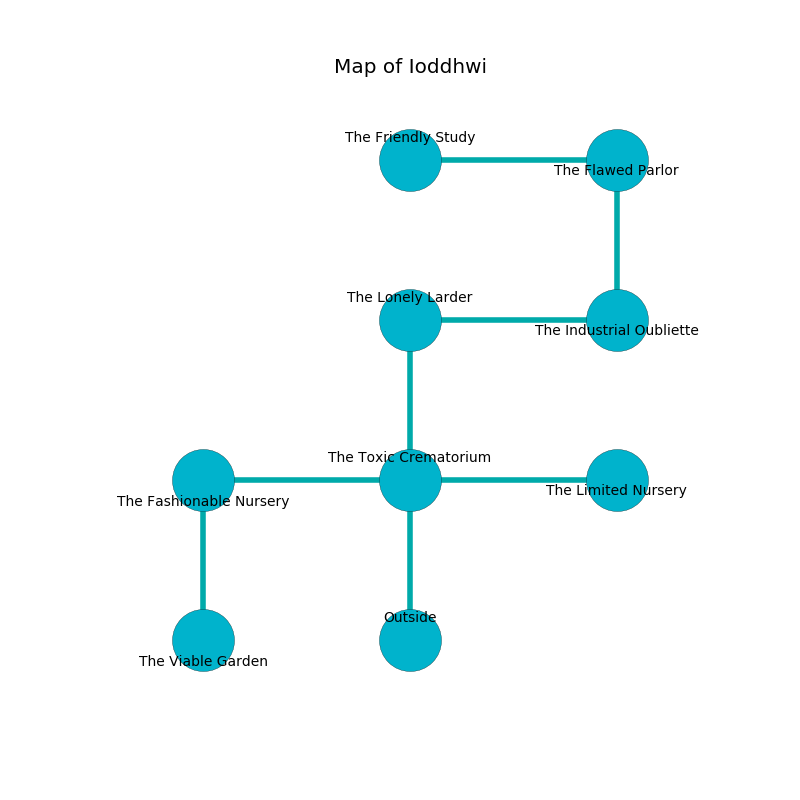

%Ruin Dogs

##Ioddhwi
###Overview
Ioddhwi is constructed on a poisoned mountain. Parts of it are frozen. A massive flood is happening outside. It is occupied by Githyanki. Sandy Williamson The Cynical, a Stone Giant is here. The Githyanki worship Sandy Williamson The Cynical. He  is trying to recover [Idaema Ucceiaeum](#Idaema-Ucceiaeum). 

###Artifact
####Idaema Ucceiaeum

Idaema Ucceiaeum looks like a wet blade. It smells like horseradish. It is a bright orange color. When smelled it repels insects. 

###Locations

####the toxic crematorium
The obsidion walls are bloodstained. The air smells like moss here. The floor is bloodstained. There are a Darkmantle, a Riding Horse, a Swarm of Bats, an Invisible Stalker, a Rat, a Slaad Tadpole, an Axe Beak, a Giant Wasp, a Berserker, and a Quipper here. 

* To the west a small pathway leads to [the fashionable nursery](#the-fashionable-nursery).
* To the east a narrow opening connects to [the limited nursery](#the-limited-nursery).
* To the north a hazy cavern connects to [the lonely larder](#the-lonely-larder).
* To the south is the entrance.

####the fashionable nursery
The floor is bloodstained. Yellow moss is sprouting in broken urns. There are three Githyanki Warriors here. One of the Githyanki is pointing a ballista at the entrance. 

* There is a box here.
* To the east a small pathway leads to [the toxic crematorium](#the-toxic-crematorium).
* To the south a torchlit threshold leads to [the viable garden](#the-viable-garden).

####the lonely larder
The air smells like peanut here. The floor is bloodstained. There are three Githyanki Warriors here. Yellow mushrooms are swaying in broken urns. The Githyanki are willing to negotiate. 

There is an engraving on the ceiling written in common. 

> I worship [Idaema Ucceiaeum](#Idaema-Ucceiaeum).
>
> Leave at once.
>

* To the east a dark artery opens to [the industrial oubliette](#the-industrial-oubliette).
* To the south a hazy cavern connects to [the toxic crematorium](#the-toxic-crematorium).

####the limited nursery
Gray razorgrass is swaying in cracks in the floor. The air smells like cloth here. The glass walls are covered in mold. There are three Githyanki Warriors here. The Githyanki are willing to fight to the death. 

There is an engraving on the floor written in Githyanki Script. 

> Dear me! our fate is poor
>
> it is never interactive
>
> it is always pure
>
> all is attractive
>

* To the west a narrow opening opens to [the toxic crematorium](#the-toxic-crematorium).

####the viable garden

* To the north a torchlit threshold leads to [the fashionable nursery](#the-fashionable-nursery).

####the industrial oubliette

* [Sandy Williamson The Cynical](#Sandy-Williamson-The-Cynical) is here.
* To the west a dark artery opens to [the lonely larder](#the-lonely-larder).
* To the north a long gap connects to [the flawed parlor](#the-flawed-parlor).

####the flawed parlor
The floor is cluttered with bones. 

* [Idaema Ucceiaeum](#Idaema-Ucceiaeum) is here.
* To the west a narrow corridor leads to [the friendly study](#the-friendly-study).
* To the south a long gap opens to [the industrial oubliette](#the-industrial-oubliette).

####the friendly study
The air tastes like black currant here. The brick walls are ruined. The floor is sticky. There are three Githyanki Warriors here. If the Githyanki notice the Ruin Dogs, one of them will retreat and alert [Sandy Williamson](#Sandy-Williamson). 

* There is a button here.
* To the east a narrow corridor opens to [the flawed parlor](#the-flawed-parlor).

