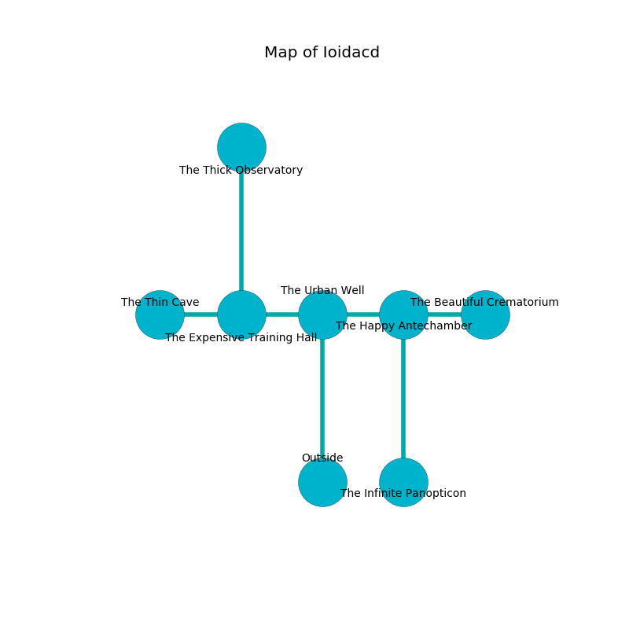

%Ruin Dogs

##Ioidacd
###Overview
Ioidacd is located under a crystal mountain. Some areas of it are flooded. The ruin is burning. It is occupied by Kobolds. Willis Mull The Ruthless, a Mage is here. The Kobolds have been charmed by Willis Mull The Ruthless. He  is founding a new religion. 

###Artifact
####The Holy Afternoon

The Holy Afternoon looks like a hard gem. Power pours away from it. When smelled it destroys others. 

###Locations

####the urban well
Red ferns are swaying in broken urns. The metallic walls are pristine. 

* To the west a small passageway opens to [the expensive training hall](#the-expensive-training-hall).
* To the east a narrow threshold connects to [the happy antechamber](#the-happy-antechamber).
* To the south is the entrance.

####the expensive training hall
The metallic walls are covered in mold. There are a Giant Wolf Spider, a Giant Constrictor Snake, a Dust Mephit, a Duergar, a Guard, a Scarecrow, and a Phase Spider here. White razorgrass is sprouting in broken urns. The floor is glossy. 

There is an engraving on a stone written in Kobolds Script. 

> I thought about cowering.
>

* [Willis Mull The Ruthless](#Willis-Mull-The-Ruthless) is here.
* To the west a windy threshold opens to [the thin cave](#the-thin-cave).
* To the east a small passageway connects to [the urban well](#the-urban-well).
* To the north a narrow pathway leads to [the thick observatory](#the-thick-observatory).

####the thin cave
The stone walls are unsettled. The air tastes like wood here. The floor is smooth. 

* To the east a windy threshold opens to [the expensive training hall](#the-expensive-training-hall).

####the thick observatory
Blue moss is decaying from the walls. There are seventeen Winged Kobolds and twenty three Kobolds here. The stone walls are covered in mold. The floor is sticky. The air smells like lemongrass here. The Kobolds are crazy with bloodlust. 

* To the south a narrow pathway leads to [the expensive training hall](#the-expensive-training-hall).

####the happy antechamber
The floor is sticky. The air tastes like hawthorn here. White razorgrass is sprouting from the walls. 

* [The Holy Afternoon](#The-Holy-Afternoon) is here.
* To the west a narrow threshold opens to [the urban well](#the-urban-well).
* To the east a hazy corridor opens to [the beautiful crematorium](#the-beautiful-crematorium).
* To the south a dripping hall leads to [the infinite panopticon](#the-infinite-panopticon).

####the infinite panopticon
There are a Homunculus, a Young Copper Dragon, an Air Elemental, and a Bat here. Green razorgrass is swaying in broken urns. The air smells like sweet pea here. 

* To the north a dripping hall connects to [the happy antechamber](#the-happy-antechamber).

####the beautiful crematorium
There is a Giant Ape here. 

* To the west a hazy corridor opens to [the happy antechamber](#the-happy-antechamber).

