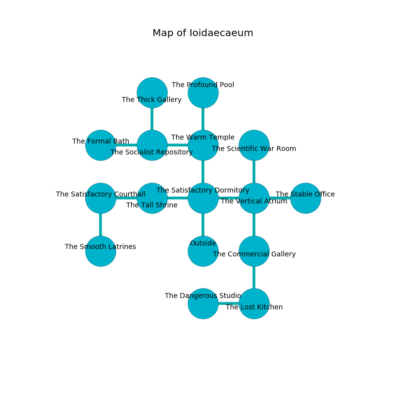

%Ruin Dogs

##Ioidaecaeum
###Overview
Ioidaecaeum is located on a volcanic plain. Parts of Ioidaecaeum are cursed. The ruin is burning. It is occupied by Orc. Larissa Melendez The Domineering, an Orc War Chief is here. The Orc are the slaves of Larissa Melendez The Domineering. She  is founding a new religion. 

###Artifact
####The Restless Defeat

The Restless Defeat looks like a transparent orb. It is a medium gray color. It smells like red apple. When touched it becomes a shielding force. 

###Locations

####the satisfactory dormitory
There are eight Orcs here. The floor is smooth. Blue moss is decaying in cracks in the floor. The Orc are defending this room from intruders. 

* To the west a dripping corridor leads to [the tall shrine](#the-tall-shrine).
* To the east a long hallway opens to [the vertical atrium](#the-vertical-atrium).
* To the north a small path opens to [the warm temple](#the-warm-temple).
* To the south is the entrance.

####the warm temple
There are eight Orcs here. Gray moss is sprouting in a patch on the floor. The brick walls are scratched. The floor is sticky. The air tastes like clary sage here. The Orc are crazy with bloodlust. 

* To the west a small gap leads to [the socialist repository](#the-socialist-repository).
* To the north a long gap connects to [the profound pool](#the-profound-pool).
* To the south a small path leads to [the satisfactory dormitory](#the-satisfactory-dormitory).

####the vertical atrium
The floor is flooded with one inch deep cool water. There are eight Orcs here. The air tastes like mulberry here. The glass walls are pristine. The Orc are willing to negotiate. 

* To the west a long hallway connects to [the satisfactory dormitory](#the-satisfactory-dormitory).
* To the east a dripping corridor connects to [the stable office](#the-stable-office).
* To the north a torchlit corridor opens to [the scientific war Room](#the-scientific-war-Room).
* To the south a long cave opens to [the commercial gallery](#the-commercial-gallery).

####the tall shrine
The floor is cluttered with ashes. 

* To the west a small cavern leads to [the satisfactory courthall](#the-satisfactory-courthall).
* To the east a dripping corridor connects to [the satisfactory dormitory](#the-satisfactory-dormitory).

####the satisfactory courthall
There is a trap here. When activated, a magical rune will make the walls close in. There are a Centaur, a Quasit, and a Sea Hag here. The wooden walls are covered in mold. The floor is smooth. 

There is an engraving on the wall written in common. 

> Do not try jumping.
>

* [The Restless Defeat](#The-Restless-Defeat) is here.
* To the east a small cavern leads to [the tall shrine](#the-tall-shrine).
* To the south a torchlit path leads to [the smooth latrines](#the-smooth-latrines).

####the scientific war Room
The air smells like cardamom here. The mirrored walls are pristine. 

* To the south a torchlit corridor leads to [the vertical atrium](#the-vertical-atrium).

####the socialist repository
The air smells like wasabi here. There are a Wererat, a Swarm of Bats, a Giant Spider, and a Harpy here. Blue ferns are growing in broken urns. 

* To the west a hazy path leads to [the formal bath](#the-formal-bath).
* To the east a small gap opens to [the warm temple](#the-warm-temple).
* To the north a twisted cave leads to [the thick gallery](#the-thick-gallery).

####the profound pool
The air tastes like carrot seed here. There are a Water Weird and an Ogre here. Blue mushrooms are decaying in a patch on the floor. 

* To the south a long gap connects to [the warm temple](#the-warm-temple).

####the commercial gallery
Red lichens are sprouting in broken urns. There are a Silver Dragon Wyrmling, a Draft Horse, a Merfolk, and a Griffon here. 

* To the north a long cave connects to [the vertical atrium](#the-vertical-atrium).
* To the south a narrow threshold opens to [the lost kitchen](#the-lost-kitchen).

####the lost kitchen
The glass walls are ruined. 

* To the west a windy gap leads to [the dangerous studio](#the-dangerous-studio).
* To the north a narrow threshold leads to [the commercial gallery](#the-commercial-gallery).

####the thick gallery
The floor is sticky. The metallic walls are caving in. There are a Blue Dragon Wyrmling and a Green Dragon Wyrmling here. White moss is growing from the ceiling. 

* To the south a twisted cave connects to [the socialist repository](#the-socialist-repository).

####the dangerous studio
There are a Water Weird, a Reef Shark, and a Swarm of Insects here. 

* There is a frame here.
* To the east a windy gap leads to [the lost kitchen](#the-lost-kitchen).

####the formal bath

* To the east a hazy path connects to [the socialist repository](#the-socialist-repository).

####the stable office
There are a Pony, a Giant Wolf Spider, a Yuan-Ti Malison, and a Griffon here. 

* [Larissa Melendez The Domineering](#Larissa-Melendez-The-Domineering) is here.
* To the west a dripping corridor opens to [the vertical atrium](#the-vertical-atrium).

####the smooth latrines
The floor is bloodstained. The air smells like lily here. Yellow ferns are swaying in a patch on the floor. 

There is an engraving on a monolith written in common. 

> O! pitiful god
>
> ready and odd
>
> yet respectable
>
> death is odd
>

* To the north a torchlit path connects to [the satisfactory courthall](#the-satisfactory-courthall).

