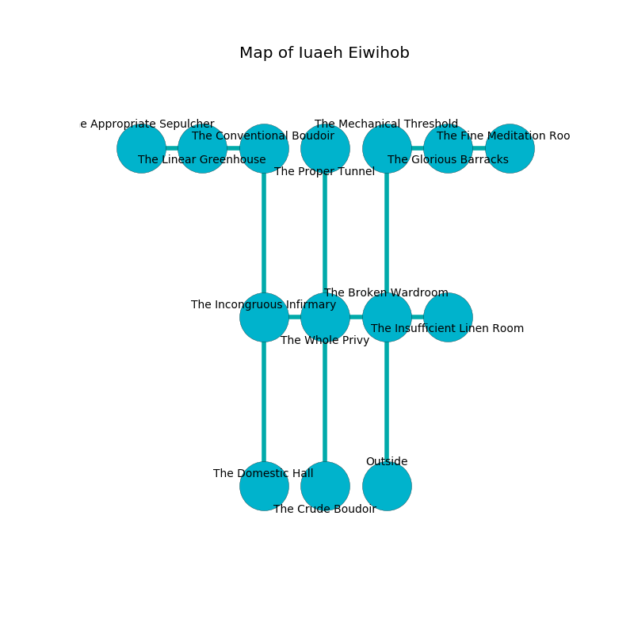

%Ruin Dogs

##Iuaeh Eiwihob
###Overview
Iuaeh Eiwihob is located in a flooded plain. Regions of it are unbearably hot. The ruin is sinking into the earth. It is occupied by Goblins. Kathey Wilkins The Naughty, a Cloud Giant is here. The Goblins worship Kathey Wilkins The Naughty. She  is trying to steal [Cumghaecd Udaemaeum](#Cumghaecd-Udaemaeum). 

###Artifact
####Cumghaecd Udaemaeum

Cumghaecd Udaemaeum looks like a soft figurine. It is a dark yellow color. Magic pours around it. When cradled it becomes a shielding force. 

###Locations

####the broken wardroom
The air tastes like ripe banana here. There are a Giant Ape, a Lion, and a Brass Dragon Wyrmling here. 

* To the west a small cave leads to [the whole privy](#the-whole-privy).
* To the east a small path opens to [the insufficient linen room](#the-insufficient-linen-room).
* To the north a hazy hall leads to [the mechanical threshold](#the-mechanical-threshold).
* To the south is the entrance.

####the insufficient linen room
The crystal walls are bloodstained. There are a Ghoul, a Lizardfolk Shaman, an Eagle, a Mammoth, and a Myconid Adult here. The floor is cluttered with broken glass. 

* There is a basket here.
* To the west a small path opens to [the broken wardroom](#the-broken-wardroom).

####the mechanical threshold
The air tastes like valerian root here. The metallic walls are covered in mold. The floor is cluttered with bones. 

There is an engraving on a monolith written in common. 

> [Cumghaecd Udaemaeum](#Cumghaecd-Udaemaeum)
>
> judicial, dull, hungry
>
> A gun is an alarm
>
> whole and lively
>
> A nail is a default
>
> but major
>
> whole and gradual
>
> closed, cultural, liberal
>
> optional, hungry, uncomfortable
>
> You are sorrowful
>
> but never horizontal
>
> [Cumghaecd Udaemaeum](#Cumghaecd-Udaemaeum)
>

* To the east a long hall connects to [the glorious barracks](#the-glorious-barracks).
* To the south a hazy hall leads to [the broken wardroom](#the-broken-wardroom).

####the whole privy
The floor is bloodstained. There is a trap here. When activated, a magical sound detector will launch a ceiling pendulum. Gray lichens are growing from the walls. The air tastes like acorn here. 

* To the west a long pathway connects to [the incongruous infirmary](#the-incongruous-infirmary).
* To the east a small cave opens to [the broken wardroom](#the-broken-wardroom).
* To the north a hazy artery connects to [the proper tunnel](#the-proper-tunnel).
* To the south a dripping artery opens to [the crude boudoir](#the-crude-boudoir).

####the glorious barracks
Red ferns are sprouting from the walls. The air smells like balsam	petal here. 

There is an engraving on the wall written in Goblins Script. 

> Maybe try running.
>

* To the west a long hall opens to [the mechanical threshold](#the-mechanical-threshold).
* To the east a dripping pathway leads to [the fine meditation room](#the-fine-meditation-room).

####the proper tunnel

* To the south a hazy artery opens to [the whole privy](#the-whole-privy).

####the incongruous infirmary
The floor is sticky. There is a trap here. When activated, a magical sound detector will launch stone blocks from the ceiling. The air smells like sweet pea here. 

* To the east a long pathway leads to [the whole privy](#the-whole-privy).
* To the north a flooded cave opens to [the conventional boudoir](#the-conventional-boudoir).
* To the south a flooded path connects to [the domestic hall](#the-domestic-hall).

####the conventional boudoir
There are a Lizard King, a Mage, and a Camel here. The floor is sticky. The air smells like smoked sausage here. 

* To the west a flooded cave opens to [the linear greenhouse](#the-linear-greenhouse).
* To the south a flooded cave connects to [the incongruous infirmary](#the-incongruous-infirmary).

####the crude boudoir
There are a Goblin, two Hobgoblin Warlords, a Hobgoblin, and  here. The air smells like powder here. One of the Goblins is pointing a ballista at the entrance. 

* To the north a dripping artery leads to [the whole privy](#the-whole-privy).

####the fine meditation room
There are a Goblin, a Hobgoblin, two Hobgoblin Warlords, and  here. Green mushrooms are growing in a patch on the floor. One of the Goblins is on watch, the rest are caring for babies. 

* To the west a dripping pathway opens to [the glorious barracks](#the-glorious-barracks).

####the linear greenhouse
The concrete walls are covered in mold. The air smells like chocolate here. 

* [Cumghaecd Udaemaeum](#Cumghaecd-Udaemaeum) is here.
* To the west a narrow cavern connects to [the appropriate sepulcher](#the-appropriate-sepulcher).
* To the east a flooded cave connects to [the conventional boudoir](#the-conventional-boudoir).

####the domestic hall
The air smells like berry here. There are a Hobgoblin, a Hobgoblin Captain, and a Hobgoblin Warlord here. The floor is flooded with eight inch deep cold water. One of the Goblins is on watch, the rest are meditating. 

* There is a pot here.
* There is a head here.
* [Kathey Wilkins The Naughty](#Kathey-Wilkins-The-Naughty) is here.
* To the north a flooded path opens to [the incongruous infirmary](#the-incongruous-infirmary).

####the appropriate sepulcher
The floor is flooded with three inch deep hot water. There are a Goblin, three Hobgoblins, a Hobgoblin Captain, a Hobgoblin Warlord,  here. The Goblins are willing to negotiate. 

* To the east a narrow cavern connects to [the linear greenhouse](#the-linear-greenhouse).

