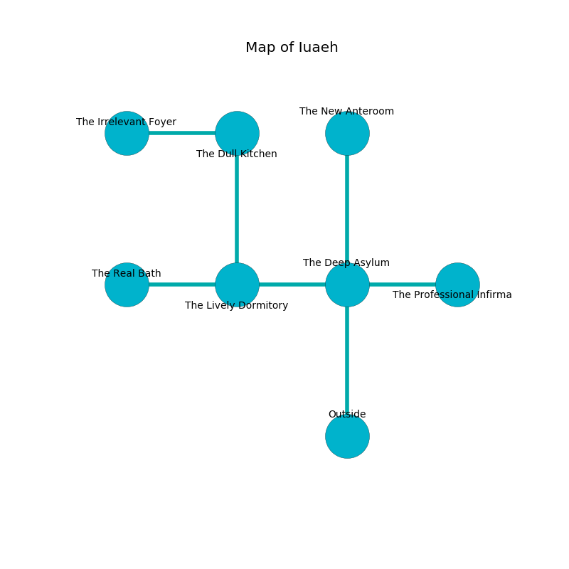

%Ruin Dogs

##Iuaeh
###Overview
Iuaeh is located under a flooded tree. Parts of it are foggy. The ruin is larger on the inside than the outside. It is occupied by Goblins. Patrica Vest The Untrustworthy, a Mind Flayer Arcanist is here. The Goblins worship Patrica Vest The Untrustworthy. She  is founding a new religion. 

###Artifact
####The Empirical Camp

The Empirical Camp is a powerful artifact in the shape of an opaque cube. It smells like gas. It is a pale yellow color. When thrown it becomes a force of destiny. 

###Locations

####the deep asylum

* To the west a long opening connects to [the lively dormitory](#the-lively-dormitory).
* To the east a long hallway leads to [the professional infirmary](#the-professional-infirmary).
* To the north a dark cave leads to [the new anteroom](#the-new-anteroom).
* To the south is the entrance.

####the professional infirmary
Red moss is swaying from the ceiling. The obsidion walls are bloodstained. 

There is an engraving on a stone written in Goblins Script. 

> I could not try digging.
>

* [Patrica Vest The Untrustworthy](#Patrica-Vest-The-Untrustworthy) is here.
* To the west a long hallway connects to [the deep asylum](#the-deep-asylum).

####the lively dormitory
The air tastes like saffron here. There are a Rhinoceros, a Sea Horse, and a Shambling Mound here. 

There is an engraving on the wall written in common. 

> O! sorry soul
>
> loose, historical, whole
>
> but unaware
>
> everything is square
>

* [The Empirical Camp](#The-Empirical-Camp) is here.
* To the west a dark cave opens to [the real bath](#the-real-bath).
* To the east a long opening opens to [the deep asylum](#the-deep-asylum).
* To the north a dripping path connects to [the dull kitchen](#the-dull-kitchen).

####the new anteroom
Gray lichens are swaying from the ceiling. The metallic walls are covered in mold. The air smells like butterscotch here. The floor is glossy. 

* To the south a dark cave opens to [the deep asylum](#the-deep-asylum).

####the dull kitchen
The floor is glossy. The obsidion walls are pristine. Blue ferns are decaying in cracks in the floor. There are a Goblin, two Hobgoblins, two Hobgoblin Captains,  here. If the Goblins notice the Ruin Dogs, one of them will retreat and alert the others. 

* There is a nail here.
* There is a kettle here.
* To the west a long artery opens to [the irrelevant foyer](#the-irrelevant-foyer).
* To the south a dripping path leads to [the lively dormitory](#the-lively-dormitory).

####the irrelevant foyer
The floor is glossy. Yellow lichens are decaying from the ceiling. The metallic walls are pristine. 

There is an engraving on the floor written in Goblins Script. 

> Oh pitiful god
>
> professional and odd
>
> distant and incongruous
>
> life is odd
>

* To the east a long artery leads to [the dull kitchen](#the-dull-kitchen).

####the real bath
The air smells like cologne here. There are two Hobgoblin Warlords here. One of the Goblins is on watch, the rest are feasting. 

* To the east a dark cave opens to [the lively dormitory](#the-lively-dormitory).

