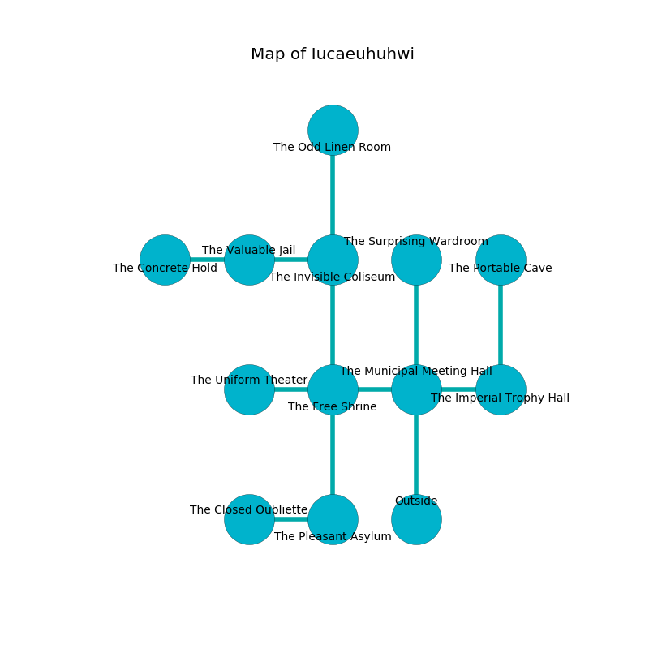

%Ruin Dogs

##Iucaeuhuhwi
###Overview
Iucaeuhuhwi is located in a haunted plain. Some areas of it are cursed. The ruin is flooding. It is occupied by Harpies. Ivette Keener The Selfish, a Fire Giant is here. The Harpies have been charmed by Ivette Keener The Selfish. She  is trying to recover [Ihaed](#Ihaed). 

###Artifact
####Ihaed

Ihaed is a powerful artifact in the shape of a glassy gem. It smells like eucalyptus. When touched it becomes a force of destiny. 

###Locations

####the municipal meeting hall
The air smells like carrot seed here. There are ten Harpies here. Gray ferns are decaying from the ceiling. The wooden walls are covered in mold. The Harpies are feasting. 

* [Ihaed](#Ihaed) is here.
* To the west a dark gap connects to [the free shrine](#the-free-shrine).
* To the east a long cavern opens to [the imperial trophy hall](#the-imperial-trophy-hall).
* To the north a long passageway leads to [the surprising wardroom](#the-surprising-wardroom).
* To the south is the entrance.

####the imperial trophy hall
Green lichens are decaying in broken urns. The floor is bloodstained. The glass walls are scratched. 

* There is a face here.
* To the west a long cavern connects to [the municipal meeting hall](#the-municipal-meeting-hall).
* To the north a long cavern leads to [the portable cave](#the-portable-cave).

####the free shrine
There are a Lion, a Giant Scorpion, a Myconid Adult, a Quipper, a Green Dragon Wyrmling, and a Roper here. The floor is sticky. 

There is an engraving on a monolith written in Harpies Script. 

> Poor me! dire fate
>
> appropriate, noble, great
>
> racial, sufficient, expected
>
> hope is unexpected
>

* There is a kettle here.
* To the west a flooded cave opens to [the uniform theater](#the-uniform-theater).
* To the east a dark gap leads to [the municipal meeting hall](#the-municipal-meeting-hall).
* To the north a dark opening connects to [the invisible coliseum](#the-invisible-coliseum).
* To the south a long cave connects to [the pleasant asylum](#the-pleasant-asylum).

####the portable cave
The air tastes like opoponax here. 

* To the south a long cavern connects to [the imperial trophy hall](#the-imperial-trophy-hall).

####the pleasant asylum
The floor is cluttered with ashes. The air tastes like mango here. 

* To the west a dripping artery opens to [the closed oubliette](#the-closed-oubliette).
* To the north a long cave opens to [the free shrine](#the-free-shrine).

####the invisible coliseum
The air smells like davana here. Red lichens are sprouting from the ceiling. 

* There is a sock here.
* [Ivette Keener The Selfish](#Ivette-Keener-The-Selfish) is here.
* To the west a windy hallway leads to [the valuable jail](#the-valuable-jail).
* To the north a torchlit hallway leads to [the odd linen room](#the-odd-linen-room).
* To the south a dark opening connects to [the free shrine](#the-free-shrine).

####the valuable jail
The floor is flooded with eight inch deep cool water. Gray lichens are growing in broken urns. The wooden walls are covered in mold. There are ten Harpies here. If the Harpies notice the Ruin Dogs, one of them will retreat and alert the others. 

* To the west a twisted gap leads to [the concrete hold](#the-concrete-hold).
* To the east a windy hallway leads to [the invisible coliseum](#the-invisible-coliseum).

####the uniform theater
There are a Kuo-Toa Monitor and an Assassin here. Gray mushrooms are sprouting from the walls. 

There is an engraving on a tablet written in Harpies Script. 

> All of us are cursed
>
> familiar and nice
>
> emotional and environmental
>
> A prison is a function
>
> practical and closed
>
> [Ihaed](#Ihaed)
>
> yet never busy
>

* To the east a flooded cave connects to [the free shrine](#the-free-shrine).

####the concrete hold
White ferns are swaying in a patch on the floor. The air tastes like cedarwood here. 

* To the east a twisted gap opens to [the valuable jail](#the-valuable-jail).

####the closed oubliette
Red lichens are sprouting from the ceiling. 

* To the east a dripping artery leads to [the pleasant asylum](#the-pleasant-asylum).

####the odd linen room
The floor is glossy. The air smells like tea here. White razorgrass is decaying from the walls. 

* There is a worm here.
* To the south a torchlit hallway leads to [the invisible coliseum](#the-invisible-coliseum).

####the surprising wardroom
The floor is cluttered with bones. Gray mushrooms are growing from the ceiling. The air tastes like blueberry here. 

* There is a sceptre here.
* To the south a long passageway leads to [the municipal meeting hall](#the-municipal-meeting-hall).

