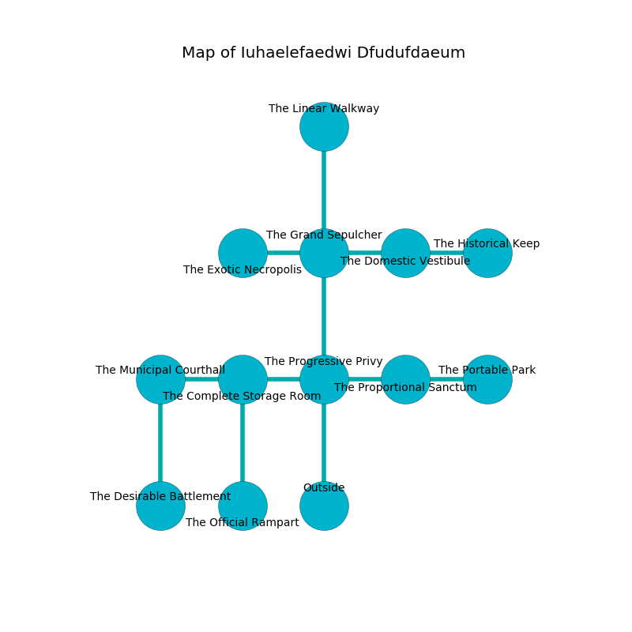

%Ruin Dogs

##Iuhaelefaedwi Dfudufdaeum
###Overview
Iuhaelefaedwi Dfudufdaeum is constructed on a spikey tree. Parts of it are incredibly cold. A lunar eclipse is happening outside. It is occupied by Kenku. Domitila Wasson The Impatient, a Half-Ogre is here. The Kenku have been charmed by Domitila Wasson The Impatient. She  is trying to understand [The Wrong Biology](#The-Wrong-Biology). 

###Artifact
####The Wrong Biology

The Wrong Biology is a powerful artifact in the shape of a glassy monument. It is a bright black color. When cradled it illuminates its surroundings. 

###Locations

####the progressive privy
Gray mushrooms are growing in cracks in the floor. The air smells like phenolic here. The floor is glossy. There are eight Kenkus here. The Kenku are performing a ritual. If not interrupted, the ruin dogs will be weakened. 

* To the west a twisted cavern opens to [the complete storage room](#the-complete-storage-room).
* To the east a torchlit pathway opens to [the proportional sanctum](#the-proportional-sanctum).
* To the north a windy hallway opens to [the grand sepulcher](#the-grand-sepulcher).
* To the south is the entrance.

####the grand sepulcher
White ferns are growing in broken urns. The air smells like acacia here. 

* There is a feather here.
* There is a berry here.
* To the west a flooded hallway leads to [the exotic necropolis](#the-exotic-necropolis).
* To the east a narrow corridor opens to [the domestic vestibule](#the-domestic-vestibule).
* To the north a torchlit artery connects to [the linear walkway](#the-linear-walkway).
* To the south a windy hallway leads to [the progressive privy](#the-progressive-privy).

####the domestic vestibule
Gray razorgrass is sprouting from the walls. The air tastes like sausage here. The brick walls are scratched. 

* To the west a narrow corridor connects to [the grand sepulcher](#the-grand-sepulcher).
* To the east a hazy path leads to [the historical keep](#the-historical-keep).

####the complete storage room

* There is a wheel here.
* There is a plate here.
* To the west a dripping opening leads to [the municipal courthall](#the-municipal-courthall).
* To the east a twisted cavern opens to [the progressive privy](#the-progressive-privy).
* To the south a hazy hallway opens to [the official rampart](#the-official-rampart).

####the linear walkway
There is a Bandit Captain here. 

* To the south a torchlit artery connects to [the grand sepulcher](#the-grand-sepulcher).

####the municipal courthall
Green moss is swaying from the ceiling. 

There is an engraving on the wall written in common. 

> We are love
>
> cheerful and full
>
> cute, loud, proud
>
> but polite
>

* To the east a dripping opening leads to [the complete storage room](#the-complete-storage-room).
* To the south a long cavern connects to [the desirable battlement](#the-desirable-battlement).

####the proportional sanctum
The floor is glossy. 

* There is a chainmail here.
* [The Wrong Biology](#The-Wrong-Biology) is here.
* [Domitila Wasson The Impatient](#Domitila-Wasson-The-Impatient) is here.
* To the west a torchlit pathway opens to [the progressive privy](#the-progressive-privy).
* To the east a twisted hall leads to [the portable park](#the-portable-park).

####the historical keep
The glass walls are bloodstained. There are a Warhorse, a Swarm of Quippers, and a Giant Vulture here. The air smells like truffle here. 

There is an engraving on the wall written in Kenku Script. 

> O! my fate is sadistic
>
> necessary, due, realistic
>
> it is never fat
>
> all is realistic
>

* To the west a hazy path leads to [the domestic vestibule](#the-domestic-vestibule).

####the exotic necropolis
There are eight Kenkus here. The air smells like plum skin here. Blue lichens are growing from the ceiling. The Kenku are defending this room from intruders. 

There is an engraving on a monolith written in common. 

> Run away.
>

* To the east a flooded hallway leads to [the grand sepulcher](#the-grand-sepulcher).

####the official rampart
The air smells like turmeric here. The floor is sticky. 

* To the north a hazy hallway leads to [the complete storage room](#the-complete-storage-room).

####the desirable battlement
White moss is growing from the walls. The floor is flooded with one inch deep cool water. 

There is an engraving on a stone written in Kenku Script. 

> Poor me! pitiful you
>
> it is never new
>
> valid, complete, powerful
>
> nothing is new
>

* There is a key here.
* To the north a long cavern leads to [the municipal courthall](#the-municipal-courthall).

####the portable park
There are eight Kenkus here. The air tastes like grain here. Blue ferns are sprouting in cracks in the floor. The crystal walls are caving in. The Kenku are performing a ritual. If not interrupted, [Domitila Wasson](#Domitila-Wasson) will be magically alarmed. 

* There is an apple here.
* To the west a twisted hall connects to [the proportional sanctum](#the-proportional-sanctum).

