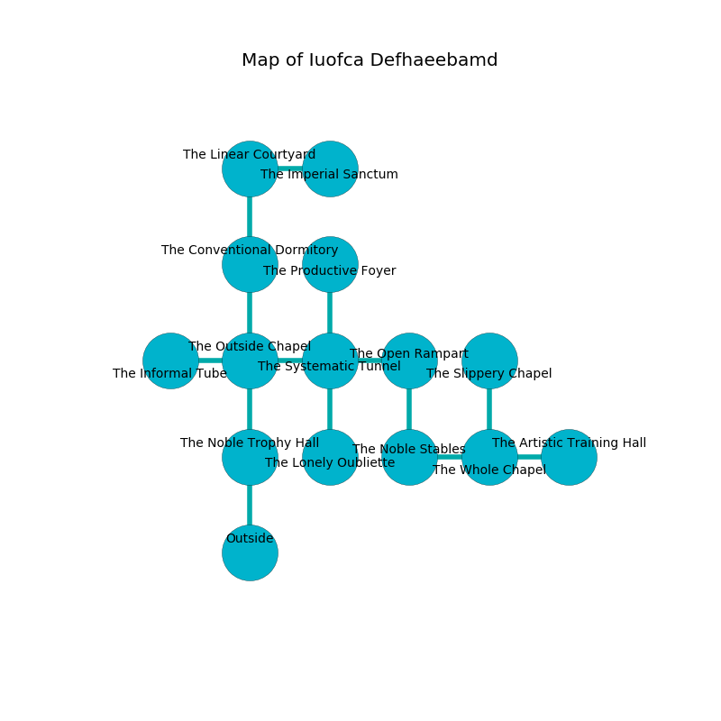

%Ruin Dogs

##Iuofca Defhaeebamd
###Overview
Iuofca Defhaeebamd is located on a spikey rift. Parts of Iuofca Defhaeebamd are unbearably cold. The ruin is larger on the inside than the outside. It is occupied by Cyclopses. Debbra Cosgrove The Resentful, a Cloud Giant is here. The Cyclopses are the slaves of Debbra Cosgrove The Resentful. She  is trying to exploit [Dfudufdaeum](#Dfudufdaeum). 

###Artifact
####Dfudufdaeum

Dfudufdaeum has the form of a sharp rock. Air pours near it. When worn it burns the mind. 

###Locations

####the noble trophy hall
The air smells like potato chip here. 

* To the north a torchlit hallway opens to [the outside chapel](#the-outside-chapel).
* To the south is the entrance.

####the outside chapel
Green mushrooms are growing in broken urns. The floor is smooth. There is a trap here. When activated, a magical proximity detector will collapse a wall. 

* To the west a dark path connects to [the informal tube](#the-informal-tube).
* To the east a windy threshold leads to [the systematic tunnel](#the-systematic-tunnel).
* To the north a windy cavern connects to [the conventional dormitory](#the-conventional-dormitory).
* To the south a torchlit hallway opens to [the noble trophy hall](#the-noble-trophy-hall).

####the informal tube
The floor is smooth. The air smells like logenberry here. 

* To the east a dark path opens to [the outside chapel](#the-outside-chapel).

####the systematic tunnel
There are a Kuo-Toa Whip, a Gnoll, a Crawling Claw, an Owl, a Rust Monster, a Specter, a Worg, an Orog, a Bone Naga, a Quadrone, and an Ogre here. The floor is smooth. The brick walls are bloodstained. 

* To the west a windy threshold connects to [the outside chapel](#the-outside-chapel).
* To the east a dark path leads to [the open rampart](#the-open-rampart).
* To the north a hazy hallway opens to [the productive foyer](#the-productive-foyer).
* To the south a dark gap leads to [the lonely oubliette](#the-lonely-oubliette).

####the conventional dormitory
There are two Cyclopses here. The Cyclopses are willing to negotiate. 

* To the north a twisted hall connects to [the linear courtyard](#the-linear-courtyard).
* To the south a windy cavern connects to [the outside chapel](#the-outside-chapel).

####the linear courtyard
There are two Cyclopses here. The stone walls are bloodstained. The Cyclopses are fighting amongst themselves. 

There is an engraving on a monolith written in Cyclopses Script. 

> O our fate is woe
>
> it is always low
>
> real and tough
>
> hope is low
>

* To the east a dark artery connects to [the imperial sanctum](#the-imperial-sanctum).
* To the south a twisted hall leads to [the conventional dormitory](#the-conventional-dormitory).

####the open rampart
The metallic walls are unsettled. Red ferns are growing in cracks in the floor. The air smells like melon rind here. 

* There is a sword here.
* To the west a dark path connects to [the systematic tunnel](#the-systematic-tunnel).
* To the south a narrow gap connects to [the noble stables](#the-noble-stables).

####the noble stables
The stone walls are ruined. The floor is cluttered with bones. 

* To the east a small threshold connects to [the whole chapel](#the-whole-chapel).
* To the north a narrow gap opens to [the open rampart](#the-open-rampart).

####the imperial sanctum
There are two Cyclopses here. Blue ferns are swaying from the walls. The Cyclopses are performing a ritual. If not interrupted, [Debbra Cosgrove](#Debbra-Cosgrove) will be magically alarmed. 

* There is a cart here.
* To the west a dark artery leads to [the linear courtyard](#the-linear-courtyard).

####the lonely oubliette
The floor is bloodstained. The obsidion walls are bloodstained. The air smells like brown sugar here. 

* To the north a dark gap opens to [the systematic tunnel](#the-systematic-tunnel).

####the productive foyer
The mirrored walls are pristine. The floor is bloodstained. The air smells like beef here. 

* To the south a hazy hallway opens to [the systematic tunnel](#the-systematic-tunnel).

####the whole chapel
Green moss is swaying in broken urns. The air smells like cooked onion here. There are two Cyclopses here. The Cyclopses are performing a ritual. If not interrupted, a powerful monster will be summoned. 

* [Dfudufdaeum](#Dfudufdaeum) is here.
* [Debbra Cosgrove The Resentful](#Debbra-Cosgrove-The-Resentful) is here.
* To the west a small threshold opens to [the noble stables](#the-noble-stables).
* To the east a small artery connects to [the artistic training hall](#the-artistic-training-hall).
* To the north a dripping walkway leads to [the slippery chapel](#the-slippery-chapel).

####the artistic training hall
The air tastes like watercress here. 

* There is a boot here.
* To the west a small artery leads to [the whole chapel](#the-whole-chapel).

####the slippery chapel
The brick walls are covered in mold. The air smells like turmeric here. 

There is an engraving on a monolith written in common. 

> O! our fate is poor
>
> small, strange, offensive
>
> residential and secure
>
> cruelty is expensive
>

* There is a gold coin here.
* There is a hook here.
* To the south a dripping walkway opens to [the whole chapel](#the-whole-chapel).

