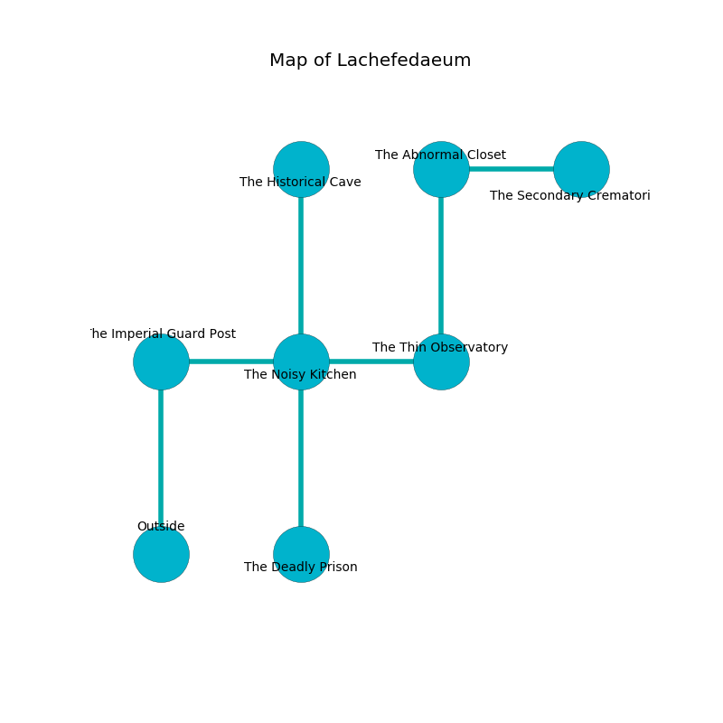

%Ruin Dogs

##Lachefedaeum
###Overview
Lachefedaeum is located under a poisoned plain. Some areas of it are somewhat hot. The ruin is coming to life. It is occupied by Lizardfolk. Efren Tallent The Unreliable, a Druid is here. The Lizardfolk are the minions of Efren Tallent The Unreliable. He  is founding a new religion. 

###Artifact
####Emehwiid Duhaedaecaeem

Emehwiid Duhaedaecaeem is a powerful artifact in the shape of a transparent crystal. Psychic energy pours from it. It is a light green color. When thrown it floats in the air. 

###Locations

####the imperial guard post
The brick walls are caving in. Red moss is decaying from the ceiling. 

* There is a berry here.
* There is a match here.
* [Efren Tallent The Unreliable](#Efren-Tallent-The-Unreliable) is here.
* To the east a dripping cave opens to [the noisy kitchen](#the-noisy-kitchen).
* To the south is the entrance.

####the noisy kitchen
The air smells like alcohol here. There is a Quaggoth Thonot here. The crystal walls are ruined. The floor is flooded with six inch deep lukewarm water. 

There is an engraving on a tablet written in common. 

> Try dying.
>

* There is a goat here.
* To the west a dripping cave connects to [the imperial guard post](#the-imperial-guard-post).
* To the east a flooded passageway connects to [the thin observatory](#the-thin-observatory).
* To the north a torchlit walkway leads to [the historical cave](#the-historical-cave).
* To the south a dark pathway leads to [the deadly prison](#the-deadly-prison).

####the historical cave
The floor is smooth. Red moss is decaying in broken urns. There are two Lizardfolk Shamans and a Lizardfolk here. The air tastes like egg yolk here. If the Lizardfolk notice the Ruin Dogs, one of them will retreat and alert the others. 

There is an engraving on a stone written in common. 

> Oh life is inhumane
>
> joint, occupational, vain
>
> violent, sad, marine
>
> fate is clean
>

* To the south a torchlit walkway connects to [the noisy kitchen](#the-noisy-kitchen).

####the deadly prison
The floor is cluttered with rocks. 

* To the north a dark pathway connects to [the noisy kitchen](#the-noisy-kitchen).

####the thin observatory
The floor is smooth. The air tastes like oatmeal here. 

* To the west a flooded passageway connects to [the noisy kitchen](#the-noisy-kitchen).
* To the north a hazy cavern opens to [the abnormal closet](#the-abnormal-closet).

####the abnormal closet
The crystal walls are unsettled. There are a Death Dog, a Blood Hawk, a Goblin, a Giant Frog, a Giant Lizard, a Fire Snake, and a Knight here. 

* [Emehwiid Duhaedaecaeem](#Emehwiid-Duhaedaecaeem) is here.
* To the east a torchlit threshold leads to [the secondary crematorium](#the-secondary-crematorium).
* To the south a hazy cavern opens to [the thin observatory](#the-thin-observatory).

####the secondary crematorium
The air smells like fish here. Green ferns are swaying in broken urns. 

* To the west a torchlit threshold connects to [the abnormal closet](#the-abnormal-closet).

