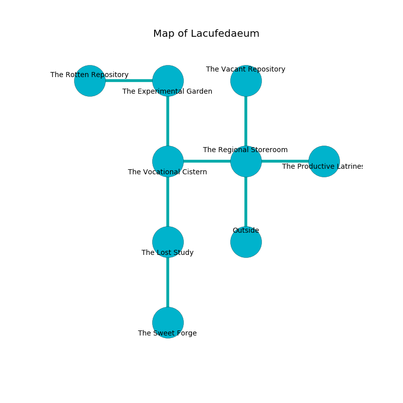

%Ruin Dogs

##Lacufedaeum
###Overview
Lacufedaeum is located on a flooded rift. Some rooms of Lacufedaeum are flooded. The ruin is collapsing slowly. It is occupied by Sahuagin. Fiona Corcoran The Interfering, a Hobgoblin Warlord is here. The Sahuagin are the soldiers of Fiona Corcoran The Interfering. She  is founding a new religion. 

###Artifact
####Imahg

Imahg is a powerful artifact in the shape of a transparent monument. Cacophony pours from it. When eaten it floats in the air. 

###Locations

####the regional storeroom
The mirrored walls are scratched. There are a Rug of Smothering, a Quaggoth, a Sahuagin Priestess, and a Steam Mephit here. 

* There is a plate here.
* To the west a narrow hallway opens to [the vocational cistern](#the-vocational-cistern).
* To the east a dripping artery leads to [the productive latrines](#the-productive-latrines).
* To the north a dripping corridor opens to [the vacant repository](#the-vacant-repository).
* To the south is the entrance.

####the vocational cistern
The air tastes like toasted grain here. 

* There is a bone here.
* To the east a narrow hallway connects to [the regional storeroom](#the-regional-storeroom).
* To the north a long corridor connects to [the experimental garden](#the-experimental-garden).
* To the south a long opening opens to [the lost study](#the-lost-study).

####the vacant repository
The floor is flooded with nine inch deep hot water. The brick walls are caving in. Green lichens are decaying in a patch on the floor. 

* There is a stocking here.
* To the south a dripping corridor leads to [the regional storeroom](#the-regional-storeroom).

####the lost study
There is a trap here. When activated, a magical proximity detector will shoot a lightning bolt. White ferns are decaying in cracks in the floor. The floor is flooded with one inch deep hot water. 

There is an engraving on the wall written in Sahuagin Script. 

> A bee is a hall
>
> magnetic and bold
>
> but cheerful
>
> you are hidden
>

* [Imahg](#Imahg) is here.
* To the north a long opening connects to [the vocational cistern](#the-vocational-cistern).
* To the south a dark threshold leads to [the sweet forge](#the-sweet-forge).

####the experimental garden
There are two Sahuagin and a Sahuagin Baron here. The air smells like cumin here. The floor is bloodstained. The Sahuagin are performing a ritual. If not interrupted, the Sahuagin will become more powerful. 

* To the west a twisted artery opens to [the rotten repository](#the-rotten-repository).
* To the south a long corridor leads to [the vocational cistern](#the-vocational-cistern).

####the rotten repository
There are a Tiger, a Steam Mephit, and a Black Pudding here. Blue razorgrass is swaying in cracks in the floor. The air smells like parsley here. 

* To the east a twisted artery leads to [the experimental garden](#the-experimental-garden).

####the productive latrines
The floor is smooth. The crystal walls are unsettled. There is a Sahuagin Baron here. Gray razorgrass is decaying in a patch on the floor. One of the Sahuagin Baron is on watch, the rest are drunk. 

* To the west a dripping artery connects to [the regional storeroom](#the-regional-storeroom).

####the sweet forge
The floor is glossy. Red moss is sprouting in a patch on the floor. The air tastes like oatmeal here. The obsidion walls are caving in. 

There is an engraving on the floor written in Sahuagin Script. 

> A glove is a football
>
> false and abstract
>

* There is a knot here.
* [Fiona Corcoran The Interfering](#Fiona-Corcoran-The-Interfering) is here.
* To the north a dark threshold connects to [the lost study](#the-lost-study).

