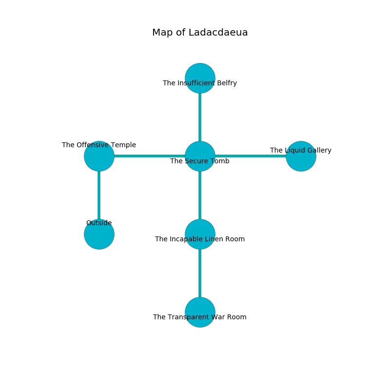

%Ruin Dogs

##Ladacdaeua
###Overview
Ladacdaeua is located on a poisoned city. Parts of it are somewhat cold. The ruin is burning. It is occupied by Centaurs. Julio Abel The Weak-Willed, a Spined Devil is here. The Centaurs are battling Julio Abel The Weak-Willed. She  is founding a new religion. 

###Artifact
####The Permanent Act

The Permanent Act looks like a soft prism. It is a bright yellow color. When smelled it glows with an eerie light. 

###Locations

####the offensive temple
The air smells like wood here. The obsidion walls are scratched. White moss is swaying in broken urns. 

There is an engraving on a stone written in common. 

> I am cruel.
>

* [Julio Abel The Weak-Willed](#Julio-Abel-The-Weak-Willed) is here.
* To the east a twisted cavern leads to [the secure tomb](#the-secure-tomb).
* To the south is the entrance.

####the secure tomb
The floor is sticky. There is a Blue Dragon Wyrmling here. 

* [The Permanent Act](#The-Permanent-Act) is here.
* To the west a twisted cavern leads to [the offensive temple](#the-offensive-temple).
* To the east a flooded hall opens to [the liquid gallery](#the-liquid-gallery).
* To the north a torchlit path opens to [the insufficient belfry](#the-insufficient-belfry).
* To the south a small gap leads to [the incapable linen room](#the-incapable-linen-room).

####the incapable linen room
There are a Troglodyte, a Giant Scorpion, and a Merfolk here. The air tastes like oak wood here. The wooden walls are scratched. 

* To the north a small gap opens to [the secure tomb](#the-secure-tomb).
* To the south a twisted cave opens to [the transparent war Room](#the-transparent-war-Room).

####the liquid gallery
The crystal walls are covered in mold. The air tastes like lily of the valley here. 

* There is a potato here.
* To the west a flooded hall opens to [the secure tomb](#the-secure-tomb).

####the transparent war Room
There is a trap here. When activated, a tripwire will launch stone blocks from the ceiling. The mirrored walls are ruined. There are a Wight, a Zombie, a Bat, and a Swarm of Insects here. 

* To the north a twisted cave connects to [the incapable linen room](#the-incapable-linen-room).

####the insufficient belfry
The floor is smooth. 

* To the south a torchlit path opens to [the secure tomb](#the-secure-tomb).

