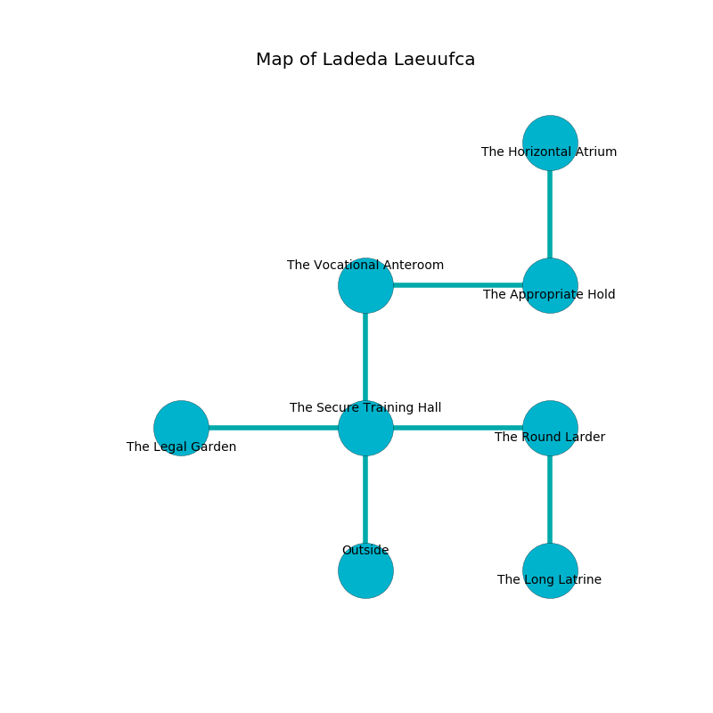

%Ruin Dogs

##Ladeda Laeuufca
###Overview
Ladeda Laeuufca is located under a broken mountain. Some areas of Ladeda Laeuufca are inaccessible. A lunar eclipse is happening outside. It is occupied by Drows. Bob Lantz The Intolerant, a Fire Giant is here. The Drows are the minions of Bob Lantz The Intolerant. He  is trying to destroy [Dfudufdaeum](#Dfudufdaeum). 

###Artifact
####Dfudufdaeum

Dfudufdaeum looks like a broken monument. It is a shifting gray color. Water shifts near it. When rubbed it becomes hot. 

###Locations

####the secure training hall
The obsidion walls are covered in mold. There are forty Drows here. One of the Drows is on watch, the rest are drunk. 

* To the west a torchlit pathway connects to [the legal garden](#the-legal-garden).
* To the east a dark artery opens to [the round larder](#the-round-larder).
* To the north a small pathway connects to [the vocational anteroom](#the-vocational-anteroom).
* To the south is the entrance.

####the vocational anteroom
Green moss is swaying from the ceiling. 

There is an engraving on a tablet written in Drows Script. 

> I tried praying.
>

* To the east a torchlit opening opens to [the appropriate hold](#the-appropriate-hold).
* To the south a small pathway connects to [the secure training hall](#the-secure-training-hall).

####the round larder
The mirrored walls are bloodstained. The air smells like immortelle here. 

* There is a cart here.
* To the west a dark artery connects to [the secure training hall](#the-secure-training-hall).
* To the south a torchlit threshold opens to [the long latrine](#the-long-latrine).

####the appropriate hold
The air smells like filbert here. Yellow moss is growing from the ceiling. There is a trap here. When activated, a tripwire will make the ceiling slowly lower. 

* [Dfudufdaeum](#Dfudufdaeum) is here.
* To the west a torchlit opening connects to [the vocational anteroom](#the-vocational-anteroom).
* To the north a narrow opening connects to [the horizontal atrium](#the-horizontal-atrium).

####the legal garden
The glass walls are pristine. There are forty Drows here. The floor is cluttered with shells. If the Drows notice the Ruin Dogs, one of them will retreat and alert [Bob Lantz](#Bob-Lantz). 

* There is a belt here.
* [Bob Lantz The Intolerant](#Bob-Lantz-The-Intolerant) is here.
* To the east a torchlit pathway connects to [the secure training hall](#the-secure-training-hall).

####the long latrine
There are a Hill Giant, an Ochre Jelly, a Silver Dragon Wyrmling, an Orc, and a Young White Dragon here. The brick walls are pristine. Green ferns are swaying in broken urns. 

* To the north a torchlit threshold opens to [the round larder](#the-round-larder).

####the horizontal atrium
The floor is bloodstained. The air smells like jasmin here. White moss is growing in cracks in the floor. There are a Green Slaad, a Satyr, a Rug of Smothering, and a Giant Spider here. 

* To the south a narrow opening opens to [the appropriate hold](#the-appropriate-hold).

