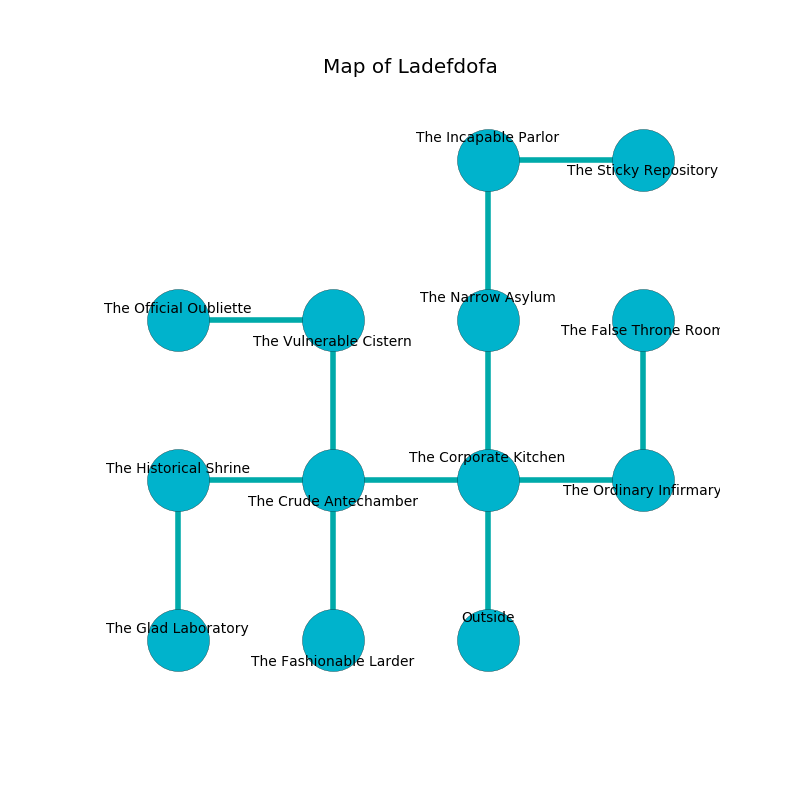

%Ruin Dogs

##Ladefdofa
###Overview
Ladefdofa is located on a volcanic city. Some rooms of Ladefdofa are frozen. A solar eclipse is happening outside. It is occupied by Harpies. Genaro Curry The Untrustworthy, a Cyclops is here. The Harpies are the minions of Genaro Curry The Untrustworthy. He  is founding a new religion. 

###Artifact
####The Liberal Replacement

The Liberal Replacement looks like a broken figurine. Gravity bends around it. It is a sickly orange color. It smells like mutton. When worn it shows an image of the future. 

###Locations

####the corporate kitchen
The floor is cluttered with debris. The concrete walls are covered in mold. Yellow ferns are growing from the ceiling. There are five Harpies here. The Harpies are willing to negotiate. 

* To the west a hazy threshold leads to [the crude antechamber](#the-crude-antechamber).
* To the east a flooded artery opens to [the ordinary infirmary](#the-ordinary-infirmary).
* To the north a hazy hallway connects to [the narrow asylum](#the-narrow-asylum).
* To the south is the entrance.

####the narrow asylum
The obsidion walls are unsettled. There are a Carrion Crawler, a Veteran, and a Yuan-Ti Pureblood here. The air tastes like egg yolk here. 

* To the north a twisted artery leads to [the incapable parlor](#the-incapable-parlor).
* To the south a hazy hallway opens to [the corporate kitchen](#the-corporate-kitchen).

####the crude antechamber
The floor is bloodstained. 

* There is a bell here.
* To the west a dripping gap opens to [the historical shrine](#the-historical-shrine).
* To the east a hazy threshold connects to [the corporate kitchen](#the-corporate-kitchen).
* To the north a flooded hall opens to [the vulnerable cistern](#the-vulnerable-cistern).
* To the south a hazy threshold connects to [the fashionable larder](#the-fashionable-larder).

####the fashionable larder

* To the north a hazy threshold leads to [the crude antechamber](#the-crude-antechamber).

####the vulnerable cistern
The air tastes like gas here. There are five Harpies here. The floor is sticky. Yellow razorgrass is growing in cracks in the floor. The Harpies are performing a ritual. If not interrupted, the ruin dogs will be weakened. 

There is an engraving on the ceiling written in Harpies Script. 

> I thought about dying.
>

* To the west a long walkway connects to [the official oubliette](#the-official-oubliette).
* To the south a flooded hall opens to [the crude antechamber](#the-crude-antechamber).

####the official oubliette
The floor is flooded with seven inch deep hot water. 

There is an engraving on a tablet written in common. 

> I lost [The Liberal Replacement](#The-Liberal-Replacement).
>

* There is a collar here.
* There is a brush here.
* To the east a long walkway connects to [the vulnerable cistern](#the-vulnerable-cistern).

####the historical shrine
The air smells like mango here. Yellow razorgrass is growing from the walls. The crystal walls are scratched. 

* There is a brain here.
* To the east a dripping gap connects to [the crude antechamber](#the-crude-antechamber).
* To the south a long cave leads to [the glad laboratory](#the-glad-laboratory).

####the ordinary infirmary
Blue razorgrass is sprouting in cracks in the floor. The floor is flooded with three inch deep scalding water. 

* [The Liberal Replacement](#The-Liberal-Replacement) is here.
* [Genaro Curry The Untrustworthy](#Genaro-Curry-The-Untrustworthy) is here.
* To the west a flooded artery connects to [the corporate kitchen](#the-corporate-kitchen).
* To the north a dripping path connects to [the false throne room](#the-false-throne-room).

####the incapable parlor
The floor is flooded with four inch deep hot water. Blue moss is sprouting from the ceiling. The brick walls are caving in. 

* There is a jewel here.
* To the east a dark hallway leads to [the sticky repository](#the-sticky-repository).
* To the south a twisted artery opens to [the narrow asylum](#the-narrow-asylum).

####the glad laboratory
Blue mushrooms are decaying in broken urns. 

* To the north a long cave opens to [the historical shrine](#the-historical-shrine).

####the sticky repository
The wooden walls are unsettled. Red moss is swaying from the walls. There are five Harpies here. The air smells like tangerine here. The floor is glossy. The Harpies are defending this room from intruders. 

There is an engraving on a stone written in Harpies Script. 

> All of us are lost
>
> civic, necessary, harmful
>
> tired, abnormal, even
>
> expected, accurate, well
>
> [The Liberal Replacement](#The-Liberal-Replacement)
>
> vulnerable and oral
>
> tidy and surprising
>
> yet never supplementary
>
> but typical
>
> you shall be frozen
>

* There is a girl here.
* To the west a dark hallway opens to [the incapable parlor](#the-incapable-parlor).

####the false throne room
The brick walls are bloodstained. There is a trap here. When activated, a pressure plate will launch a fireball. The air tastes like caramel here. 

* To the south a dripping path leads to [the ordinary infirmary](#the-ordinary-infirmary).

