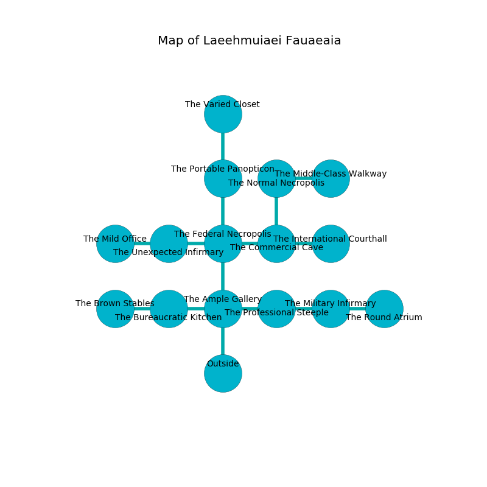

%Ruin Dogs

##Laeehmuiaei Fauaeaia
###Overview
Laeehmuiaei Fauaeaia is constructed on a spikey city. Regions of it are cursed. The ruin is sinking into the earth. It is occupied by Sahuagins. Jeana Chavis The Domineering, a Sahuagin Baron is here. The Sahuagins are the minions of Jeana Chavis The Domineering. She  is founding a new religion. 

###Artifact
####Gauaf

Gauaf has the form of a glassy cube. It smells like pecan. It is a sickly purple color. When held it changes probabilities. 

###Locations

####the ample gallery
Yellow moss is swaying in cracks in the floor. 

* To the west a long cave leads to [the bureaucratic kitchen](#the-bureaucratic-kitchen).
* To the east a long walkway connects to [the professional steeple](#the-professional-steeple).
* To the north a narrow gap opens to [the federal necropolis](#the-federal-necropolis).
* To the south is the entrance.

####the federal necropolis
The floor is sticky. 

* To the west a small hall leads to [the unexpected infirmary](#the-unexpected-infirmary).
* To the east a twisted cave opens to [the commercial cave](#the-commercial-cave).
* To the north a windy walkway leads to [the portable panopticon](#the-portable-panopticon).
* To the south a narrow gap connects to [the ample gallery](#the-ample-gallery).

####the bureaucratic kitchen
Blue lichens are decaying from the ceiling. The crystal walls are pristine. 

* To the west a narrow hallway opens to [the brown stables](#the-brown-stables).
* To the east a long cave leads to [the ample gallery](#the-ample-gallery).

####the brown stables
The brick walls are unsettled. The floor is sticky. Red ferns are sprouting in cracks in the floor. 

* To the east a narrow hallway leads to [the bureaucratic kitchen](#the-bureaucratic-kitchen).

####the unexpected infirmary
Gray ferns are decaying in a patch on the floor. The obsidion walls are ruined. There are a Troglodyte, a Giant Weasel, a Revenant, a Pixie, a Polar Bear, and a Griffon here. 

* To the west a hazy hallway connects to [the mild office](#the-mild-office).
* To the east a small hall leads to [the federal necropolis](#the-federal-necropolis).

####the portable panopticon
The floor is smooth. There is a trap here. When activated, a magical sound detector will collapse a column. The air tastes like grain here. 

* There is a door here.
* There is a nail here.
* [Gauaf](#Gauaf) is here.
* To the north a twisted path opens to [the varied closet](#the-varied-closet).
* To the south a windy walkway connects to [the federal necropolis](#the-federal-necropolis).

####the commercial cave
The floor is glossy. Yellow moss is sprouting in broken urns. The air tastes like lard here. The stone walls are pristine. 

* To the west a twisted cave connects to [the federal necropolis](#the-federal-necropolis).
* To the east a long walkway connects to [the international courthall](#the-international-courthall).
* To the north a small hall connects to [the normal necropolis](#the-normal-necropolis).

####the professional steeple
The floor is bloodstained. 

There is an engraving on the wall written in common. 

> A book is a limit
>
> current and arrogant
>
> reckless and married
>
> you will be crystalized
>

* To the west a long walkway connects to [the ample gallery](#the-ample-gallery).
* To the east a small passageway leads to [the military infirmary](#the-military-infirmary).

####the normal necropolis
White razorgrass is sprouting in cracks in the floor. The concrete walls are scratched. The air smells like currant here. 

* To the east a hazy gap opens to [the middle-class walkway](#the-middle-class-walkway).
* To the south a small hall opens to [the commercial cave](#the-commercial-cave).

####the international courthall
The air smells like rose here. 

* To the west a long walkway opens to [the commercial cave](#the-commercial-cave).

####the middle-class walkway
The concrete walls are ruined. There are a Bugbear Chief, a Goat, a Couatl, and a Boar here. 

* [Jeana Chavis The Domineering](#Jeana-Chavis-The-Domineering) is here.
* To the west a hazy gap leads to [the normal necropolis](#the-normal-necropolis).

####the military infirmary
There are three Sahuagin Priestesses here. The Sahuagins are berserk with rage. 

There is an engraving on a monolith written in Sahuagins Script. 

> Dear me! dire you
>
> able, fat, new
>
> yet bureaucratic
>
> everything is automatic
>

* To the west a small passageway opens to [the professional steeple](#the-professional-steeple).
* To the east a flooded artery connects to [the round atrium](#the-round-atrium).

####the round atrium
The mirrored walls are pristine. Yellow ferns are decaying in broken urns. The air smells like red apple here. There is a trap here. When activated, a tripwire will make the walls close in. 

* To the west a flooded artery connects to [the military infirmary](#the-military-infirmary).

####the mild office

* To the east a hazy hallway opens to [the unexpected infirmary](#the-unexpected-infirmary).

####the varied closet
The brick walls are scratched. Gray mushrooms are swaying in broken urns. There are two Satyrs, a Grell, a Hippogriff, and  here. 

There is an engraving on the wall written in Sahuagins Script. 

> I am lost.
>

* To the south a twisted path opens to [the portable panopticon](#the-portable-panopticon).

