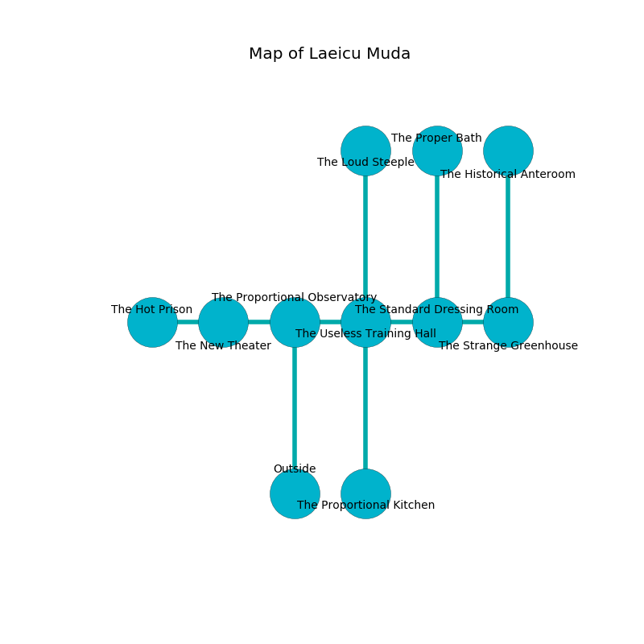

%Ruin Dogs

##Laeicu Muda
###Overview
Laeicu Muda is constructed on a spikey rift. Regions of it are flooded. The ruin is coming to life. It is occupied by Ogres. Howard Mooney The Pessimistic, a Hobgoblin Captain is here. The Ogres are the soldiers of Howard Mooney The Pessimistic. He  is trying to recover [Iohhaidaeum Geaefwi](#Iohhaidaeum-Geaefwi). 

###Artifact
####Iohhaidaeum Geaefwi

Iohhaidaeum Geaefwi is a powerful artifact in the shape of a mushy crystal. Power flows from it. When eaten it becomes a deadly projectile. 

###Locations

####the proportional observatory
Gray lichens are growing in a patch on the floor. 

* There is a stocking here.
* To the west a windy path connects to [the new theater](#the-new-theater).
* To the east a long passageway connects to [the useless training hall](#the-useless-training-hall).
* To the south is the entrance.

####the useless training hall
There are a Half-Ogre and two Ogres here. The floor is flooded with six inch deep cool water. The stone walls are scratched. One of the Ogres is on watch, the rest are fighting amongst themselves. 

* To the west a long passageway leads to [the proportional observatory](#the-proportional-observatory).
* To the east a twisted threshold connects to [the standard dressing room](#the-standard-dressing-room).
* To the north a dripping passageway connects to [the loud steeple](#the-loud-steeple).
* To the south a torchlit threshold leads to [the proportional kitchen](#the-proportional-kitchen).

####the standard dressing room
The floor is sticky. The wooden walls are ruined. There are two Half-Ogres and an Ogre here. The air smells like burnt sugar here. The Ogres are willing to negotiate. 

* To the west a twisted threshold opens to [the useless training hall](#the-useless-training-hall).
* To the east a windy artery leads to [the strange greenhouse](#the-strange-greenhouse).
* To the north a flooded pathway opens to [the proper bath](#the-proper-bath).

####the strange greenhouse
Gray lichens are decaying in a patch on the floor. 

* To the west a windy artery leads to [the standard dressing room](#the-standard-dressing-room).
* To the north a windy gap leads to [the historical anteroom](#the-historical-anteroom).

####the loud steeple
The concrete walls are bloodstained. There are a Swarm of Rats, an Intellect Devourer, a Sea Hag, and a Giant Vulture here. 

* To the south a dripping passageway connects to [the useless training hall](#the-useless-training-hall).

####the proper bath
The glass walls are scratched. 

There is an engraving on the wall written in Ogres Script. 

> I lost [Iohhaidaeum Geaefwi](#Iohhaidaeum-Geaefwi).
>
> I tried dying.
>

* To the south a flooded pathway leads to [the standard dressing room](#the-standard-dressing-room).

####the historical anteroom
There are a Half-Ogre and two Ogres here. If the Ogres notice the Ruin Dogs, one of them will retreat and alert [Howard Mooney](#Howard-Mooney). 

* There is a spirit here.
* To the south a windy gap opens to [the strange greenhouse](#the-strange-greenhouse).

####the proportional kitchen
There is a trap here. When activated, a magical sound detector will extend a spring loaded spear. The floor is glossy. Blue lichens are swaying in cracks in the floor. 

* To the north a torchlit threshold leads to [the useless training hall](#the-useless-training-hall).

####the new theater
Blue razorgrass is sprouting in cracks in the floor. The wooden walls are caving in. The floor is glossy. 

There is an engraving on a monolith written in common. 

> A finger is a design
>
> bad and conservative
>
> smooth, obese, dull
>
> sad, assertive, revolutionary
>
> [Iohhaidaeum Geaefwi](#Iohhaidaeum-Geaefwi)
>
> but never chronic
>
> straight, cold, unpleasant
>
> you shall be captured
>

* There is a finger here.
* [Iohhaidaeum Geaefwi](#Iohhaidaeum-Geaefwi) is here.
* To the west a torchlit hallway opens to [the hot prison](#the-hot-prison).
* To the east a windy path opens to [the proportional observatory](#the-proportional-observatory).

####the hot prison
The metallic walls are covered in mold. 

* [Howard Mooney The Pessimistic](#Howard-Mooney-The-Pessimistic) is here.
* To the east a torchlit hallway connects to [the new theater](#the-new-theater).

