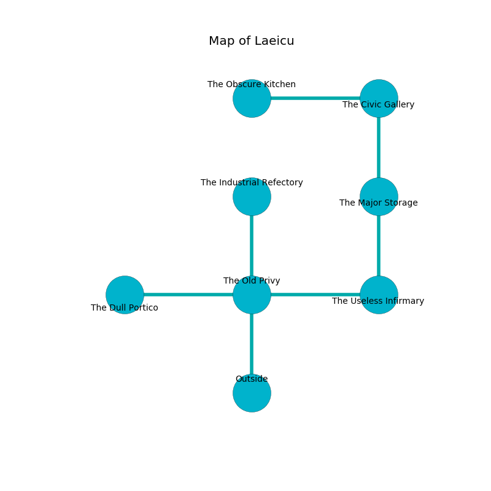

%Ruin Dogs

##Laeicu
###Overview
Laeicu is located in a crystal tree. Parts of Laeicu are flooded. The ruin is flooding. It is occupied by Thri-Kreens. Dante Brown The Domineering, a Cloud Giant is here. The Thri-Kreens are the slaves of Dante Brown The Domineering. He  is founding a new religion. 

###Artifact
####The Wild Auditor

The Wild Auditor looks like a smooth amulet. It is a shifting pink color. When smelled it levitates those nearby. 

###Locations

####the old privy
The floor is bloodstained. Blue razorgrass is decaying in broken urns. The air smells like moss here. 

* To the west a dark hall leads to [the dull portico](#the-dull-portico).
* To the east a torchlit walkway leads to [the useless infirmary](#the-useless-infirmary).
* To the north a twisted hall leads to [the industrial refectory](#the-industrial-refectory).
* To the south is the entrance.

####the useless infirmary
The floor is cluttered with debris. The air smells like fennel here. There are nine Thri-Kreens here. The Thri-Kreens are celebrating. 

* To the west a torchlit walkway leads to [the old privy](#the-old-privy).
* To the north a dark cavern connects to [the major storage](#the-major-storage).

####the major storage
The floor is smooth. The air smells like cream here. 

* To the north a windy corridor opens to [the civic gallery](#the-civic-gallery).
* To the south a dark cavern leads to [the useless infirmary](#the-useless-infirmary).

####the civic gallery
The air tastes like boysenberry here. 

* [The Wild Auditor](#The-Wild-Auditor) is here.
* To the west a dripping gap connects to [the obscure kitchen](#the-obscure-kitchen).
* To the south a windy corridor leads to [the major storage](#the-major-storage).

####the industrial refectory
The floor is cluttered with ashes. There are a Salamander, a Lion, and a Drow Elite Warrior here. The air tastes like dates here. The mirrored walls are scratched. 

* [Dante Brown The Domineering](#Dante-Brown-The-Domineering) is here.
* To the south a twisted hall connects to [the old privy](#the-old-privy).

####the dull portico
The air tastes like coffee here. There are a Blink Dog, a Giant Owl, a Bandit Captain, a Pixie, a Young Black Dragon, a Copper Dragon Wyrmling, and a Bat here. Green mushrooms are sprouting in broken urns. 

There is an engraving on the wall written in common. 

> [The Wild Auditor](#The-Wild-Auditor)
>
> yet never rotten
>
> [The Wild Auditor](#The-Wild-Auditor)
>

* To the east a dark hall connects to [the old privy](#the-old-privy).

####the obscure kitchen
The floor is sticky. Gray lichens are sprouting in broken urns. The obsidion walls are covered in mold. 

* To the east a dripping gap opens to [the civic gallery](#the-civic-gallery).

