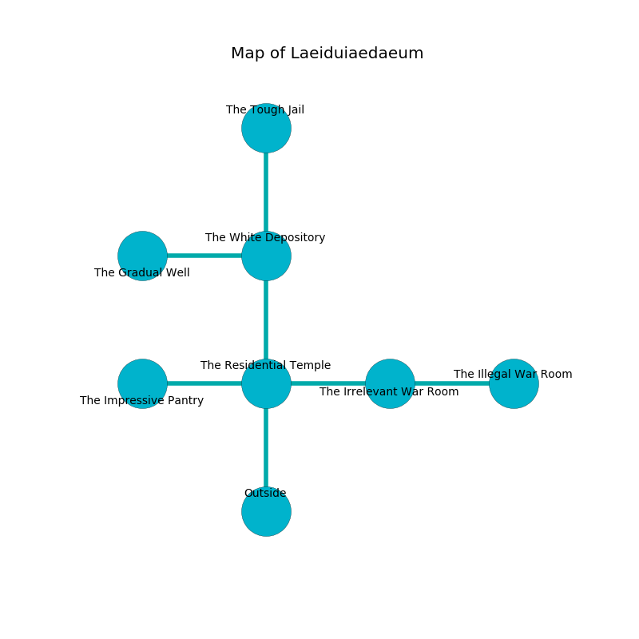

%Ruin Dogs

##Laeiduiaedaeum
###Overview
Laeiduiaedaeum is located under a flooded city. Some rooms of it are inaccessible. A blizzard is happening outside. It is occupied by Humans. Fritz Kroll The Perverse, a Myconid Sovereign is here. The Humans are ruled by Fritz Kroll The Perverse. He  is trying to research [The Bold Diagnosis](#The-Bold-Diagnosis). 

###Artifact
####The Bold Diagnosis

The Bold Diagnosis has the form of a broken orb. It is a shifting green color. Gravity glows away from it. When gazed upon it becomes a shielding force. 

###Locations

####the residential temple
There are a Pony, a Wolf, a Swarm of Quippers, and a Merrow here. 

* There is a fowl here.
* [The Bold Diagnosis](#The-Bold-Diagnosis) is here.
* To the west a dark opening connects to [the impressive pantry](#the-impressive-pantry).
* To the east a windy cave connects to [the irrelevant war Room](#the-irrelevant-war-Room).
* To the north a dark corridor connects to [the white depository](#the-white-depository).
* To the south is the entrance.

####the white depository
Red razorgrass is growing in broken urns. There are a Giant Constrictor Snake and a Gnoll Pack Lord here. The floor is bloodstained. The air tastes like ozone here. 

* To the west a small gap connects to [the gradual well](#the-gradual-well).
* To the north a long hallway connects to [the tough jail](#the-tough-jail).
* To the south a dark corridor opens to [the residential temple](#the-residential-temple).

####the gradual well
The metallic walls are scratched. The floor is smooth. There are a Quasit, a Thri-Kreen, and a Knight here. There is a trap here. When activated, a magical sound detector will launch stone blocks from the ceiling. 

There is an engraving on the wall written in common. 

> Treasure here.
>

* There is a bone here.
* [Fritz Kroll The Perverse](#Fritz-Kroll-The-Perverse) is here.
* To the east a small gap leads to [the white depository](#the-white-depository).

####the irrelevant war Room
The floor is glossy. White moss is decaying from the walls. The air smells like violet leaf here. The obsidion walls are ruined. There are a Scout, a Bandit Captain, and a Priest here. One of the Humans is working a mechanism that can open a trapodoor in the floor. 

* To the west a windy cave leads to [the residential temple](#the-residential-temple).
* To the east a windy cave opens to [the illegal war Room](#the-illegal-war-Room).

####the illegal war Room
The floor is glossy. Gray razorgrass is decaying from the walls. There is a trap here. When activated, a magical rune will collapse a wall. The air smells like rhubarb here. 

* To the west a windy cave connects to [the irrelevant war Room](#the-irrelevant-war-Room).

####the tough jail
The air tastes like pineapple here. 

* To the south a long hallway connects to [the white depository](#the-white-depository).

####the impressive pantry
Yellow razorgrass is decaying from the walls. The air tastes like quince here. There are a Badger, a Spider, a Jackalwere, a Swarm of Insects, an Axe Beak, a Bugbear Chief, a Winged Kobold, and a Merfolk here. 

There is an engraving on a monolith written in common. 

> I discovered [The Bold Diagnosis](#The-Bold-Diagnosis).
>
> Go away.
>

* To the east a dark opening opens to [the residential temple](#the-residential-temple).

