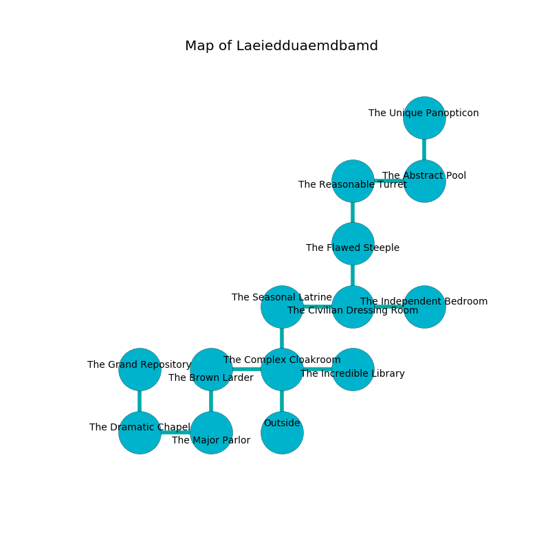

%Ruin Dogs

##Laeiedduaemdbamd
###Overview
Laeiedduaemdbamd is located under a poisoned mountain. Some areas of it are flooded. A lunar eclipse is happening outside. It is occupied by Lizardfolk. Peter Rossi The Truculent, a Hobgoblin Captain is here. The Lizardfolk are battling Peter Rossi The Truculent. He  is founding a new religion. 

###Artifact
####Laidfocdaeum Amdfwi

Laidfocdaeum Amdfwi has the form of a hard cube. It smells like dill. When gazed upon it destroys itself. 

###Locations

####the complex cloakroom
The air smells like spinach here. The floor is smooth. There are a Lizardfolk Shaman and four Lizardfolk here. If the Lizardfolk notice the Ruin Dogs, one of them will retreat and alert the others. 

* There is a table here.
* To the west a small hallway connects to [the brown larder](#the-brown-larder).
* To the east a torchlit threshold connects to [the incredible library](#the-incredible-library).
* To the north a hazy corridor opens to [the seasonal latrine](#the-seasonal-latrine).
* To the south is the entrance.

####the brown larder
Green ferns are sprouting in broken urns. The concrete walls are bloodstained. 

* There is a baby here.
* To the east a small hallway opens to [the complex cloakroom](#the-complex-cloakroom).
* To the south a windy cave leads to [the major parlor](#the-major-parlor).

####the incredible library
The air tastes like fish here. The floor is smooth. 

* To the west a torchlit threshold opens to [the complex cloakroom](#the-complex-cloakroom).

####the seasonal latrine
Gray ferns are swaying in cracks in the floor. The air smells like vanilla here. There are a Manticore, a Merrow, and a Giant Badger here. 

* To the east a small cave opens to [the civilian dressing room](#the-civilian-dressing-room).
* To the south a hazy corridor leads to [the complex cloakroom](#the-complex-cloakroom).

####the civilian dressing room
There are a Doppelganger, a Harpy, and a Giant Centipede here. There is a trap here. When activated, a magical sound detector will collapse a wall. The air smells like lemon here. 

* There is a roof here.
* To the west a small cave opens to [the seasonal latrine](#the-seasonal-latrine).
* To the east a narrow opening opens to [the independent bedroom](#the-independent-bedroom).
* To the north a torchlit hallway opens to [the flawed steeple](#the-flawed-steeple).

####the major parlor
There are a Spined Devil, a Giant Scorpion, a Camel, and a Manes here. The air smells like nut skin here. 

There is an engraving on a stone written in Lizardfolk Script. 

> [Laidfocdaeum Amdfwi](#Laidfocdaeum-Amdfwi)
>
> but attractive
>
> straight and right
>
> you are not cursed
>

* To the west a dripping cave connects to [the dramatic chapel](#the-dramatic-chapel).
* To the north a windy cave opens to [the brown larder](#the-brown-larder).

####the flawed steeple
The air tastes like honeysuckle here. The glass walls are caving in. 

* To the north a windy hall connects to [the reasonable turret](#the-reasonable-turret).
* To the south a torchlit hallway connects to [the civilian dressing room](#the-civilian-dressing-room).

####the reasonable turret
The air tastes like resin here. White razorgrass is growing in a patch on the floor. 

* To the east a long hall connects to [the abstract pool](#the-abstract-pool).
* To the south a windy hall opens to [the flawed steeple](#the-flawed-steeple).

####the abstract pool
The brick walls are covered in mold. There are a Lizardfolk Shaman and four Lizardfolk here. Green moss is sprouting from the walls. The Lizardfolk are drunk. 

* [Laidfocdaeum Amdfwi](#Laidfocdaeum-Amdfwi) is here.
* To the west a long hall opens to [the reasonable turret](#the-reasonable-turret).
* To the north a flooded threshold leads to [the unique panopticon](#the-unique-panopticon).

####the dramatic chapel
The air smells like lilac here. Yellow lichens are sprouting from the walls. 

* There is a knife here.
* To the east a dripping cave opens to [the major parlor](#the-major-parlor).
* To the north a windy path opens to [the grand repository](#the-grand-repository).

####the independent bedroom
The concrete walls are covered in mold. The floor is sticky. 

* There is a leaf here.
* [Peter Rossi The Truculent](#Peter-Rossi-The-Truculent) is here.
* To the west a narrow opening leads to [the civilian dressing room](#the-civilian-dressing-room).

####the grand repository
Yellow razorgrass is swaying from the ceiling. The glass walls are unsettled. There are a Yeti and a Shadow Demon here. 

There is an engraving on a tablet written in common. 

> I am lovely.
>
> I thought about leaving.
>

* To the south a windy path opens to [the dramatic chapel](#the-dramatic-chapel).

####the unique panopticon
The floor is flooded with one inch deep cold water. The brick walls are ruined. 

There is an engraving on the wall written in common. 

> I am lost in Laeiedduaemdbamd.
>
> Go away.
>

* To the south a flooded threshold connects to [the abstract pool](#the-abstract-pool).

