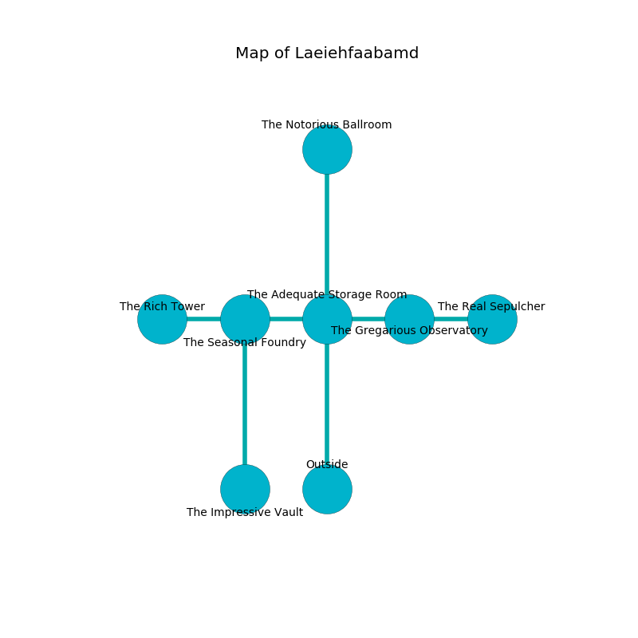

%Ruin Dogs

##Laeiehfaabamd
###Overview
Laeiehfaabamd is located on a cursed plain. Some rooms of it are flooded. The ruin is collapsing slowly. It is occupied by Sahuagins. Casey Wilkinson The Compulsive, an Orc War Chief is here. The Sahuagins are battling Casey Wilkinson The Compulsive. He  is trying to discover [Laeidhewi Oia](#Laeidhewi-Oia). 

###Artifact
####Laeidhewi Oia

Laeidhewi Oia looks like a soft rock. It is a shifting brown color. When carried it illuminates its surroundings. 

###Locations

####the adequate storage room
The concrete walls are pristine. The floor is smooth. There are a Saber-Toothed Tiger, a Giant Bat, a Goat, a Pseudodragon, and a Goblin Boss here. 

There is an engraving on the wall written in Sahuagins Script. 

> I am seeking [Laeidhewi Oia](#Laeidhewi-Oia).
>
> Go away.
>

* [Laeidhewi Oia](#Laeidhewi-Oia) is here.
* To the west a dark cave opens to [the seasonal foundry](#the-seasonal-foundry).
* To the east a flooded walkway opens to [the gregarious observatory](#the-gregarious-observatory).
* To the north a flooded gap opens to [the notorious ballroom](#the-notorious-ballroom).
* To the south is the entrance.

####the gregarious observatory
White lichens are decaying in cracks in the floor. There are a Water Weird, a Cockatrice, an Eagle, and a Tridrone here. The floor is smooth. 

* To the west a flooded walkway leads to [the adequate storage room](#the-adequate-storage-room).
* To the east a dark hall opens to [the real sepulcher](#the-real-sepulcher).

####the real sepulcher
There are two Sahuagin Priestesses here. Green lichens are decaying from the walls. The floor is sticky. The air smells like asparagus here. The Sahuagins are drunk. 

* There is a shield here.
* [Casey Wilkinson The Compulsive](#Casey-Wilkinson-The-Compulsive) is here.
* To the west a dark hall leads to [the gregarious observatory](#the-gregarious-observatory).

####the seasonal foundry
Red moss is growing from the walls. The air smells like buttery	cabbage here. The wooden walls are unsettled. The floor is bloodstained. 

* To the west a narrow artery opens to [the rich tower](#the-rich-tower).
* To the east a dark cave leads to [the adequate storage room](#the-adequate-storage-room).
* To the south a dripping walkway opens to [the impressive vault](#the-impressive-vault).

####the impressive vault
There is a Yuan-Ti Malison here. The glass walls are bloodstained. The floor is smooth. The air tastes like fennel here. There is a trap here. When activated, a magical proximity detector will launch a fusillade of darts. 

There is an engraving on the wall written in Sahuagins Script. 

> I tried praying.
>

* There is a specter here.
* To the north a dripping walkway leads to [the seasonal foundry](#the-seasonal-foundry).

####the rich tower
The obsidion walls are unsettled. 

* There is a head here.
* To the east a narrow artery opens to [the seasonal foundry](#the-seasonal-foundry).

####the notorious ballroom
Gray mushrooms are swaying in a patch on the floor. The metallic walls are scratched. The floor is glossy. There are a Flumph, a Kenku, a Bugbear, and an Ettercap here. The air smells like baked potato here. 

* There is a sword here.
* To the south a flooded gap connects to [the adequate storage room](#the-adequate-storage-room).

