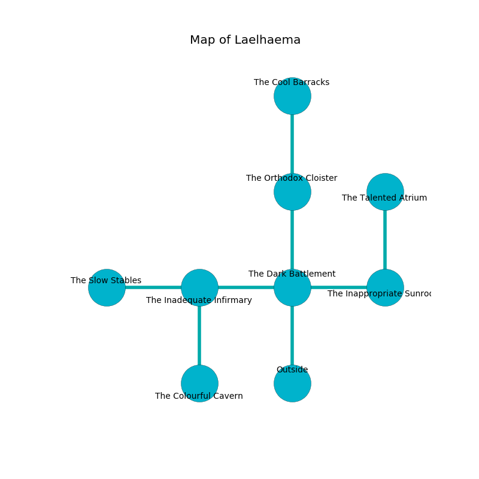

%Ruin Dogs

##Laelhaema
###Overview
Laelhaema is located on a crystal city. Parts of Laelhaema are corrupted. A blizzard is happening outside. It is occupied by Yuan-Ti. Kiyoko Heard The Foolhardy, a Mind Flayer is here. The Yuan-Ti worship Kiyoko Heard The Foolhardy. She  is trying to exploit [Cuaemd](#Cuaemd). 

###Artifact
####Cuaemd

Cuaemd is a powerful artifact in the shape of a hard monument. Light incinerates around it. It smells like goat. When smelled it changes probabilities. 

###Locations

####the dark battlement
There is a trap here. When activated, a magical rune will launch a hail of needles. The air tastes like pepper here. Yellow ferns are growing in a patch on the floor. The floor is sticky. 

* To the west a long corridor connects to [the inadequate infirmary](#the-inadequate-infirmary).
* To the east a windy pathway leads to [the inappropriate sunroom](#the-inappropriate-sunroom).
* To the north a torchlit cave leads to [the orthodox cloister](#the-orthodox-cloister).
* To the south is the entrance.

####the inadequate infirmary
The floor is smooth. There are three Yuan-Ti Purebloods, a Yuan-Ti Abomination, a Yuan-Ti Malison,  here. One of the Yuan-Ti is on watch, the rest are sleeping. 

* To the west a dripping pathway connects to [the slow stables](#the-slow-stables).
* To the east a long corridor connects to [the dark battlement](#the-dark-battlement).
* To the south a torchlit walkway connects to [the colourful cavern](#the-colourful-cavern).

####the inappropriate sunroom
The air tastes like violet leaf here. The glass walls are pristine. There are a Magma Mephit, a Flameskull, and a Barlgura here. The floor is cluttered with rocks. Red lichens are growing from the walls. 

* To the west a windy pathway connects to [the dark battlement](#the-dark-battlement).
* To the north a dripping corridor connects to [the talented atrium](#the-talented-atrium).

####the orthodox cloister
There are a Yuan-Ti Abomination and two Yuan-Ti Malisons here. The crystal walls are scratched. The floor is glossy. Red mushrooms are swaying from the ceiling. If the Yuan-Ti notice the Ruin Dogs, one of them will retreat and alert [Kiyoko Heard](#Kiyoko-Heard). 

* [Cuaemd](#Cuaemd) is here.
* To the north a flooded threshold connects to [the cool barracks](#the-cool-barracks).
* To the south a torchlit cave opens to [the dark battlement](#the-dark-battlement).

####the colourful cavern
The floor is bloodstained. There are a Yuan-Ti Pureblood, a Yuan-Ti Abomination, and a Yuan-Ti Malison here. The metallic walls are covered in mold. Gray lichens are swaying from the walls. The Yuan-Ti are meditating. 

* To the north a torchlit walkway leads to [the inadequate infirmary](#the-inadequate-infirmary).

####the slow stables
The stone walls are covered in mold. There are a Yuan-Ti Abomination and two Yuan-Ti Malisons here. There is a trap here. When activated, a magical proximity detector will launch a rolling boulder. The Yuan-Ti are performing a ritual. If not interrupted, the Yuan-Ti will become more powerful. 

There is an engraving on a tablet written in Yuan-Ti Script. 

> I worship [Cuaemd](#Cuaemd).
>
> I tried praying.
>

* To the east a dripping pathway leads to [the inadequate infirmary](#the-inadequate-infirmary).

####the talented atrium
The glass walls are caving in. 

There is an engraving on the ceiling written in common. 

> I was injured in Laelhaema.
>

* [Kiyoko Heard The Foolhardy](#Kiyoko-Heard-The-Foolhardy) is here.
* To the south a dripping corridor leads to [the inappropriate sunroom](#the-inappropriate-sunroom).

####the cool barracks
The air smells like roasted meaty here. White lichens are decaying from the ceiling. The mirrored walls are ruined. The floor is flooded with two inch deep scalding water. There are a Yuan-Ti Abomination and a Yuan-Ti Malison here. The Yuan-Ti are feasting. 

* There is a pin here.
* To the south a flooded threshold connects to [the orthodox cloister](#the-orthodox-cloister).

