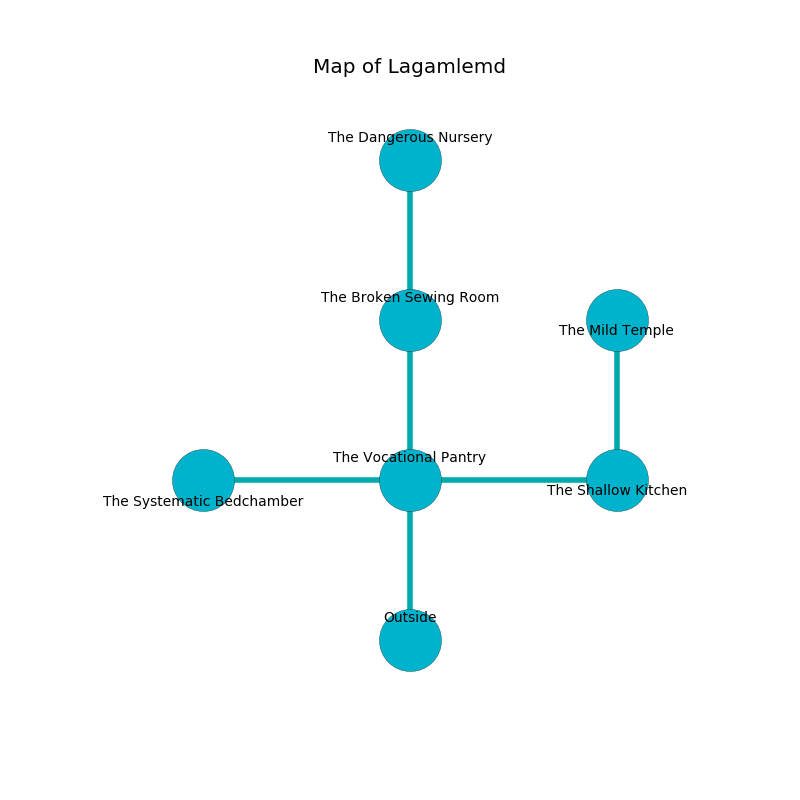

%Ruin Dogs

##Lagamlemd
###Overview
Lagamlemd is constructed on a spikey rift. Parts of it are unbearably hot. The ruin is burning. It is occupied by Sahuagins. Miriam Hunt The Intolerant, a Stone Giant is here. The Sahuagins are battling Miriam Hunt The Intolerant. She  is trying to exploit [Dfagafamca](#Dfagafamca). 

###Artifact
####Dfagafamca

Dfagafamca has the form of an opaque amulet. Magic slides from it. It smells like currant bud. When worn it projects energy. 

###Locations

####the vocational pantry
Gray lichens are sprouting in cracks in the floor. There is a trap here. When activated, a magical rune will close a portcullis. The glass walls are unsettled. 

* [Miriam Hunt The Intolerant](#Miriam-Hunt-The-Intolerant) is here.
* To the west a flooded path connects to [the systematic bedchamber](#the-systematic-bedchamber).
* To the east a dark threshold leads to [the shallow kitchen](#the-shallow-kitchen).
* To the north a long hall connects to [the broken sewing room](#the-broken-sewing-room).
* To the south is the entrance.

####the systematic bedchamber
The concrete walls are scratched. The air smells like grilling here. There are three Sahuagin Priestesses here. The floor is cluttered with debris. One of the Sahuagins is working a mechanism that can launch acid at the Ruin Dogs. 

* To the east a flooded path connects to [the vocational pantry](#the-vocational-pantry).

####the shallow kitchen

* To the west a dark threshold opens to [the vocational pantry](#the-vocational-pantry).
* To the north a hazy artery opens to [the mild temple](#the-mild-temple).

####the broken sewing room
The stone walls are unsettled. The floor is bloodstained. 

* There is a wight here.
* [Dfagafamca](#Dfagafamca) is here.
* To the north a narrow artery opens to [the dangerous nursery](#the-dangerous-nursery).
* To the south a long hall leads to [the vocational pantry](#the-vocational-pantry).

####the mild temple
Blue moss is decaying from the ceiling. There are three Sahuagin Priestesses here. The glass walls are ruined. The floor is cluttered with ashes. One of the Sahuagins is on watch, the rest are caring for babies. 

* To the south a hazy artery connects to [the shallow kitchen](#the-shallow-kitchen).

####the dangerous nursery
The air smells like marigold here. There is a Cyclops here. The glass walls are caving in. 

There is an engraving on a tablet written in Sahuagins Script. 

> Maybe try praying.
>

* To the south a narrow artery leads to [the broken sewing room](#the-broken-sewing-room).

