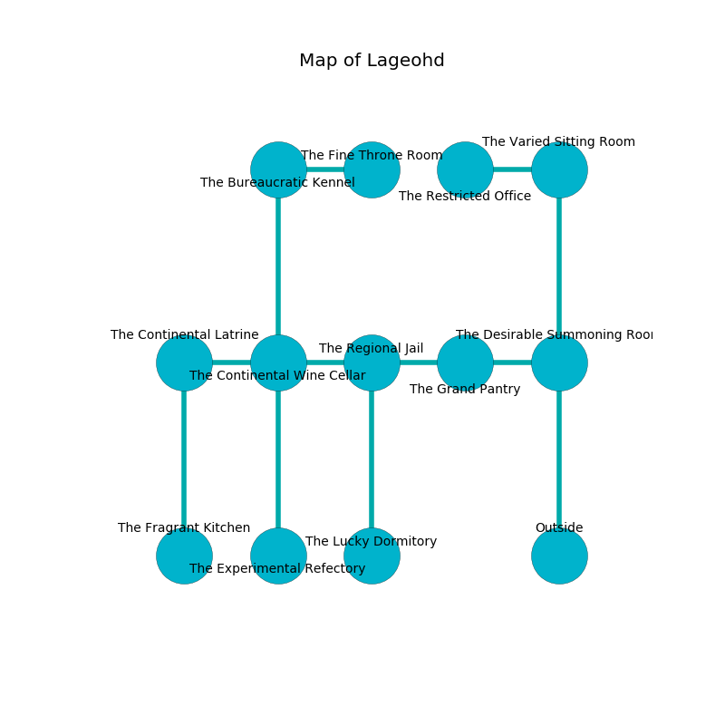

%Ruin Dogs

##Lageohd
###Overview
Lageohd is located under a giant rift. Regions of it are somewhat hot. A massive storm is happening outside. It is occupied by Humans. Yasuko Gant The Cruel, a Kuo-Toa Monitor is here. The Humans worship Yasuko Gant The Cruel. She  is trying to use [Budaeuedaeum](#Budaeuedaeum). 

###Artifact
####Budaeuedaeum

Budaeuedaeum looks like a transparent meteorite. It is a bright purple color. When held it becomes a shielding force. 

###Locations

####the desirable summoning room
The air smells like toast here. The glass walls are pristine. Yellow lichens are growing in broken urns. The floor is smooth. 

* To the west a twisted passageway leads to [the grand pantry](#the-grand-pantry).
* To the north a hazy passageway opens to [the varied sitting Room](#the-varied-sitting-Room).
* To the south is the entrance.

####the grand pantry
White ferns are swaying from the ceiling. 

* To the west a flooded path opens to [the regional jail](#the-regional-jail).
* To the east a twisted passageway leads to [the desirable summoning room](#the-desirable-summoning-room).

####the regional jail
There is a trap here. When activated, a magical sound detector will launch a javelin. There are a Quasit, a Giant Octopus, a Thug, and a Fire Snake here. Blue moss is decaying from the ceiling. 

There is an engraving on the ceiling written in common. 

> Treasure here.
>

* There is an arch here.
* There is an imp here.
* To the west a twisted cavern leads to [the continental wine cellar](#the-continental-wine-cellar).
* To the east a flooded path leads to [the grand pantry](#the-grand-pantry).
* To the south a dark opening leads to [the lucky dormitory](#the-lucky-dormitory).

####the continental wine cellar
The air smells like egg nog here. The stone walls are unsettled. There are a Thug, a Commoner, a Druid, and a Scout here. The Humans are performing a ritual. If not interrupted, [Yasuko Gant](#Yasuko-Gant) will be magically alarmed. 

* There is a demon here.
* To the west a dark hallway connects to [the continental latrine](#the-continental-latrine).
* To the east a twisted cavern leads to [the regional jail](#the-regional-jail).
* To the north a dark path connects to [the bureaucratic kennel](#the-bureaucratic-kennel).
* To the south a dark walkway connects to [the experimental refectory](#the-experimental-refectory).

####the bureaucratic kennel
The floor is smooth. The wooden walls are scratched. White lichens are growing from the walls. There are a Veteran, a Tribal Warrior, a Commoner, and a Druid here. The Humans are celebrating. 

There is an engraving on the wall written in Humans Script. 

> Try dying.
>

* There is a drawer here.
* [Budaeuedaeum](#Budaeuedaeum) is here.
* To the east a long path leads to [the fine throne room](#the-fine-throne-room).
* To the south a dark path leads to [the continental wine cellar](#the-continental-wine-cellar).

####the experimental refectory
The stone walls are bloodstained. 

* [Yasuko Gant The Cruel](#Yasuko-Gant-The-Cruel) is here.
* To the north a dark walkway connects to [the continental wine cellar](#the-continental-wine-cellar).

####the varied sitting Room
White moss is decaying in a patch on the floor. 

* To the west a small opening opens to [the restricted office](#the-restricted-office).
* To the south a hazy passageway opens to [the desirable summoning room](#the-desirable-summoning-room).

####the continental latrine
The concrete walls are pristine. The floor is glossy. There is a trap here. When activated, a magical proximity detector will fire a scything blade. 

* To the east a dark hallway connects to [the continental wine cellar](#the-continental-wine-cellar).
* To the south a hazy cave leads to [the fragrant kitchen](#the-fragrant-kitchen).

####the restricted office
White ferns are sprouting from the walls. The air tastes like bergamot here. 

* To the east a small opening leads to [the varied sitting Room](#the-varied-sitting-Room).

####the fragrant kitchen
There is a Water Weird here. The air tastes like phenolic here. The brick walls are pristine. 

There is an engraving on the floor written in common. 

> [Budaeuedaeum](#Budaeuedaeum)
>
> always thirsty
>
> yet regular
>
> trivial and extraordinary
>
> uneasy and fair
>
> nuclear, liquid, literary
>

* To the north a hazy cave leads to [the continental latrine](#the-continental-latrine).

####the lucky dormitory
Yellow lichens are sprouting in broken urns. The mirrored walls are caving in. 

* To the north a dark opening connects to [the regional jail](#the-regional-jail).

####the fine throne room
The air tastes like lavender here. The crystal walls are covered in mold. 

There is an engraving on the ceiling written in common. 

> Do not try cowering.
>

* To the west a long path opens to [the bureaucratic kennel](#the-bureaucratic-kennel).

