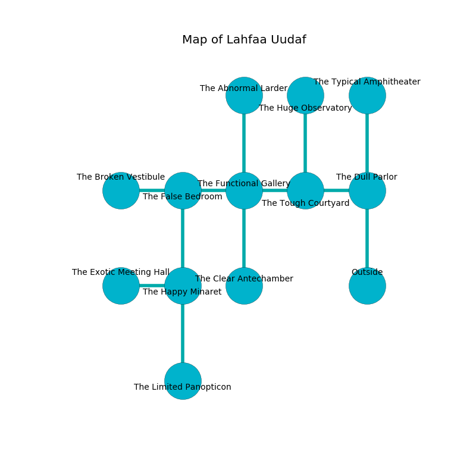

%Ruin Dogs

##Lahfaa Uudaf
###Overview
Lahfaa Uudaf is constructed on an alien city. Some rooms of it are foggy. The ruin is coming to life. It is occupied by Humans. Lera Gagnon The Possessive, a Knight is here. The Humans are battling Lera Gagnon The Possessive. She  is founding a new religion. 

###Artifact
####Fuda Iofuaeuuf

Fuda Iofuaeuuf is a powerful artifact in the shape of a soft spear. It is a medium green color. When worn it becomes a force of destiny. 

###Locations

####the dull parlor
There are two Scouts, a Commoner, a Druid, an Acolyte, and  here. The floor is sticky. The Humans are performing a ritual. If not interrupted, a powerful monster will be summoned. 

* There is a ghost here.
* To the west a torchlit cavern leads to [the tough courtyard](#the-tough-courtyard).
* To the north a flooded cave connects to [the typical amphitheater](#the-typical-amphitheater).
* To the south is the entrance.

####the typical amphitheater
The air tastes like popcorn here. There is a trap here. When activated, a pressure plate will launch an arrow. There are a Hippogriff, a Black Bear, a Bandit Captain, and a Kuo-Toa here. 

There is an engraving on a monolith written in Humans Script. 

> Dig here.
>

* There is a dagger here.
* To the south a flooded cave leads to [the dull parlor](#the-dull-parlor).

####the tough courtyard
White mushrooms are growing in broken urns. The air tastes like sap here. The floor is cluttered with debris. 

There is an engraving on a stone written in Humans Script. 

> Do not try digging.
>

* There is a whip here.
* There is a pendant here.
* To the west a dark path opens to [the functional gallery](#the-functional-gallery).
* To the east a torchlit cavern leads to [the dull parlor](#the-dull-parlor).
* To the north a small artery opens to [the huge observatory](#the-huge-observatory).

####the functional gallery
The air tastes like paper here. The floor is cluttered with broken glass. Blue mushrooms are growing in broken urns. 

* To the west a long artery leads to [the false bedroom](#the-false-bedroom).
* To the east a dark path leads to [the tough courtyard](#the-tough-courtyard).
* To the north a dripping walkway opens to [the abnormal larder](#the-abnormal-larder).
* To the south a windy passageway connects to [the clear antechamber](#the-clear-antechamber).

####the false bedroom
White moss is swaying in broken urns. There are an Acolyte, a Frog, a Gnoll, a Black Dragon Wyrmling, and a Wererat here. The floor is sticky. 

* [Fuda Iofuaeuuf](#Fuda-Iofuaeuuf) is here.
* To the west a twisted hallway leads to [the broken vestibule](#the-broken-vestibule).
* To the east a long artery opens to [the functional gallery](#the-functional-gallery).
* To the south a flooded opening connects to [the happy minaret](#the-happy-minaret).

####the happy minaret
The concrete walls are unsettled. 

* To the west a small cavern leads to [the exotic meeting hall](#the-exotic-meeting-hall).
* To the north a flooded opening opens to [the false bedroom](#the-false-bedroom).
* To the south a twisted passageway connects to [the limited panopticon](#the-limited-panopticon).

####the abnormal larder
The stone walls are scratched. The air smells like lilac here. 

* To the south a dripping walkway leads to [the functional gallery](#the-functional-gallery).

####the exotic meeting hall
There are a Giant Lizard, a Giant Bat, a Smoke Mephit, a Tiger, and a Githzerai Monk here. White moss is sprouting from the walls. 

There is an engraving on the floor written in common. 

> Treasure here.
>

* There is a bone here.
* To the east a small cavern leads to [the happy minaret](#the-happy-minaret).

####the limited panopticon
The crystal walls are covered in mold. Red razorgrass is swaying in cracks in the floor. 

* To the north a twisted passageway opens to [the happy minaret](#the-happy-minaret).

####the clear antechamber
The air smells like verbena here. The crystal walls are bloodstained. There are a Guard and a Knight here. The floor is sticky. One of the Humans is on watch, the rest are feasting. 

* [Lera Gagnon The Possessive](#Lera-Gagnon-The-Possessive) is here.
* To the north a windy passageway connects to [the functional gallery](#the-functional-gallery).

####the huge observatory
Red ferns are growing in broken urns. 

* To the south a small artery opens to [the tough courtyard](#the-tough-courtyard).

####the broken vestibule
There is a Knight here. Red moss is decaying from the ceiling. The stone walls are scratched. The floor is smooth. There is a trap here. When activated, a pressure plate will launch a hail of needles. The Knight is performing a ritual. If not interrupted, the Knight will become more powerful. 

* To the east a twisted hallway opens to [the false bedroom](#the-false-bedroom).

