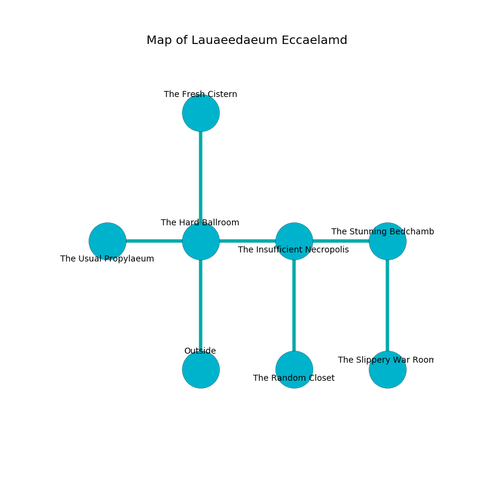

%Ruin Dogs

##Lauaeedaeum Eccaelamd
###Overview
Lauaeedaeum Eccaelamd is located in a haunted plain. Parts of it are frozen. A massive flood is happening outside. It is occupied by Mind Flayers. Deonna William The Aggressive, a Drow Priestess of Lolth is here. The Mind Flayers are battling Deonna William The Aggressive. She  is trying to research [Ecdaeum Hehhafwi](#Ecdaeum-Hehhafwi). 

###Artifact
####Ecdaeum Hehhafwi

Ecdaeum Hehhafwi has the form of a soft gem. Air glows near it. It smells like brandy. When worn it burns the mind. 

###Locations

####the hard ballroom
The floor is flooded with two inch deep cold water. The obsidion walls are caving in. There are two Mind Flayer Arcanists here. The air tastes like fish here. The Mind Flayers are crazy with bloodlust. 

There is an engraving on the ceiling written in Mind Flayers Script. 

> I thought about swimming.
>

* To the west a dripping corridor opens to [the usual propylaeum](#the-usual-propylaeum).
* To the east a flooded walkway leads to [the insufficient necropolis](#the-insufficient-necropolis).
* To the north a flooded pathway connects to [the fresh cistern](#the-fresh-cistern).
* To the south is the entrance.

####the insufficient necropolis
The wooden walls are covered in mold. 

* [Ecdaeum Hehhafwi](#Ecdaeum-Hehhafwi) is here.
* To the west a flooded walkway connects to [the hard ballroom](#the-hard-ballroom).
* To the east a hazy hallway leads to [the stunning bedchamber](#the-stunning-bedchamber).
* To the south a dripping walkway connects to [the random closet](#the-random-closet).

####the stunning bedchamber
The obsidion walls are ruined. There are a Dryad, a Frost Giant, a Gnoll Fang of Yeenoghu, a Reef Shark, a Copper Dragon Wyrmling, and a Gnoll here. 

* To the west a hazy hallway opens to [the insufficient necropolis](#the-insufficient-necropolis).
* To the south a flooded corridor opens to [the slippery war Room](#the-slippery-war-Room).

####the fresh cistern
There are a Warhorse, a Fomorian, and a Giant Goat here. The stone walls are ruined. 

* To the south a flooded pathway opens to [the hard ballroom](#the-hard-ballroom).

####the usual propylaeum
The floor is sticky. There are a Mind Flayer Arcanist and a Mind Flayer here. The Mind Flayers are performing a ritual. If not interrupted, a powerful monster will be summoned. 

* To the east a dripping corridor opens to [the hard ballroom](#the-hard-ballroom).

####the slippery war Room
The air smells like broccoli here. There is a trap here. When activated, a magical sound detector will launch a ceiling pendulum. 

* [Deonna William The Aggressive](#Deonna-William-The-Aggressive) is here.
* To the north a flooded corridor connects to [the stunning bedchamber](#the-stunning-bedchamber).

####the random closet
The air smells like umami here. The floor is bloodstained. 

There is an engraving on the floor written in common. 

> Poor me! sorry fate
>
> it is never plain
>
> it is never great
>
> death is main
>

* To the north a dripping walkway leads to [the insufficient necropolis](#the-insufficient-necropolis).

