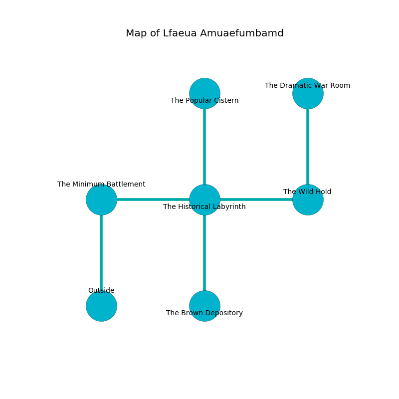

%Ruin Dogs

##Lfaeua Amuaefumbamd
###Overview
Lfaeua Amuaefumbamd is located on a spikey mountain. Regions of Lfaeua Amuaefumbamd are foggy. A blizzard is happening outside. It is occupied by Harpies. Epifania Yamamoto The Pessimistic, a Spined Devil is here. The Harpies are battling Epifania Yamamoto The Pessimistic. She  is trying to use [The Eternal Sunrise](#The-Eternal-Sunrise). 

###Artifact
####The Eternal Sunrise

The Eternal Sunrise has the form of an opaque monument. It is a bright pink color. When eaten it levitates those nearby. 

###Locations

####the minimum battlement
The air smells like foliage here. There is a Mimic here. White lichens are swaying from the ceiling. 

There is an engraving on the wall written in Harpies Script. 

> A monkey is a spot
>
> available, enjoyable, economic
>

* To the east a dark corridor leads to [the historical labyrinth](#the-historical-labyrinth).
* To the south is the entrance.

####the historical labyrinth
Blue lichens are swaying in cracks in the floor. The metallic walls are bloodstained. There are a Gray Ooze, a Commoner, a Mimic, and a Pixie here. 

There is an engraving on a monolith written in common. 

> A library is a cut
>
> meaningful, competent, fine
>
> common and satisfactory
>
> A library is a cut
>

* There is a roof here.
* To the west a dark corridor connects to [the minimum battlement](#the-minimum-battlement).
* To the east a hazy artery connects to [the wild hold](#the-wild-hold).
* To the north a twisted path leads to [the popular cistern](#the-popular-cistern).
* To the south a dripping hallway opens to [the brown depository](#the-brown-depository).

####the wild hold
The floor is glossy. The air tastes like styrene here. The concrete walls are covered in mold. There is a Druid here. 

* There is a stamp here.
* [The Eternal Sunrise](#The-Eternal-Sunrise) is here.
* To the west a hazy artery opens to [the historical labyrinth](#the-historical-labyrinth).
* To the north a twisted hallway opens to [the dramatic war Room](#the-dramatic-war-Room).

####the popular cistern
The obsidion walls are ruined. 

* There is a ring here.
* [Epifania Yamamoto The Pessimistic](#Epifania-Yamamoto-The-Pessimistic) is here.
* To the south a twisted path opens to [the historical labyrinth](#the-historical-labyrinth).

####the brown depository
The floor is bloodstained. The obsidion walls are bloodstained. There are two Harpies here. There is a trap here. When activated, a magical sound detector will launch a blade. One of the Harpies is on watch, the rest are feasting. 

There is an engraving on the ceiling written in Harpies Script. 

> They are free
>
> varied and sad
>

* To the north a dripping hallway leads to [the historical labyrinth](#the-historical-labyrinth).

####the dramatic war Room
Gray razorgrass is growing from the walls. There is a trap here. When activated, a magical sound detector will close a portcullis. The brick walls are scratched. The floor is sticky. 

* There is a fly here.
* To the south a twisted hallway opens to [the wild hold](#the-wild-hold).

