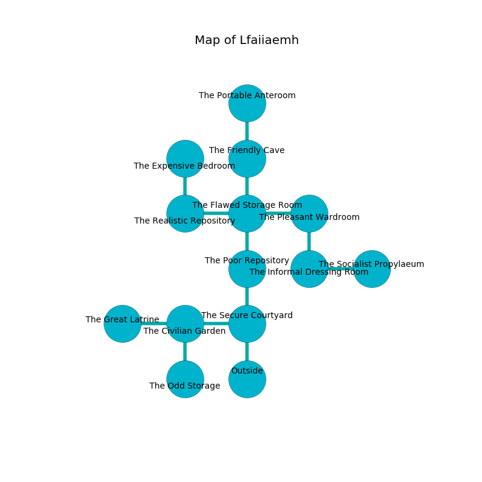

%Ruin Dogs

##Lfaiiaemh
###Overview
Lfaiiaemh is located on a spikey tree. Parts of it are frozen. The ruin is coming to life. It is occupied by Orc. Antionette Caskey The Irresponsible, a Cloud Giant is here. The Orc are the minions of Antionette Caskey The Irresponsible. She  is trying to find [Laeggafamca](#Laeggafamca). 

###Artifact
####Laeggafamca

Laeggafamca looks like a smooth meteorite. It is a light red color. It smells like melon rind. When gazed upon it becomes lost. 

###Locations

####the secure courtyard
White moss is decaying from the ceiling. There are a Water Weird, a Helmed Horror, a Banshee, and a Spider here. The floor is cluttered with ashes. 

* To the west a long walkway opens to [the civilian garden](#the-civilian-garden).
* To the north a twisted cavern connects to [the poor repository](#the-poor-repository).
* To the south is the entrance.

####the poor repository
There are twenty Orcs here. If the Orc notice the Ruin Dogs, one of them will retreat and alert [Antionette Caskey](#Antionette-Caskey). 

* [Antionette Caskey The Irresponsible](#Antionette-Caskey-The-Irresponsible) is here.
* To the north a flooded path connects to [the flawed storage room](#the-flawed-storage-room).
* To the south a twisted cavern leads to [the secure courtyard](#the-secure-courtyard).

####the civilian garden
The air tastes like narcissus here. Blue ferns are swaying in cracks in the floor. 

* To the west a long gap opens to [the great latrine](#the-great-latrine).
* To the east a long walkway connects to [the secure courtyard](#the-secure-courtyard).
* To the south a small threshold leads to [the odd storage](#the-odd-storage).

####the flawed storage room
There are a Githyanki Warrior, a Black Pudding, a Giant fire beetle, a Hell Hound, and a Goblin Boss here. The brick walls are pristine. 

There is an engraving on the floor written in common. 

> Maybe try dying.
>

* To the west a dark artery opens to [the realistic repository](#the-realistic-repository).
* To the east a dripping corridor opens to [the pleasant wardroom](#the-pleasant-wardroom).
* To the north a long corridor leads to [the friendly cave](#the-friendly-cave).
* To the south a flooded path opens to [the poor repository](#the-poor-repository).

####the friendly cave
There are twenty Orcs here. The floor is bloodstained. If the Orc notice the Ruin Dogs, one of them will retreat and alert the others. 

There is an engraving on a stone written in Orc Script. 

> Run away.
>

* There is a seed here.
* To the north a small corridor connects to [the portable anteroom](#the-portable-anteroom).
* To the south a long corridor opens to [the flawed storage room](#the-flawed-storage-room).

####the pleasant wardroom
The air tastes like fudge here. There are a Hezrou, a Swarm of Ravens, an Ogre, a Zombie, and a Worg here. The glass walls are caving in. 

* To the west a dripping corridor connects to [the flawed storage room](#the-flawed-storage-room).
* To the south a narrow walkway leads to [the informal dressing room](#the-informal-dressing-room).

####the informal dressing room
The floor is cluttered with debris. There is a trap here. When activated, a magical rune will launch stone blocks from the ceiling. Gray ferns are growing in a patch on the floor. The air tastes like rye bread here. The glass walls are ruined. 

* There is a cup here.
* [Laeggafamca](#Laeggafamca) is here.
* To the east a small passageway leads to [the socialist propylaeum](#the-socialist-propylaeum).
* To the north a narrow walkway leads to [the pleasant wardroom](#the-pleasant-wardroom).

####the realistic repository
The floor is smooth. Blue ferns are swaying from the walls. 

* To the east a dark artery connects to [the flawed storage room](#the-flawed-storage-room).
* To the north a twisted corridor leads to [the expensive bedroom](#the-expensive-bedroom).

####the odd storage
There is a trap here. When activated, a magical rune will open a large pit in the floor. The wooden walls are ruined. The air smells like passion fruit here. There are twenty Orcs here. The Orc are berserk with rage. 

* To the north a small threshold leads to [the civilian garden](#the-civilian-garden).

####the expensive bedroom
The air tastes like grape skin here. There are twenty Orcs here. Green mushrooms are swaying in broken urns. The Orc are willing to negotiate. 

* To the south a twisted corridor opens to [the realistic repository](#the-realistic-repository).

####the portable anteroom
The floor is cluttered with bones. The air smells like orange here. 

* To the south a small corridor leads to [the friendly cave](#the-friendly-cave).

####the great latrine
The glass walls are ruined. Green moss is swaying from the walls. 

* To the east a long gap opens to [the civilian garden](#the-civilian-garden).

####the socialist propylaeum
The floor is cluttered with shells. There are twenty Orcs here. One of the Orc is pointing a ballista at the entrance. 

* To the west a small passageway leads to [the informal dressing room](#the-informal-dressing-room).

