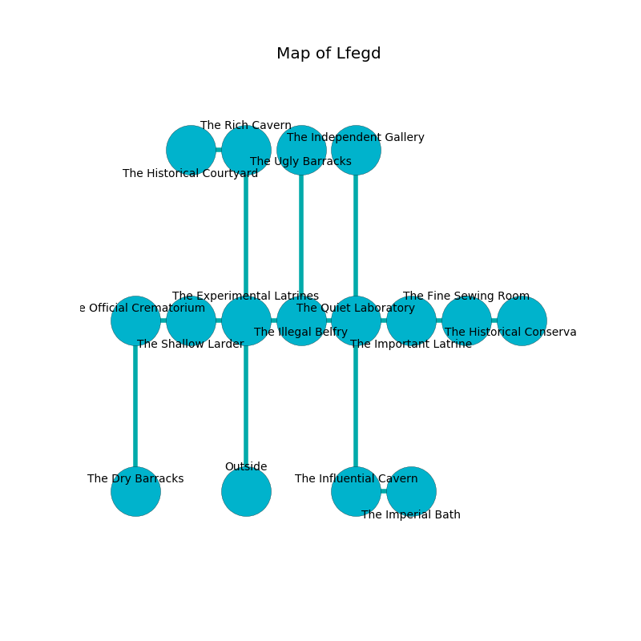

%Ruin Dogs

##Lfegd
###Overview
Lfegd is located in an obsidion rift. Some areas of Lfegd are unbearably hot. A massive flood is happening outside. It is occupied by Duergars. Gaston Bowling The Cruel, a Cloud Giant is here. The Duergars are ruled by Gaston Bowling The Cruel. He  is trying to find [The Flexible Licence](#The-Flexible-Licence). 

###Artifact
####The Flexible Licence

The Flexible Licence is a powerful artifact in the shape of a warm orb. It is a medium orange color. When touched it curses all nearby. 

###Locations

####the experimental latrines
The floor is sticky. There are nine Duergars here. White lichens are growing in a patch on the floor. The Duergars are performing a ritual. If not interrupted, the ruin dogs will be weakened. 

There is an engraving on a stone written in common. 

> I discovered [The Flexible Licence](#The-Flexible-Licence).
>

* To the west a narrow hallway leads to [the shallow larder](#the-shallow-larder).
* To the east a twisted hall opens to [the illegal belfry](#the-illegal-belfry).
* To the north a dripping path connects to [the rich cavern](#the-rich-cavern).
* To the south is the entrance.

####the illegal belfry
The air smells like sawdust here. The mirrored walls are caving in. There is a trap here. When activated, a tripwire will collapse a wall. The floor is sticky. 

There is an engraving on the ceiling written in common. 

> I am lost in Lfegd.
>
> Try cowering.
>

* [The Flexible Licence](#The-Flexible-Licence) is here.
* To the west a twisted hall connects to [the experimental latrines](#the-experimental-latrines).
* To the east a windy threshold leads to [the quiet laboratory](#the-quiet-laboratory).
* To the north a windy threshold leads to [the ugly barracks](#the-ugly-barracks).

####the shallow larder
Yellow mushrooms are decaying in broken urns. 

There is an engraving on a stone written in common. 

> A hospital is a banner
>
> ever legal
>
> sticky, enjoyable, rural
>
> you are not punished
>

* To the west a dark opening leads to [the official crematorium](#the-official-crematorium).
* To the east a narrow hallway connects to [the experimental latrines](#the-experimental-latrines).

####the quiet laboratory
Red ferns are decaying from the ceiling. The brick walls are scratched. 

* To the west a windy threshold connects to [the illegal belfry](#the-illegal-belfry).
* To the east a dripping cave opens to [the important latrine](#the-important-latrine).
* To the north a narrow hallway connects to [the independent gallery](#the-independent-gallery).
* To the south a long hall leads to [the influential cavern](#the-influential-cavern).

####the official crematorium
The air tastes like rancid butter here. There are a Manes, a Veteran, an Old Faerie Dragon, a Berserker, a Giant Octopus, a Myconid Adult, a Needle Blight, an Octopus, and a Mammoth here. The wooden walls are pristine. 

There is an engraving on a monolith written in Duergars Script. 

> O! meak we
>
> it is always free
>
> privileged, automatic, indirect
>
> everything is direct
>

* To the east a dark opening opens to [the shallow larder](#the-shallow-larder).
* To the south a narrow cave leads to [the dry barracks](#the-dry-barracks).

####the important latrine
Gray lichens are sprouting in a patch on the floor. There are a Zombie, a Yeti, a Blue Slaad, a Camel, and a Cambion here. 

* There is a triptych here.
* To the west a dripping cave leads to [the quiet laboratory](#the-quiet-laboratory).
* To the east a twisted artery opens to [the fine sewing room](#the-fine-sewing-room).

####the influential cavern
There are a Sprite, a Giant Rat, a Quaggoth Thonot, a Young Blue Dragon, a Bugbear, and a Deer here. The obsidion walls are ruined. The floor is bloodstained. Yellow razorgrass is sprouting in broken urns. 

* To the east a small threshold leads to [the imperial bath](#the-imperial-bath).
* To the north a long hall opens to [the quiet laboratory](#the-quiet-laboratory).

####the fine sewing room
The air smells like paper here. The floor is cluttered with bones. White moss is swaying in broken urns. 

* To the west a twisted artery leads to [the important latrine](#the-important-latrine).
* To the east a dark cavern connects to [the historical conservatory](#the-historical-conservatory).

####the rich cavern
The floor is smooth. The air tastes like mushroom here. Yellow razorgrass is decaying from the walls. The metallic walls are ruined. 

* There is a wheel here.
* There is a plow here.
* To the west a torchlit opening leads to [the historical courtyard](#the-historical-courtyard).
* To the south a dripping path opens to [the experimental latrines](#the-experimental-latrines).

####the historical conservatory
Gray moss is swaying from the walls. There are a Myconid Sovereign, a Flesh Golem, a Myconid Adult, and a Pegasus here. 

* To the west a dark cavern connects to [the fine sewing room](#the-fine-sewing-room).

####the dry barracks
The air tastes like melon rind here. The floor is sticky. 

* To the north a narrow cave opens to [the official crematorium](#the-official-crematorium).

####the imperial bath
The air tastes like peanut here. The floor is flooded with eight inch deep lukewarm water. 

* [Gaston Bowling The Cruel](#Gaston-Bowling-The-Cruel) is here.
* To the west a small threshold connects to [the influential cavern](#the-influential-cavern).

####the historical courtyard
The floor is glossy. The mirrored walls are ruined. There are a Young Silver Dragon and a Chimera here. The air tastes like chamomile here. 

* To the east a torchlit opening connects to [the rich cavern](#the-rich-cavern).

####the independent gallery
The wooden walls are pristine. 

* There is a leprechaun here.
* To the south a narrow hallway opens to [the quiet laboratory](#the-quiet-laboratory).

####the ugly barracks
The concrete walls are pristine. Gray mushrooms are sprouting in a patch on the floor. 

* To the south a windy threshold opens to [the illegal belfry](#the-illegal-belfry).

