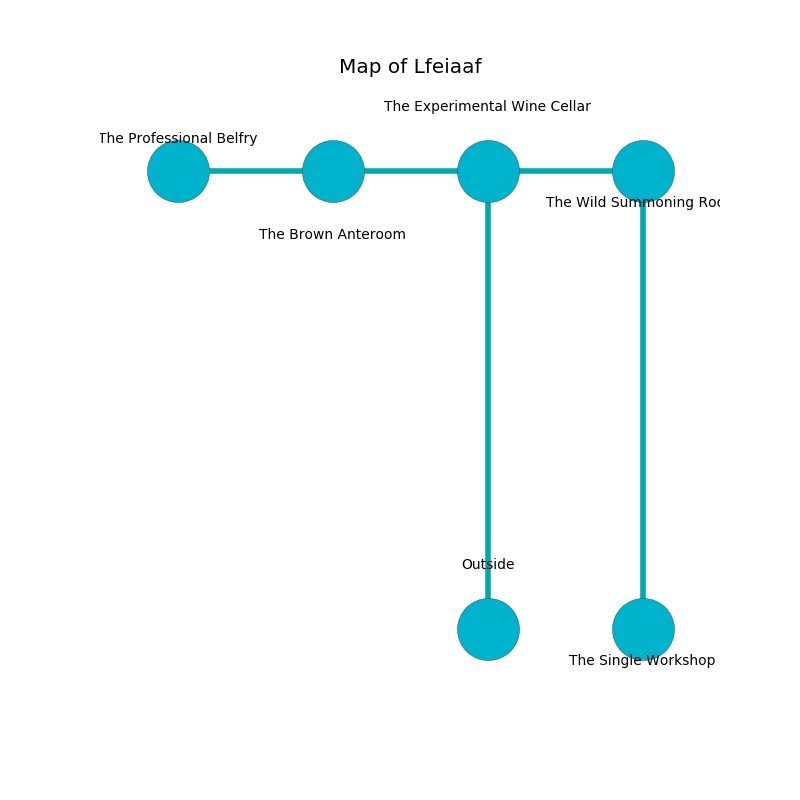

%Ruin Dogs

##Lfeiaaf
###Overview
Lfeiaaf is located on a flooded city. Parts of it are corrupted. A windstorm is happening outside. It is occupied by Troglodytes. Katrice Scruggs The Indiscreet, a Bulette is here. The Troglodytes are the slaves of Katrice Scruggs The Indiscreet. She  is founding a new religion. 

###Artifact
####The Visual Ambulance

The Visual Ambulance is a powerful artifact in the shape of a hard prism. Power shifts towards it. It smells like pecan. When picked up it destroys itself. 

###Locations

####the experimental wine cellar

* To the west a twisted artery leads to [the brown anteroom](#the-brown-anteroom).
* To the east a dripping corridor leads to [the wild summoning room](#the-wild-summoning-room).
* To the south is the entrance.

####the wild summoning room
The floor is bloodstained. The concrete walls are scratched. Yellow mushrooms are decaying in cracks in the floor. 

There is an engraving on the floor written in common. 

> I tried digging.
>

* There is a stamp here.
* [The Visual Ambulance](#The-Visual-Ambulance) is here.
* [Katrice Scruggs The Indiscreet](#Katrice-Scruggs-The-Indiscreet) is here.
* To the west a dripping corridor leads to [the experimental wine cellar](#the-experimental-wine-cellar).
* To the south a windy gap connects to [the single workshop](#the-single-workshop).

####the brown anteroom
The air tastes like metal here. 

* To the west a hazy gap connects to [the professional belfry](#the-professional-belfry).
* To the east a twisted artery connects to [the experimental wine cellar](#the-experimental-wine-cellar).

####the professional belfry
The crystal walls are unsettled. Gray razorgrass is sprouting in a patch on the floor. 

There is an engraving on a stone written in Troglodytes Script. 

> I am looting Lfeiaaf.
>
> I could not try giving up.
>

* To the east a hazy gap leads to [the brown anteroom](#the-brown-anteroom).

####the single workshop
The floor is smooth. There are sixteen Troglodytes here. The obsidion walls are caving in. The Troglodytes are willing to negotiate. 

* To the north a windy gap connects to [the wild summoning room](#the-wild-summoning-room).

