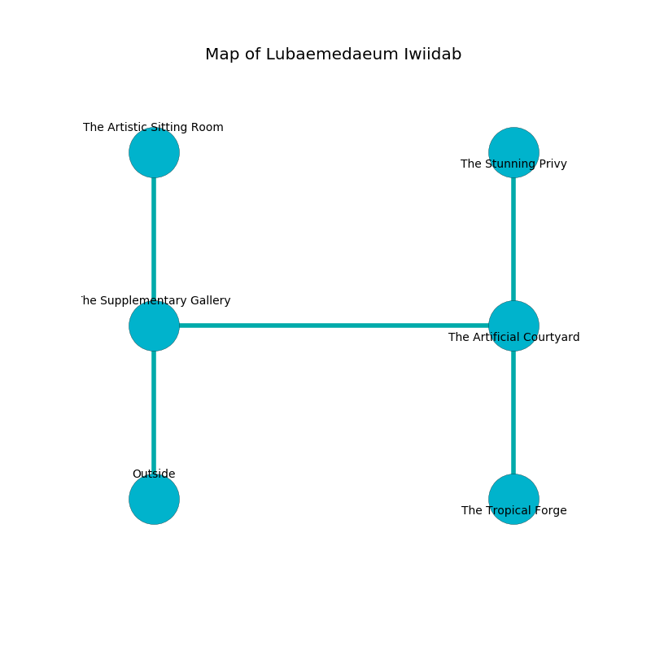

%Ruin Dogs

##Lubaemedaeum Iwiidab
###Overview
Lubaemedaeum Iwiidab is constructed on a giant mountain. Regions of Lubaemedaeum Iwiidab are flooded. The ruin is collapsing slowly. It is occupied by Gnolls. Jewell Enright The Perverse, a Hobgoblin Warlord is here. The Gnolls are battling Jewell Enright The Perverse. He  is founding a new religion. 

###Artifact
####The Explicit Fist

The Explicit Fist looks like a sharp sphere. It is a shifting blue color. When thrown it levitates surrounding objects. 

###Locations

####the supplementary gallery
The air smells like cypress here. The concrete walls are caving in. 

* To the east a torchlit walkway leads to [the artificial courtyard](#the-artificial-courtyard).
* To the north a narrow artery leads to [the artistic sitting Room](#the-artistic-sitting-Room).
* To the south is the entrance.

####the artificial courtyard
The air tastes like hyssop here. 

There is an engraving on a stone written in Gnolls Script. 

> I am worshipping this place.
>

* [The Explicit Fist](#The-Explicit-Fist) is here.
* To the west a torchlit walkway leads to [the supplementary gallery](#the-supplementary-gallery).
* To the north a long cavern opens to [the stunning privy](#the-stunning-privy).
* To the south a dark cave opens to [the tropical forge](#the-tropical-forge).

####the artistic sitting Room
The crystal walls are scratched. The air smells like spearmint here. 

There is an engraving on the ceiling written in common. 

> I tried hiding.
>

* [Jewell Enright The Perverse](#Jewell-Enright-The-Perverse) is here.
* To the south a narrow artery leads to [the supplementary gallery](#the-supplementary-gallery).

####the tropical forge
The concrete walls are caving in. The air tastes like roast beef here. 

* To the north a dark cave connects to [the artificial courtyard](#the-artificial-courtyard).

####the stunning privy
The obsidion walls are ruined. There are a Werebear and a Priest here. The air tastes like shellfish here. 

* To the south a long cavern leads to [the artificial courtyard](#the-artificial-courtyard).

