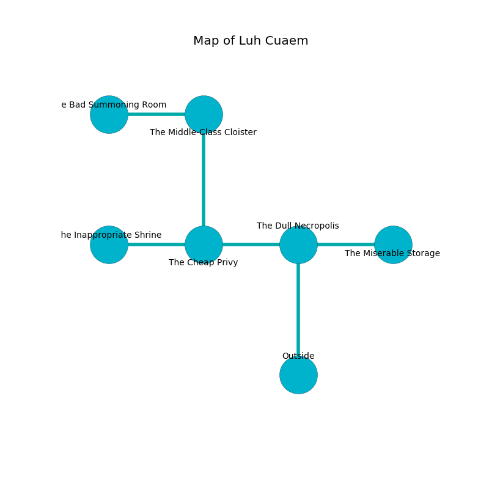

%Ruin Dogs

##Luh Cuaem
###Overview
Luh Cuaem is constructed on a broken rift. Parts of Luh Cuaem are flooded. The ruin is coming to life. It is occupied by Dryads. Arnold Wellman The Boastful, a Yuan-Ti Abomination is here. The Dryads are battling Arnold Wellman The Boastful. He  is trying to understand [Caedaesam Goii](#Caedaesam-Goii). 

###Artifact
####Caedaesam Goii

Caedaesam Goii is a powerful artifact in the shape of a soft doll. It smells like humus. Power flows towards it. When picked up it ignites its surrroundings. 

###Locations

####the dull necropolis
There are seven Dryads here. There is a trap here. When activated, a magical rune will launch a poison needle. The floor is cluttered with shells. White lichens are swaying in broken urns. One of the Dryads is on watch, the rest are caring for babies. 

* To the west a dripping hall leads to [the cheap privy](#the-cheap-privy).
* To the east a torchlit artery opens to [the miserable storage](#the-miserable-storage).
* To the south is the entrance.

####the cheap privy
There are a Githzerai Zerth, a Draft Horse, a Grick, and a Needle Blight here. The air smells like currant bud here. The stone walls are scratched. 

* To the west a dripping pathway opens to [the inappropriate shrine](#the-inappropriate-shrine).
* To the east a dripping hall leads to [the dull necropolis](#the-dull-necropolis).
* To the north a hazy hall opens to [the middle-class cloister](#the-middle-class-cloister).

####the inappropriate shrine
There are seven Dryads here. The Dryads are fighting amongst themselves. 

* To the east a dripping pathway leads to [the cheap privy](#the-cheap-privy).

####the miserable storage
The floor is bloodstained. The air tastes like corn chip here. 

* There is an orb here.
* There is a sock here.
* There is a button here.
* There is a stick here.
* [Arnold Wellman The Boastful](#Arnold-Wellman-The-Boastful) is here.
* To the west a torchlit artery leads to [the dull necropolis](#the-dull-necropolis).

####the middle-class cloister
The floor is glossy. The air tastes like tuberose here. The mirrored walls are unsettled. 

* [Caedaesam Goii](#Caedaesam-Goii) is here.
* To the west a twisted path leads to [the bad summoning room](#the-bad-summoning-room).
* To the south a hazy hall connects to [the cheap privy](#the-cheap-privy).

####the bad summoning room
The floor is bloodstained. White moss is swaying from the walls. 

* To the east a twisted path leads to [the middle-class cloister](#the-middle-class-cloister).

