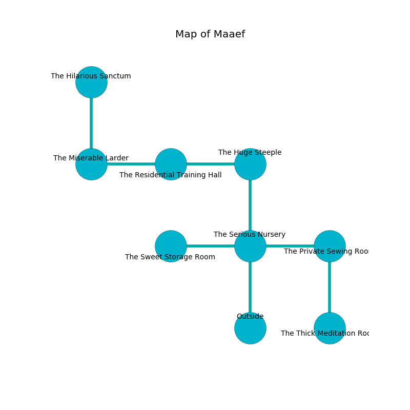

%Ruin Dogs

##Maaef
###Overview
Maaef is located in a flooded tree. Parts of it are corrupted. The ruin is sinking into the earth. It is occupied by Sprites. Gabriel Box The Rude, a Kuo-Toa Monitor is here. The Sprites are the slaves of Gabriel Box The Rude. He  is trying to steal [The Inevitable Occasion](#The-Inevitable-Occasion). 

###Artifact
####The Inevitable Occasion

The Inevitable Occasion looks like a smooth figurine. It smells like styrene. It is a dark blue color. When smelled it grants power to its owner. 

###Locations

####the serious nursery
Gray lichens are swaying from the walls. The floor is sticky. There are a Lion, a Bugbear, and a Giant Poisonous Snake here. The concrete walls are bloodstained. 

* To the west a hazy passageway connects to [the sweet storage room](#the-sweet-storage-room).
* To the east a flooded opening leads to [the private sewing room](#the-private-sewing-room).
* To the north a twisted artery leads to [the huge steeple](#the-huge-steeple).
* To the south is the entrance.

####the private sewing room
The air smells like eggs here. Blue mushrooms are swaying in broken urns. The floor is smooth. The stone walls are ruined. 

* [The Inevitable Occasion](#The-Inevitable-Occasion) is here.
* [Gabriel Box The Rude](#Gabriel-Box-The-Rude) is here.
* To the west a flooded opening leads to [the serious nursery](#the-serious-nursery).
* To the south a flooded gap connects to [the thick meditation room](#the-thick-meditation-room).

####the huge steeple
There are a Kuo-Toa Whip, an Ape, and a Tiger here. Blue razorgrass is swaying from the walls. 

There is an engraving on a stone written in common. 

> [The Inevitable Occasion](#The-Inevitable-Occasion)
>
> familiar and uneasy
>
> frozen, miserable, free
>
> you are not remembered
>

* To the west a flooded pathway leads to [the residential training hall](#the-residential-training-hall).
* To the south a twisted artery leads to [the serious nursery](#the-serious-nursery).

####the residential training hall
The floor is sticky. The air tastes like lettuce here. 

There is an engraving on the ceiling written in Sprites Script. 

> Oh sorry we
>
> young, vigorous, unlawful
>
> mutual and free
>
> sadness is awful
>

* To the west a windy walkway leads to [the miserable larder](#the-miserable-larder).
* To the east a flooded pathway leads to [the huge steeple](#the-huge-steeple).

####the miserable larder
Gray razorgrass is growing from the walls. The air tastes like gravy here. 

There is an engraving on a stone written in Sprites Script. 

> O! pitiful we
>
> it is always free
>
> professional and late
>
> cruelty is free
>

* To the east a windy walkway connects to [the residential training hall](#the-residential-training-hall).
* To the north a hazy gap opens to [the hilarious sanctum](#the-hilarious-sanctum).

####the sweet storage room
The metallic walls are ruined. The air smells like rose here. There are a Giant Constrictor Snake, a Kuo-Toa, a Gas Spore, a Deep Gnome, a Goat, and a Hobgoblin here. 

* To the east a hazy passageway leads to [the serious nursery](#the-serious-nursery).

####the hilarious sanctum
The crystal walls are caving in. There are a Plesiosaurus, a Raven, a Crab, and a Scorpion here. The floor is cluttered with bones. 

* To the south a hazy gap opens to [the miserable larder](#the-miserable-larder).

####the thick meditation room
The air smells like huckleberry here. 

* To the north a flooded gap opens to [the private sewing room](#the-private-sewing-room).

