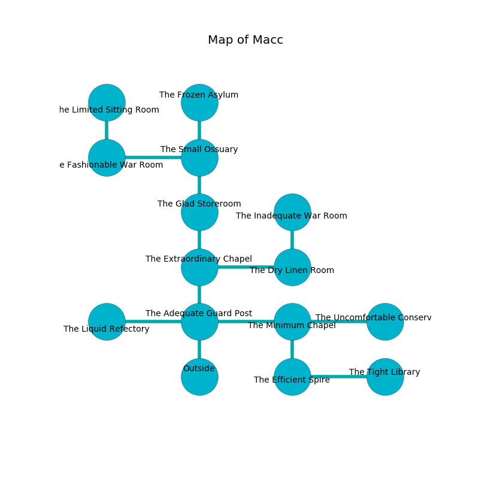

%Ruin Dogs

##Macc
###Overview
Macc is located on a haunted tree. Some areas of it are cursed. A battle between raiders is happening outside. It is occupied by Thri-Kreens. Graham Vanmeter The Machiavellian, a Fire Giant is here. The Thri-Kreens are the slaves of Graham Vanmeter The Machiavellian. He  is trying to find [Iaddhabamd](#Iaddhabamd). 

###Artifact
####Iaddhabamd

Iaddhabamd looks like a sharp sphere. It is a sickly green color. When smelled it emits dust. 

###Locations

####the adequate guard post
There are ten Thri-Kreens here. The air tastes like patchouli here. The stone walls are pristine. The Thri-Kreens are feasting. 

* To the west a flooded gap connects to [the liquid refectory](#the-liquid-refectory).
* To the east a windy hall leads to [the minimum chapel](#the-minimum-chapel).
* To the north a long cave opens to [the extraordinary chapel](#the-extraordinary-chapel).
* To the south is the entrance.

####the extraordinary chapel
The metallic walls are scratched. The floor is glossy. The air smells like wintergreen here. 

* To the east a flooded passageway leads to [the dry linen room](#the-dry-linen-room).
* To the north a long cave connects to [the glad storeroom](#the-glad-storeroom).
* To the south a long cave connects to [the adequate guard post](#the-adequate-guard-post).

####the liquid refectory
There is a trap here. When activated, a magical rune will make the ceiling slowly lower. The floor is smooth. The obsidion walls are caving in. 

* To the east a flooded gap opens to [the adequate guard post](#the-adequate-guard-post).

####the minimum chapel
The floor is flooded with three inch deep cold water. Green moss is swaying from the ceiling. The obsidion walls are caving in. There are ten Thri-Kreens here. The Thri-Kreens are meditating. 

* [Iaddhabamd](#Iaddhabamd) is here.
* To the west a windy hall connects to [the adequate guard post](#the-adequate-guard-post).
* To the east a dark passageway leads to [the uncomfortable conservatory](#the-uncomfortable-conservatory).
* To the south a windy walkway opens to [the efficient spire](#the-efficient-spire).

####the dry linen room
Green lichens are swaying from the walls. The metallic walls are scratched. There are ten Thri-Kreens here. The Thri-Kreens are willing to negotiate. 

* There is a rat here.
* To the west a flooded passageway connects to [the extraordinary chapel](#the-extraordinary-chapel).
* To the north a dripping cave leads to [the inadequate war Room](#the-inadequate-war-Room).

####the efficient spire
Gray ferns are decaying in cracks in the floor. There are a Chuul, an Unicorn, and a Mage here. 

* [Graham Vanmeter The Machiavellian](#Graham-Vanmeter-The-Machiavellian) is here.
* To the east a windy walkway leads to [the tight library](#the-tight-library).
* To the north a windy walkway opens to [the minimum chapel](#the-minimum-chapel).

####the glad storeroom
The floor is sticky. The air smells like deertongue here. The mirrored walls are unsettled. There are ten Thri-Kreens here. One of the Thri-Kreens is on watch, the rest are celebrating. 

* To the north a windy hallway connects to [the small ossuary](#the-small-ossuary).
* To the south a long cave connects to [the extraordinary chapel](#the-extraordinary-chapel).

####the small ossuary
There are ten Thri-Kreens here. The air smells like musk here. If the Thri-Kreens notice the Ruin Dogs, one of them will retreat and alert the others. 

* There is a cake here.
* To the west a flooded artery leads to [the fashionable war Room](#the-fashionable-war-Room).
* To the north a hazy walkway leads to [the frozen asylum](#the-frozen-asylum).
* To the south a windy hallway leads to [the glad storeroom](#the-glad-storeroom).

####the fashionable war Room
The mirrored walls are ruined. The air tastes like blueberry here. There are an Axe Beak, a Blue Slaad, and a Bone Naga here. 

* There is a girl here.
* To the east a flooded artery opens to [the small ossuary](#the-small-ossuary).
* To the north a dark walkway leads to [the limited sitting Room](#the-limited-sitting-Room).

####the inadequate war Room
The mirrored walls are pristine. The air tastes like raisin here. The floor is smooth. There are ten Thri-Kreens here. The Thri-Kreens are berserk with rage. 

* There is a wall here.
* To the south a dripping cave opens to [the dry linen room](#the-dry-linen-room).

####the frozen asylum
There is a trap here. When activated, a magical proximity detector will swing a tripping chain. The air tastes like cooked onion here. There are a Badger, a Fire Giant, and a Young Remorhaz here. The floor is bloodstained. 

* To the south a hazy walkway connects to [the small ossuary](#the-small-ossuary).

####the limited sitting Room
The air tastes like the fresh outdoors here. Blue ferns are decaying in broken urns. The obsidion walls are covered in mold. 

* To the south a dark walkway connects to [the fashionable war Room](#the-fashionable-war-Room).

####the tight library
The floor is flooded with six inch deep cold water. 

There is an engraving on the ceiling written in common. 

> O! weak soul
>
> always marine
>
> aggressive and whole
>
> hope is clean
>

* There is a sceptre here.
* To the west a windy walkway leads to [the efficient spire](#the-efficient-spire).

####the uncomfortable conservatory
The metallic walls are unsettled. Gray razorgrass is swaying in broken urns. The air smells like lily here. The floor is glossy. 

* To the west a dark passageway opens to [the minimum chapel](#the-minimum-chapel).

