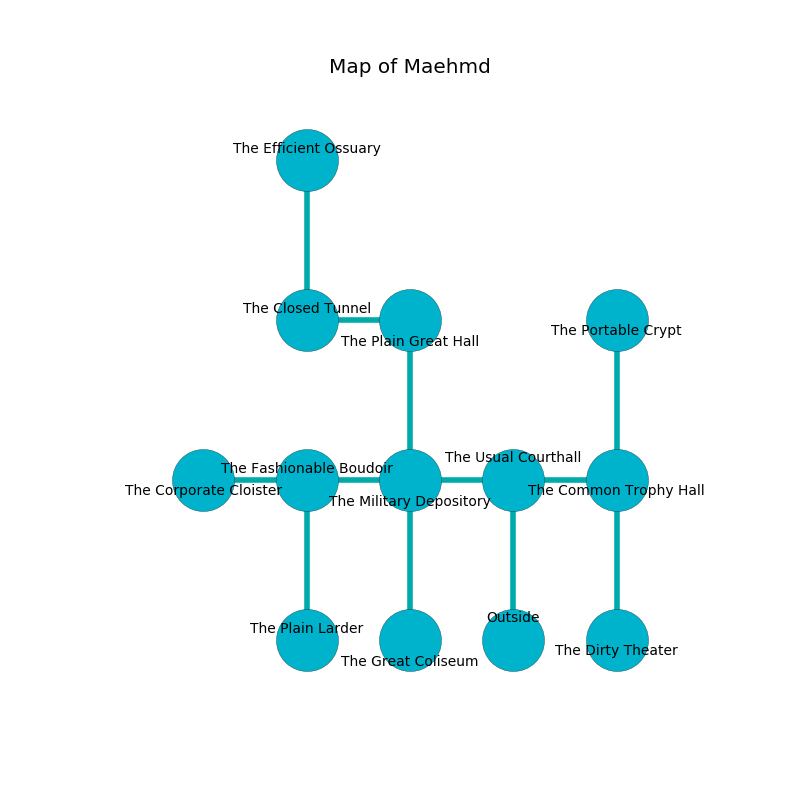

%Ruin Dogs

##Maehmd
###Overview
Maehmd is located on a giant plain. Some areas of it are foggy. The ruin is coming to life. It is occupied by Centaurs. Brady Dorn The Naughty, a Yuan-Ti Abomination is here. The Centaurs are the slaves of Brady Dorn The Naughty. He  is trying to research [Deida Haehmd](#Deida-Haehmd). 

###Artifact
####Deida Haehmd

Deida Haehmd is a powerful artifact in the shape of a warm blade. It smells like tuberose. It is a medium white color. When picked up it projects energy. 

###Locations

####the usual courthall
There are a Revenant, a Giant Eagle, a Baboon, a Harpy, and an Owlbear here. The wooden walls are ruined. 

There is an engraving on a stone written in Centaurs Script. 

> [Deida Haehmd](#Deida-Haehmd)
>
> impressive, bureaucratic, prolonged
>

* There is a book here.
* To the west a dripping cave leads to [the military depository](#the-military-depository).
* To the east a narrow artery leads to [the common trophy hall](#the-common-trophy-hall).
* To the south is the entrance.

####the military depository
White ferns are growing in cracks in the floor. There are a Mind Flayer Arcanist and a Giant Boar here. The floor is cluttered with ashes. The air smells like camphoreous here. 

* There is a cat here.
* To the west a long cave connects to [the fashionable boudoir](#the-fashionable-boudoir).
* To the east a dripping cave connects to [the usual courthall](#the-usual-courthall).
* To the north a dark opening opens to [the plain great hall](#the-plain-great-hall).
* To the south a small cavern connects to [the great coliseum](#the-great-coliseum).

####the plain great hall
The metallic walls are bloodstained. The air smells like sweat here. 

* To the west a twisted opening leads to [the closed tunnel](#the-closed-tunnel).
* To the south a dark opening connects to [the military depository](#the-military-depository).

####the closed tunnel
The obsidion walls are pristine. The floor is sticky. 

* To the east a twisted opening connects to [the plain great hall](#the-plain-great-hall).
* To the north a dripping corridor connects to [the efficient ossuary](#the-efficient-ossuary).

####the common trophy hall
There are four Centaurs here. The air smells like mold here. The crystal walls are scratched. Gray ferns are decaying from the walls. The Centaurs are performing a ritual. If not interrupted, the ruin dogs will be weakened. 

* To the west a narrow artery opens to [the usual courthall](#the-usual-courthall).
* To the north a long threshold connects to [the portable crypt](#the-portable-crypt).
* To the south a dripping cavern opens to [the dirty theater](#the-dirty-theater).

####the portable crypt
The floor is glossy. The glass walls are covered in mold. 

* To the south a long threshold opens to [the common trophy hall](#the-common-trophy-hall).

####the dirty theater

* To the north a dripping cavern connects to [the common trophy hall](#the-common-trophy-hall).

####the fashionable boudoir
The air tastes like muguet here. White razorgrass is decaying in a patch on the floor. The wooden walls are ruined. 

* [Deida Haehmd](#Deida-Haehmd) is here.
* To the west a hazy threshold opens to [the corporate cloister](#the-corporate-cloister).
* To the east a long cave leads to [the military depository](#the-military-depository).
* To the south a dripping gap leads to [the plain larder](#the-plain-larder).

####the great coliseum
The floor is flooded with one inch deep cool water. White moss is sprouting from the walls. 

* To the north a small cavern connects to [the military depository](#the-military-depository).

####the efficient ossuary
Red ferns are sprouting in a patch on the floor. The floor is flooded with seven inch deep lukewarm water. The concrete walls are ruined. There are two Aarakocras, a Grell, a Dust Mephit, a Hippogriff, a Rust Monster, a Reef Shark, a Hobgoblin, two Brass Dragon Wyrmlings, a Giant fire beetle, a Vulture,  here. The air smells like rum here. 

* There is a trophy here.
* To the south a dripping corridor opens to [the closed tunnel](#the-closed-tunnel).

####the corporate cloister
White mushrooms are growing in broken urns. The floor is smooth. 

* To the east a hazy threshold connects to [the fashionable boudoir](#the-fashionable-boudoir).

####the plain larder
There are a Noble, two Hell Hounds, a Thug, an Axe Beak, a Yuan-Ti Malison, a Vulture, and  here. Yellow mushrooms are sprouting from the ceiling. 

There is an engraving on the ceiling written in common. 

> Oh sorry fate
>
> it is always straight
>
> familiar and tender
>
> sadness is late
>

* [Brady Dorn The Naughty](#Brady-Dorn-The-Naughty) is here.
* To the north a dripping gap connects to [the fashionable boudoir](#the-fashionable-boudoir).

