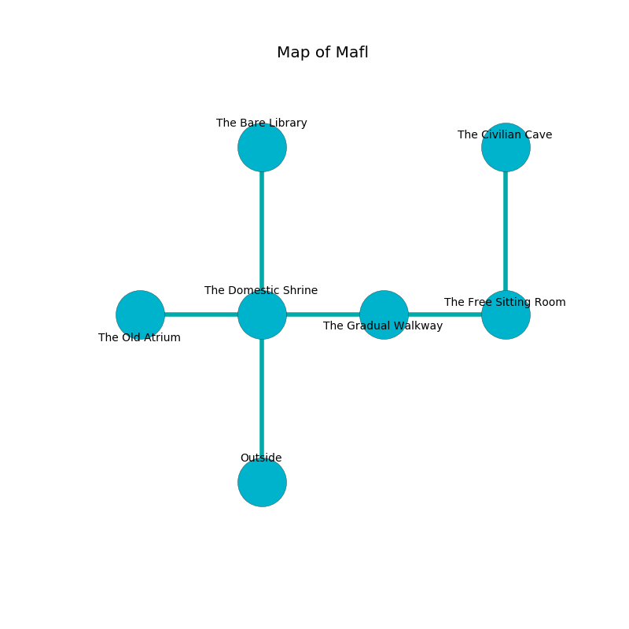

%Ruin Dogs

##Mafl
###Overview
Mafl is located under a crystal mountain. Regions of Mafl are foggy. The ruin is burning. It is occupied by Sahuagin. Winfred Michael The Superficial, a Drow Mage is here. The Sahuagin worship Winfred Michael The Superficial. He  is founding a new religion. 

###Artifact
####The Weak Slave

The Weak Slave has the form of an opaque sphere. It is a pale green color. When worshipped it shows an image of the future. 

###Locations

####the domestic shrine
There are a Warhorse, a Black Bear, and a Mage here. Yellow lichens are decaying from the ceiling. 

* There is a horn here.
* To the west a twisted opening opens to [the old atrium](#the-old-atrium).
* To the east a windy threshold leads to [the gradual walkway](#the-gradual-walkway).
* To the north a small hall leads to [the bare library](#the-bare-library).
* To the south is the entrance.

####the gradual walkway
The crystal walls are pristine. There are a Slaad Tadpole, an Awakened Tree, a Bulette, and a Flying Snake here. The floor is cluttered with shells. 

* There is a picture here.
* [Winfred Michael The Superficial](#Winfred-Michael-The-Superficial) is here.
* To the west a windy threshold opens to [the domestic shrine](#the-domestic-shrine).
* To the east a narrow cavern opens to [the free sitting Room](#the-free-sitting-Room).

####the free sitting Room
There are a Hunter Shark and a Flesh Golem here. 

There is an engraving on the wall written in common. 

> I am lost in Mafl.
>

* [The Weak Slave](#The-Weak-Slave) is here.
* To the west a narrow cavern connects to [the gradual walkway](#the-gradual-walkway).
* To the north a flooded walkway opens to [the civilian cave](#the-civilian-cave).

####the old atrium
There are two Sahuagin Barons here. The floor is glossy. One of the Sahuagin is pointing a ballista at the entrance. 

* There is a hook here.
* To the east a twisted opening leads to [the domestic shrine](#the-domestic-shrine).

####the bare library
The air smells like wine here. The floor is cluttered with ashes. 

* To the south a small hall leads to [the domestic shrine](#the-domestic-shrine).

####the civilian cave
The air tastes like sandalwood here. The metallic walls are covered in mold. Gray razorgrass is growing in broken urns. 

* To the south a flooded walkway opens to [the free sitting Room](#the-free-sitting-Room).

