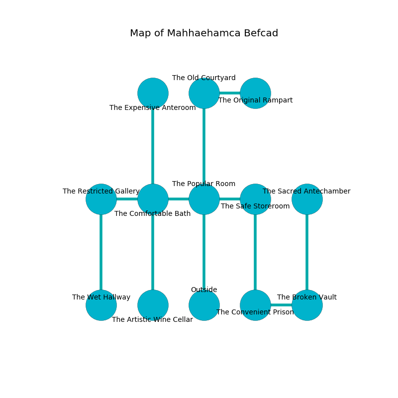

%Ruin Dogs

##Mahhaehamca Befcad
###Overview
Mahhaehamca Befcad is located under a poisoned rift. Parts of Mahhaehamca Befcad are unbearably cold. A windstorm is happening outside. It is occupied by Myconids. Sunny Poindexter The Pusillanimous, a Harpy is here. The Myconids are the minions of Sunny Poindexter The Pusillanimous. She  is founding a new religion. 

###Artifact
####The Obvious Glance

The Obvious Glance has the form of a mushy figurine. It is a sickly green color. When rubbed it makes its owner invisible. 

###Locations

####the popular room
There are a Gnoll and a White Dragon Wyrmling here. The obsidion walls are bloodstained. The air smells like ambergris here. The floor is glossy. Blue mushrooms are swaying in broken urns. 

* [Sunny Poindexter The Pusillanimous](#Sunny-Poindexter-The-Pusillanimous) is here.
* To the west a flooded hallway connects to [the comfortable bath](#the-comfortable-bath).
* To the east a twisted walkway opens to [the safe storeroom](#the-safe-storeroom).
* To the north a small hall connects to [the old courtyard](#the-old-courtyard).
* To the south is the entrance.

####the safe storeroom
Gray mushrooms are sprouting in a patch on the floor. The floor is smooth. 

* To the west a twisted walkway opens to [the popular room](#the-popular-room).
* To the south a long corridor opens to [the convenient prison](#the-convenient-prison).

####the comfortable bath
There is an Ogre Zombie here. 

* To the west a long threshold connects to [the restricted gallery](#the-restricted-gallery).
* To the east a flooded hallway leads to [the popular room](#the-popular-room).
* To the north a torchlit passageway connects to [the expensive anteroom](#the-expensive-anteroom).
* To the south a long threshold connects to [the artistic wine cellar](#the-artistic-wine-cellar).

####the old courtyard
The air tastes like caramel here. The floor is flooded with five inch deep lukewarm water. There is a Druid here. White moss is growing from the walls. 

* To the east a long opening connects to [the original rampart](#the-original-rampart).
* To the south a small hall leads to [the popular room](#the-popular-room).

####the original rampart
Blue mushrooms are sprouting in a patch on the floor. There are a Myconid Sovereign and a Myconid Adult here. If the Myconids notice the Ruin Dogs, one of them will retreat and alert the others. 

* There is a seed here.
* To the west a long opening opens to [the old courtyard](#the-old-courtyard).

####the artistic wine cellar
The metallic walls are ruined. There is a trap here. When activated, a tripwire will launch a javelin. Yellow lichens are sprouting in broken urns. 

* To the north a long threshold connects to [the comfortable bath](#the-comfortable-bath).

####the convenient prison
White moss is decaying in cracks in the floor. 

* To the east a torchlit artery connects to [the broken vault](#the-broken-vault).
* To the north a long corridor leads to [the safe storeroom](#the-safe-storeroom).

####the broken vault
Blue ferns are swaying in a patch on the floor. There is a Myconid Sovereign here. One of the Myconid Sovereign is on watch, the rest are caring for babies. 

There is an engraving on a stone written in common. 

> Do not try jumping.
>

* To the west a torchlit artery opens to [the convenient prison](#the-convenient-prison).
* To the north a hazy cavern leads to [the sacred antechamber](#the-sacred-antechamber).

####the expensive anteroom
There are a Myconid Sovereign and three Myconid Adults here. The floor is smooth. The mirrored walls are bloodstained. The air smells like white rose here. One of the Myconids is on watch, the rest are drunk. 

* To the south a torchlit passageway leads to [the comfortable bath](#the-comfortable-bath).

####the sacred antechamber
There are a Giant Vulture and a Copper Dragon Wyrmling here. The stone walls are unsettled. 

* To the south a hazy cavern connects to [the broken vault](#the-broken-vault).

####the restricted gallery
Blue lichens are growing from the walls. There are a Myconid Sovereign and a Myconid Adult here. The floor is smooth. The Myconids are willing to negotiate. 

* [The Obvious Glance](#The-Obvious-Glance) is here.
* To the east a long threshold opens to [the comfortable bath](#the-comfortable-bath).
* To the south a dripping cave leads to [the wet hallway](#the-wet-hallway).

####the wet hallway
The stone walls are scratched. 

* To the north a dripping cave connects to [the restricted gallery](#the-restricted-gallery).

