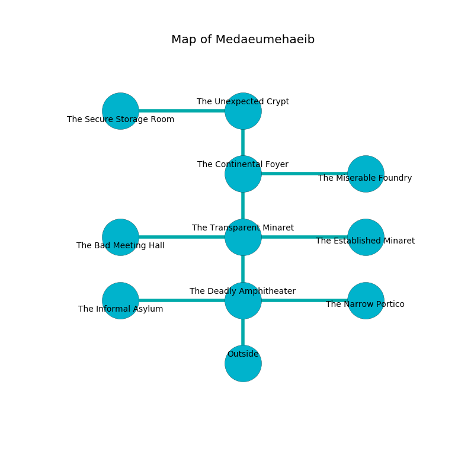

%Ruin Dogs

##Medaeumehaeib
###Overview
Medaeumehaeib is located on a volcanic mountain. Some rooms of it are somewhat hot. A massive storm is happening outside. It is occupied by Troglodytes. Danial Yancey The Silly, a Cyclops is here. The Troglodytes are ruled by Danial Yancey The Silly. He  is trying to recover [Uacduf Ced](#Uacduf-Ced). 

###Artifact
####Uacduf Ced

Uacduf Ced looks like a smooth amulet. When touched it ignites its surrroundings. 

###Locations

####the deadly amphitheater
The air tastes like grape skin here. There are twenty eight Troglodytes here. The floor is cluttered with shells. If the Troglodytes notice the Ruin Dogs, one of them will retreat and alert [Danial Yancey](#Danial-Yancey). 

* To the west a narrow pathway leads to [the informal asylum](#the-informal-asylum).
* To the east a flooded pathway opens to [the narrow portico](#the-narrow-portico).
* To the north a small artery connects to [the transparent minaret](#the-transparent-minaret).
* To the south is the entrance.

####the transparent minaret

* To the west a dark cavern connects to [the bad meeting hall](#the-bad-meeting-hall).
* To the east a hazy gap opens to [the established minaret](#the-established-minaret).
* To the north a flooded path opens to [the continental foyer](#the-continental-foyer).
* To the south a small artery leads to [the deadly amphitheater](#the-deadly-amphitheater).

####the continental foyer
The crystal walls are ruined. The air smells like corn here. 

* [Danial Yancey The Silly](#Danial-Yancey-The-Silly) is here.
* To the east a hazy hallway opens to [the miserable foundry](#the-miserable-foundry).
* To the north a long opening connects to [the unexpected crypt](#the-unexpected-crypt).
* To the south a flooded path opens to [the transparent minaret](#the-transparent-minaret).

####the unexpected crypt
There are an Imp, a Badger, a Barlgura, and a Bugbear here. White ferns are sprouting in cracks in the floor. There is a trap here. When activated, a magical rune will cast a curse. The air smells like bouillon here. The floor is bloodstained. 

There is an engraving on the ceiling written in common. 

> Leave now.
>

* [Uacduf Ced](#Uacduf-Ced) is here.
* To the west a torchlit passageway leads to [the secure storage room](#the-secure-storage-room).
* To the south a long opening connects to [the continental foyer](#the-continental-foyer).

####the informal asylum
Gray razorgrass is swaying from the walls. The floor is glossy. The air smells like peppermint here. There are a Winter Wolf and an Incubus here. The wooden walls are bloodstained. 

There is an engraving on a tablet written in common. 

> Poor me! weak god
>
> always odd
>
> democratic, wild, progressive
>
> the world is impressive
>

* To the east a narrow pathway leads to [the deadly amphitheater](#the-deadly-amphitheater).

####the bad meeting hall
The air smells like brandy here. There are twenty eight Troglodytes here. There is a trap here. When activated, a magical sound detector will launch a poison dart. If the Troglodytes notice the Ruin Dogs, one of them will retreat and alert [Danial Yancey](#Danial-Yancey). 

* There is a leaf here.
* To the east a dark cavern opens to [the transparent minaret](#the-transparent-minaret).

####the established minaret
The floor is glossy. 

* To the west a hazy gap opens to [the transparent minaret](#the-transparent-minaret).

####the narrow portico
Blue moss is growing in broken urns. The metallic walls are scratched. 

* To the west a flooded pathway opens to [the deadly amphitheater](#the-deadly-amphitheater).

####the miserable foundry
The air smells like sulfur here. Blue moss is decaying from the ceiling. 

* To the west a hazy hallway opens to [the continental foyer](#the-continental-foyer).

####the secure storage room
The floor is flooded with one inch deep cool water. There are twenty eight Troglodytes here. The wooden walls are bloodstained. The Troglodytes are willing to negotiate. 

* To the east a torchlit passageway connects to [the unexpected crypt](#the-unexpected-crypt).

