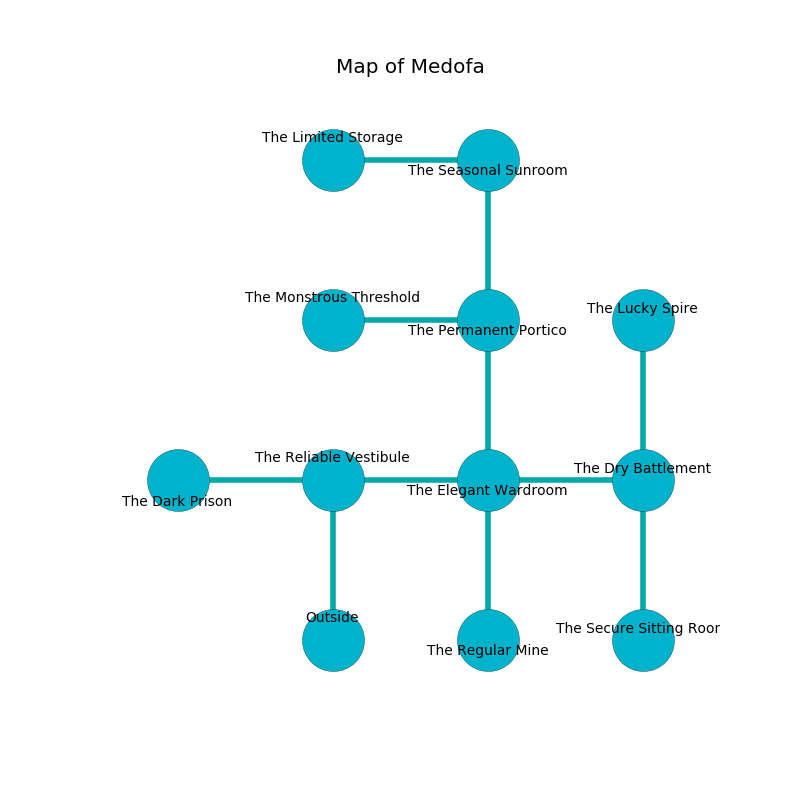

%Ruin Dogs

##Medofa
###Overview
Medofa is located in a flooded tree. Some rooms of Medofa are unbearably hot. A massive storm is happening outside. It is occupied by Lizardfolk. Anibal Jefferies The Inconsiderate, a Cloud Giant is here. The Lizardfolk are the soldiers of Anibal Jefferies The Inconsiderate. He  is founding a new religion. 

###Artifact
####Laeicu

Laeicu looks like a warm gem. When worshipped it flies into the air. 

###Locations

####the reliable vestibule
The air smells like currant bud here. Blue ferns are decaying in broken urns. 

* To the west a windy gap connects to [the dark prison](#the-dark-prison).
* To the east a long walkway connects to [the elegant wardroom](#the-elegant-wardroom).
* To the south is the entrance.

####the elegant wardroom

* To the west a long walkway connects to [the reliable vestibule](#the-reliable-vestibule).
* To the east a dark artery leads to [the dry battlement](#the-dry-battlement).
* To the north a flooded artery connects to [the permanent portico](#the-permanent-portico).
* To the south a dark threshold connects to [the regular mine](#the-regular-mine).

####the regular mine
Red ferns are swaying from the ceiling. There are five Lizardfolk Shamans here. If the Lizardfolk notice the Ruin Dogs, one of them will retreat and alert the others. 

* To the north a dark threshold leads to [the elegant wardroom](#the-elegant-wardroom).

####the dry battlement
The floor is glossy. The air smells like shellfish here. 

* To the west a dark artery leads to [the elegant wardroom](#the-elegant-wardroom).
* To the north a long cave leads to [the lucky spire](#the-lucky-spire).
* To the south a windy corridor connects to [the secure sitting Room](#the-secure-sitting-Room).

####the permanent portico
The stone walls are unsettled. There are a Reef Shark, an Orog, a Blue Slaad, and a Giant Spider here. 

* To the west a small path connects to [the monstrous threshold](#the-monstrous-threshold).
* To the north a long corridor connects to [the seasonal sunroom](#the-seasonal-sunroom).
* To the south a flooded artery opens to [the elegant wardroom](#the-elegant-wardroom).

####the lucky spire
There are five Lizardfolk Shamans and two Lizardfolk here. The air smells like corn chip here. The mirrored walls are scratched. Gray moss is decaying from the ceiling. One of the Lizardfolk is on watch, the rest are sleeping. 

There is an engraving on a tablet written in Lizardfolk Script. 

> They are corrupted
>
> peaceful and favorable
>

* To the south a long cave connects to [the dry battlement](#the-dry-battlement).

####the monstrous threshold
Red razorgrass is sprouting from the walls. The floor is smooth. The air smells like lavender here. 

There is an engraving on a stone written in Lizardfolk Script. 

> We are cursed
>
> safe and agile
>

* To the east a small path leads to [the permanent portico](#the-permanent-portico).

####the dark prison
The air smells like frying here. The floor is smooth. 

* To the east a windy gap opens to [the reliable vestibule](#the-reliable-vestibule).

####the secure sitting Room
The floor is smooth. The air smells like rum here. There are five Lizardfolk Shamans and three Lizardfolk here. The Lizardfolk are drunk. 

There is an engraving on the ceiling written in Lizardfolk Script. 

> I am lost in Medofa.
>

* There is a feather here.
* To the north a windy corridor leads to [the dry battlement](#the-dry-battlement).

####the seasonal sunroom
There are four Lizardfolk Shamans and four Lizardfolk here. The floor is flooded with five inch deep cold water. Blue moss is growing from the walls. The Lizardfolk are crazy with bloodlust. 

* There is a key here.
* There is a spirit here.
* There is a hoard here.
* [Laeicu](#Laeicu) is here.
* [Anibal Jefferies The Inconsiderate](#Anibal-Jefferies-The-Inconsiderate) is here.
* To the west a flooded threshold leads to [the limited storage](#the-limited-storage).
* To the south a long corridor connects to [the permanent portico](#the-permanent-portico).

####the limited storage
The stone walls are caving in. There are a Chasme, a Black Bear, and a Night Hag here. Green mushrooms are sprouting in broken urns. The air tastes like pine here. 

* To the east a flooded threshold leads to [the seasonal sunroom](#the-seasonal-sunroom).

