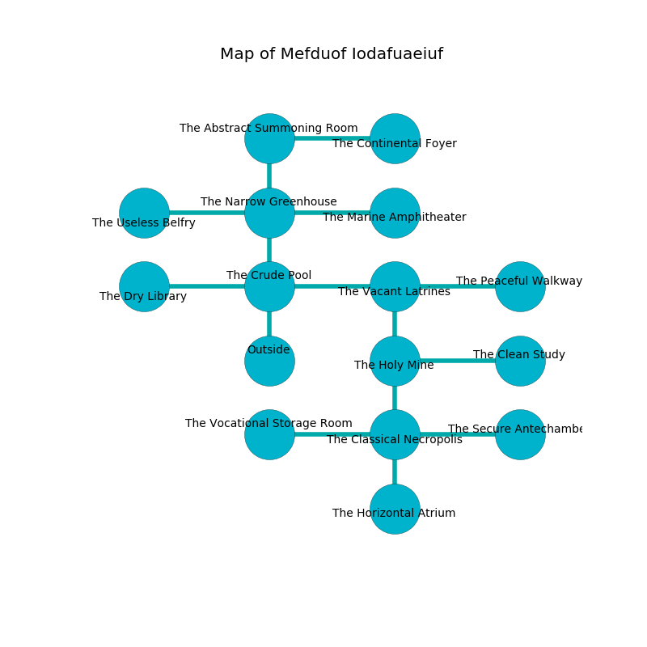

%Ruin Dogs

##Mefduof Iodafuaeiuf
###Overview
Mefduof Iodafuaeiuf is constructed on a spikey mountain. Some rooms of Mefduof Iodafuaeiuf are cursed. A massive storm is happening outside. It is occupied by Deep Gnomes. Nanette Blodgett The Dogmatic, a Cloud Giant is here. The Deep Gnomes are ruled by Nanette Blodgett The Dogmatic. She  is trying to steal [Iaehm](#Iaehm). 

###Artifact
####Iaehm

Iaehm has the form of a sharp cube. Cacophony slips near it. It is a sickly orange color. When touched it becomes lost. 

###Locations

####the crude pool
The brick walls are scratched. Blue mushrooms are decaying in a patch on the floor. 

* To the west a long opening opens to [the dry library](#the-dry-library).
* To the east a small walkway leads to [the vacant latrines](#the-vacant-latrines).
* To the north a long artery opens to [the narrow greenhouse](#the-narrow-greenhouse).
* To the south is the entrance.

####the dry library
The crystal walls are unsettled. The floor is flooded with four inch deep scalding water. The air smells like phenolic here. 

* There is a sceptre here.
* There is a stocking here.
* There is a sword here.
* There is an orange here.
* To the east a long opening leads to [the crude pool](#the-crude-pool).

####the vacant latrines
The mirrored walls are pristine. White moss is growing in cracks in the floor. The air smells like forest here. 

* To the west a small walkway opens to [the crude pool](#the-crude-pool).
* To the east a torchlit artery opens to [the peaceful walkway](#the-peaceful-walkway).
* To the south a flooded cavern connects to [the holy mine](#the-holy-mine).

####the holy mine
Yellow lichens are decaying in broken urns. The floor is smooth. The air smells like cedar here. There are a Young Black Dragon, a Dryad, a Flameskull, and an Ankylosaurus here. 

* To the east a torchlit hallway leads to [the clean study](#the-clean-study).
* To the north a flooded cavern connects to [the vacant latrines](#the-vacant-latrines).
* To the south a small cave connects to [the classical necropolis](#the-classical-necropolis).

####the narrow greenhouse
The air smells like huckleberry here. There are twenty Deep Gnomes here. The Deep Gnomes are drunk. 

There is an engraving on a monolith written in Deep Gnomes Script. 

> I am cruel.
>
> Maybe try dying.
>

* [Iaehm](#Iaehm) is here.
* To the west a twisted pathway opens to [the useless belfry](#the-useless-belfry).
* To the east a flooded threshold opens to [the marine amphitheater](#the-marine-amphitheater).
* To the north a long path opens to [the abstract summoning room](#the-abstract-summoning-room).
* To the south a long artery leads to [the crude pool](#the-crude-pool).

####the abstract summoning room
There is a trap here. When activated, a pressure plate will ring a bell. The brick walls are scratched. The air tastes like oatmeal here. Yellow moss is growing from the walls. 

* To the east a long walkway connects to [the continental foyer](#the-continental-foyer).
* To the south a long path leads to [the narrow greenhouse](#the-narrow-greenhouse).

####the classical necropolis
White moss is swaying in broken urns. The crystal walls are ruined. There are twenty Deep Gnomes here. The Deep Gnomes are performing a ritual. If not interrupted, [Nanette Blodgett](#Nanette-Blodgett) will be magically alarmed. 

* There is a stamp here.
* To the west a twisted artery leads to [the vocational storage room](#the-vocational-storage-room).
* To the east a flooded cavern leads to [the secure antechamber](#the-secure-antechamber).
* To the north a small cave opens to [the holy mine](#the-holy-mine).
* To the south a dripping hall opens to [the horizontal atrium](#the-horizontal-atrium).

####the vocational storage room
The air tastes like sage here. The wooden walls are scratched. There are twenty Deep Gnomes here. The Deep Gnomes are performing a ritual. If not interrupted, [Nanette Blodgett](#Nanette-Blodgett) will be magically alarmed. 

There is an engraving on the floor written in common. 

> O sorry fate
>
> it is never great
>
> quiet, intellectual, moral
>
> nothing is oral
>

* To the east a twisted artery connects to [the classical necropolis](#the-classical-necropolis).

####the peaceful walkway
The air tastes like marzipan here. There are twenty Deep Gnomes here. The floor is smooth. The crystal walls are covered in mold. The Deep Gnomes are willing to negotiate. 

There is an engraving on the ceiling written in common. 

> [Iaehm](#Iaehm)
>
> glorious and tired
>

* There is a fork here.
* To the west a torchlit artery opens to [the vacant latrines](#the-vacant-latrines).

####the horizontal atrium
The obsidion walls are covered in mold. 

* There is a worm here.
* There is a bell here.
* To the north a dripping hall leads to [the classical necropolis](#the-classical-necropolis).

####the secure antechamber
The floor is smooth. The glass walls are ruined. 

* To the west a flooded cavern connects to [the classical necropolis](#the-classical-necropolis).

####the clean study
The obsidion walls are pristine. Blue ferns are swaying in a patch on the floor. There are twenty Deep Gnomes here. There is a trap here. When activated, a magical sound detector will launch a poison dart. The Deep Gnomes are crazy with bloodlust. 

* To the west a torchlit hallway connects to [the holy mine](#the-holy-mine).

####the marine amphitheater
The floor is glossy. The concrete walls are covered in mold. The air tastes like citrus peel here. 

* To the west a flooded threshold opens to [the narrow greenhouse](#the-narrow-greenhouse).

####the continental foyer
There are an Ettin, a Barbed Devil, a Veteran, and a Manes here. Gray razorgrass is growing in a patch on the floor. The floor is sticky. 

There is an engraving on a stone written in Deep Gnomes Script. 

> I am lost in Mefduof Iodafuaeiuf.
>

* There is a face here.
* To the west a long walkway opens to [the abstract summoning room](#the-abstract-summoning-room).

####the useless belfry
The floor is glossy. 

* [Nanette Blodgett The Dogmatic](#Nanette-Blodgett-The-Dogmatic) is here.
* To the east a twisted pathway opens to [the narrow greenhouse](#the-narrow-greenhouse).

