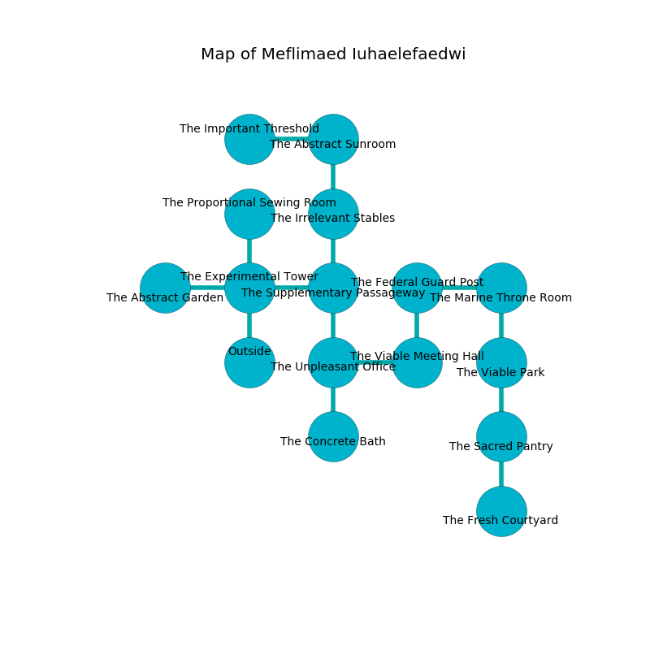

%Ruin Dogs

##Meflimaed Iuhaelefaedwi
###Overview
Meflimaed Iuhaelefaedwi is located in a volcanic mountain. Some areas of Meflimaed Iuhaelefaedwi are corrupted. A windstorm is happening outside. It is occupied by Quaggoths. Yong Fleck The Changeable, a Drow Priestess of Lolth is here. The Quaggoths are ruled by Yong Fleck The Changeable. He  is trying to destroy [Ghed](#Ghed). 

###Artifact
####Ghed

Ghed is a powerful artifact in the shape of a hard crystal. It is a light red color. When thrown it destroys itself. 

###Locations

####the experimental tower
The brick walls are pristine. There are a Sprite, a Manticore, a Giant Sea Horse, a Bandit, a Giant Elk, and a Gibbering Mouther here. Gray razorgrass is growing in cracks in the floor. 

* To the west a small corridor connects to [the abstract garden](#the-abstract-garden).
* To the east a windy walkway connects to [the supplementary passageway](#the-supplementary-passageway).
* To the north a narrow walkway leads to [the proportional sewing room](#the-proportional-sewing-room).
* To the south is the entrance.

####the supplementary passageway
The floor is glossy. Gray moss is decaying from the ceiling. 

There is an engraving on the floor written in Quaggoths Script. 

> Run away.
>

* To the west a windy walkway connects to [the experimental tower](#the-experimental-tower).
* To the north a long opening opens to [the irrelevant stables](#the-irrelevant-stables).
* To the south a hazy gap connects to [the unpleasant office](#the-unpleasant-office).

####the unpleasant office

* To the east a windy gap opens to [the viable meeting hall](#the-viable-meeting-hall).
* To the north a hazy gap leads to [the supplementary passageway](#the-supplementary-passageway).
* To the south a windy passageway opens to [the concrete bath](#the-concrete-bath).

####the abstract garden
The floor is cluttered with bones. The air smells like clam here. 

There is an engraving on a tablet written in Quaggoths Script. 

> [Ghed](#Ghed)
>
> noisy, uneasy, secure
>
> official, absolute, federal
>
> but still
>
> you must be crystalized
>

* To the east a small corridor opens to [the experimental tower](#the-experimental-tower).

####the concrete bath
There are three Quaggoth Thonots here. There is a trap here. When activated, a pressure plate will launch a ceiling pendulum. The air tastes like ozone here. The obsidion walls are scratched. The floor is bloodstained. Gray mushrooms are swaying from the walls. One of the Quaggoths is on watch, the rest are drunk. 

* To the north a windy passageway leads to [the unpleasant office](#the-unpleasant-office).

####the viable meeting hall
The obsidion walls are scratched. Red razorgrass is growing in broken urns. 

* To the west a windy gap opens to [the unpleasant office](#the-unpleasant-office).
* To the north a torchlit hallway connects to [the federal guard post](#the-federal-guard-post).

####the federal guard post
The obsidion walls are caving in. The air tastes like peach here. The floor is flooded with one inch deep cold water. There are a Giant Rat, a Young Black Dragon, a Swarm of Ravens, a Myconid Sovereign, and an Ankheg here. 

* To the east a small pathway connects to [the marine throne room](#the-marine-throne-room).
* To the south a torchlit hallway connects to [the viable meeting hall](#the-viable-meeting-hall).

####the irrelevant stables
The floor is sticky. There is a trap here. When activated, a pressure plate will fire a scything blade. The brick walls are unsettled. 

* To the north a twisted opening connects to [the abstract sunroom](#the-abstract-sunroom).
* To the south a long opening leads to [the supplementary passageway](#the-supplementary-passageway).

####the marine throne room
Green mushrooms are sprouting in broken urns. The floor is smooth. The obsidion walls are unsettled. 

* To the west a small pathway connects to [the federal guard post](#the-federal-guard-post).
* To the south a long walkway leads to [the viable park](#the-viable-park).

####the proportional sewing room
The floor is smooth. There are a Quaggoth, a Giant Eagle, a Fire Snake, and a Troll here. The concrete walls are ruined. The air smells like blueberry here. 

There is an engraving on a tablet written in common. 

> I am lost in Meflimaed Iuhaelefaedwi.
>
> I tried fighting.
>

* To the south a narrow walkway opens to [the experimental tower](#the-experimental-tower).

####the viable park
The floor is smooth. The mirrored walls are covered in mold. The air smells like cherry here. Blue lichens are sprouting in a patch on the floor. 

There is an engraving on a stone written in Quaggoths Script. 

> I found this place.
>
> Try swimming.
>

* To the north a long walkway leads to [the marine throne room](#the-marine-throne-room).
* To the south a twisted hallway connects to [the sacred pantry](#the-sacred-pantry).

####the abstract sunroom
The air smells like red apple here. The floor is bloodstained. There are three Quaggoth Thonots here. The Quaggoths are caring for babies. 

There is an engraving on the wall written in common. 

> I tried digging.
>

* [Ghed](#Ghed) is here.
* [Yong Fleck The Changeable](#Yong-Fleck-The-Changeable) is here.
* To the west a narrow corridor opens to [the important threshold](#the-important-threshold).
* To the south a twisted opening leads to [the irrelevant stables](#the-irrelevant-stables).

####the sacred pantry
Red moss is sprouting in cracks in the floor. The crystal walls are scratched. The air smells like grease here. 

* There is a bowl here.
* To the north a twisted hallway connects to [the viable park](#the-viable-park).
* To the south a torchlit path connects to [the fresh courtyard](#the-fresh-courtyard).

####the fresh courtyard
The air tastes like muguet here. The stone walls are unsettled. Red moss is swaying in broken urns. 

* To the north a torchlit path connects to [the sacred pantry](#the-sacred-pantry).

####the important threshold
There are two Quaggoth Thonots and a Quaggoth here. The concrete walls are bloodstained. The floor is glossy. The air smells like salmon here. The Quaggoths are berserk with rage. 

* To the east a narrow corridor leads to [the abstract sunroom](#the-abstract-sunroom).

