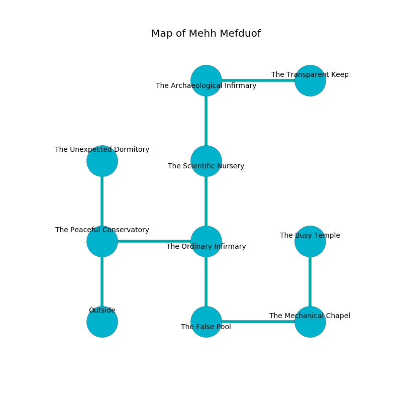

%Ruin Dogs

##Mehh Mefduof
###Overview
Mehh Mefduof is located under an alien tree. Some areas of it are flooded. A massive storm is happening outside. It is occupied by Centaurs. Selena Keenan The Lazy, a Stone Giant is here. The Centaurs are the soldiers of Selena Keenan The Lazy. She  is trying to understand [The Romantic Score](#The-Romantic-Score). 

###Artifact
####The Romantic Score

The Romantic Score looks like a hard rock. It smells like zedoary. When worn it projects energy. 

###Locations

####the peaceful conservatory
Red moss is growing in a patch on the floor. 

* To the east a windy passageway opens to [the ordinary infirmary](#the-ordinary-infirmary).
* To the north a twisted pathway opens to [the unexpected dormitory](#the-unexpected-dormitory).
* To the south is the entrance.

####the ordinary infirmary
The floor is sticky. There are four Centaurs here. The air smells like wormwood here. Red razorgrass is sprouting in cracks in the floor. The Centaurs are fighting amongst themselves. 

There is an engraving on a tablet written in Centaurs Script. 

> I am free.
>

* To the west a windy passageway connects to [the peaceful conservatory](#the-peaceful-conservatory).
* To the north a dripping opening leads to [the scientific nursery](#the-scientific-nursery).
* To the south a flooded artery opens to [the false pool](#the-false-pool).

####the scientific nursery
The air tastes like black currant here. White moss is decaying from the walls. The floor is sticky. There are four Centaurs here. The Centaurs are feasting. 

* There is a box here.
* To the north a long artery opens to [the archaeological infirmary](#the-archaeological-infirmary).
* To the south a dripping opening opens to [the ordinary infirmary](#the-ordinary-infirmary).

####the archaeological infirmary
The floor is cluttered with broken glass. The metallic walls are unsettled. The air smells like dairy here. Yellow moss is swaying from the ceiling. 

* To the east a windy hallway leads to [the transparent keep](#the-transparent-keep).
* To the south a long artery connects to [the scientific nursery](#the-scientific-nursery).

####the unexpected dormitory
The air smells like ham here. The obsidion walls are ruined. Yellow ferns are growing from the walls. There are four Centaurs here. The Centaurs are sleeping. 

There is an engraving on a stone written in Centaurs Script. 

> Dear me! the world is woe
>
> yet slow
>
> yet abstract
>
> everything is exact
>

* To the south a twisted pathway opens to [the peaceful conservatory](#the-peaceful-conservatory).

####the false pool
The air smells like lavender here. Red lichens are swaying from the walls. 

* [Selena Keenan The Lazy](#Selena-Keenan-The-Lazy) is here.
* To the east a small cave opens to [the mechanical chapel](#the-mechanical-chapel).
* To the north a flooded artery leads to [the ordinary infirmary](#the-ordinary-infirmary).

####the mechanical chapel
The brick walls are covered in mold. The air tastes like truffle here. 

* There is a fork here.
* [The Romantic Score](#The-Romantic-Score) is here.
* To the west a small cave connects to [the false pool](#the-false-pool).
* To the north a hazy pathway opens to [the busy temple](#the-busy-temple).

####the transparent keep
The metallic walls are covered in mold. 

* To the west a windy hallway opens to [the archaeological infirmary](#the-archaeological-infirmary).

####the busy temple
Gray lichens are swaying from the ceiling. 

* To the south a hazy pathway leads to [the mechanical chapel](#the-mechanical-chapel).

