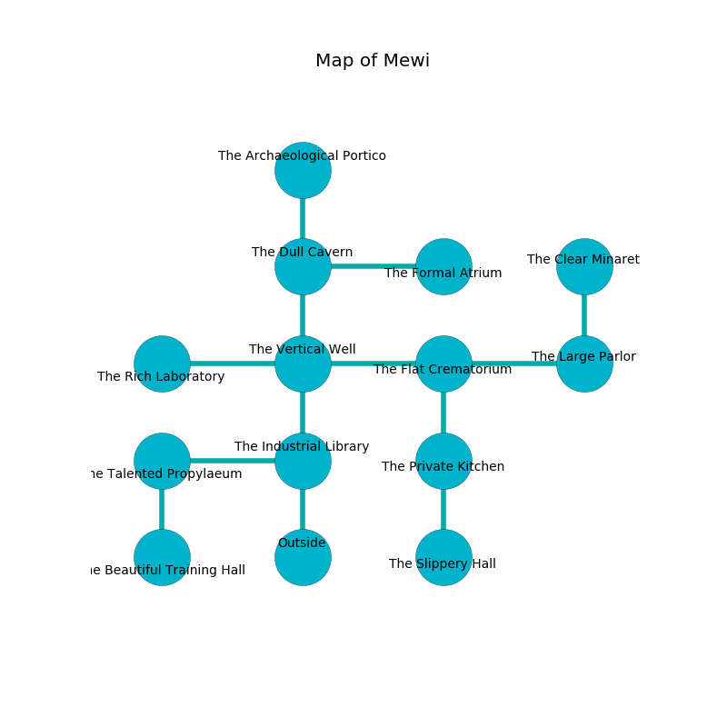

%Ruin Dogs

##Mewi
###Overview
Mewi is located under a flooded mountain. Parts of it are corrupted. A massive storm is happening outside. It is occupied by Quaggoths. Beryl Chau The Impatient, an Assassin is here. The Quaggoths are the slaves of Beryl Chau The Impatient. She  is trying to discover [The Blank Bark](#The-Blank-Bark). 

###Artifact
####The Blank Bark

The Blank Bark looks like a sharp prism. Air slides towards it. It is a bright orange color. It smells like rhubarb. When rubbed it grants a wish. 

###Locations

####the industrial library
The floor is flooded with one inch deep hot water. Green moss is decaying in cracks in the floor. 

There is an engraving on the wall written in common. 

> We are sorrowful
>
> desirable, weak, original
>
> lost and delicate
>
> They are dying
>
> large and seasonal
>
> you are destroyed
>

* There is a goat here.
* There is a drawer here.
* There is a bee here.
* To the west a narrow artery connects to [the talented propylaeum](#the-talented-propylaeum).
* To the north a dripping opening opens to [the vertical well](#the-vertical-well).
* To the south is the entrance.

####the talented propylaeum
White ferns are sprouting from the walls. The floor is flooded with six inch deep scalding water. There are two Quaggoth Thonots and a Quaggoth here. One of the Quaggoths is on watch, the rest are celebrating. 

* There is a branch here.
* To the east a narrow artery connects to [the industrial library](#the-industrial-library).
* To the south a hazy pathway leads to [the beautiful training hall](#the-beautiful-training-hall).

####the vertical well
There are two Quaggoth Thonots and a Quaggoth here. The air tastes like mandarin here. The Quaggoths are crazy with bloodlust. 

* [Beryl Chau The Impatient](#Beryl-Chau-The-Impatient) is here.
* To the west a windy hallway leads to [the rich laboratory](#the-rich-laboratory).
* To the east a torchlit cavern opens to [the flat crematorium](#the-flat-crematorium).
* To the north a narrow hallway opens to [the dull cavern](#the-dull-cavern).
* To the south a dripping opening opens to [the industrial library](#the-industrial-library).

####the flat crematorium
The obsidion walls are caving in. There are three Quaggoths here. The floor is glossy. The Quaggoths are performing a ritual. If not interrupted, the Quaggoths will become more powerful. 

There is an engraving on a tablet written in common. 

> Dear me! our fate is inhumane
>
> warm, genuine, acute
>
> qualified and plain
>
> nothing is cute
>

* There is a whip here.
* To the west a torchlit cavern leads to [the vertical well](#the-vertical-well).
* To the east a torchlit hall connects to [the large parlor](#the-large-parlor).
* To the south a long walkway connects to [the private kitchen](#the-private-kitchen).

####the dull cavern
Red moss is growing in cracks in the floor. The obsidion walls are bloodstained. There are a Wraith, a Ghost, and an Elk here. 

* To the east a flooded walkway opens to [the formal atrium](#the-formal-atrium).
* To the north a windy cave opens to [the archaeological portico](#the-archaeological-portico).
* To the south a narrow hallway opens to [the vertical well](#the-vertical-well).

####the rich laboratory
The floor is cluttered with broken glass. The crystal walls are ruined. The air tastes like sugar here. There are a Kuo-Toa Archpriest, a Shrieker, a Rhinoceros, a Crab, a Fire Elemental, and a Gray Ooze here. 

* There is a brush here.
* There is a spear here.
* There is a glove here.
* To the east a windy hallway leads to [the vertical well](#the-vertical-well).

####the formal atrium
There are three Quaggoths here. Yellow moss is growing from the ceiling. The floor is flooded with four inch deep cool water. The obsidion walls are pristine. One of the Quaggoths is working a mechanism that can flood the room. 

* To the west a flooded walkway connects to [the dull cavern](#the-dull-cavern).

####the private kitchen
Red lichens are growing from the walls. The air smells like prune here. 

* [The Blank Bark](#The-Blank-Bark) is here.
* To the north a long walkway leads to [the flat crematorium](#the-flat-crematorium).
* To the south a windy corridor connects to [the slippery hall](#the-slippery-hall).

####the archaeological portico
The floor is flooded with seven inch deep cool water. The air smells like green peas here. Blue ferns are decaying from the walls. 

* To the south a windy cave connects to [the dull cavern](#the-dull-cavern).

####the large parlor
White razorgrass is sprouting from the ceiling. The floor is flooded with eight inch deep cool water. There are three Quaggoth Thonots here. The Quaggoths are crazy with bloodlust. 

* There is a basket here.
* To the west a torchlit hall opens to [the flat crematorium](#the-flat-crematorium).
* To the north a small cave leads to [the clear minaret](#the-clear-minaret).

####the clear minaret
The air tastes like radish here. The crystal walls are scratched. Red ferns are swaying in a patch on the floor. The floor is sticky. 

* To the south a small cave connects to [the large parlor](#the-large-parlor).

####the beautiful training hall
The brick walls are bloodstained. There are a Lion, a Githzerai Zerth, two Draft Horses, a Jackalwere, a Giant Centipede, a Hunter Shark, and  here. 

There is an engraving on a tablet written in Quaggoths Script. 

> Hide here.
>

* To the north a hazy pathway connects to [the talented propylaeum](#the-talented-propylaeum).

####the slippery hall
There are a Quaggoth Thonot and two Quaggoths here. The air tastes like apple here. The Quaggoths are willing to negotiate. 

* There is an apple here.
* To the north a windy corridor opens to [the private kitchen](#the-private-kitchen).

