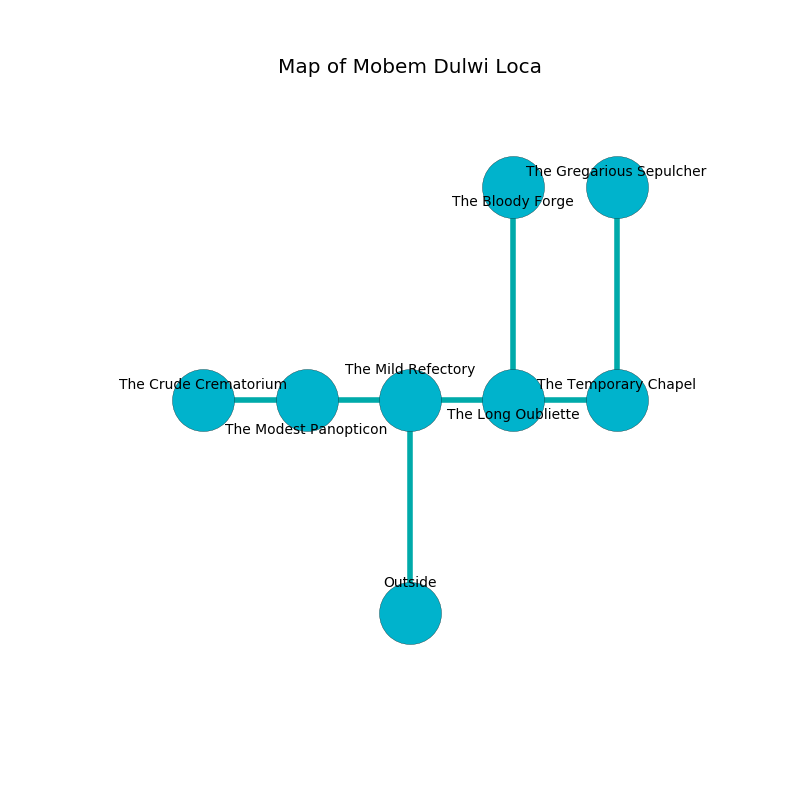

%Ruin Dogs

##Mobem Dulwi Loca
###Overview
Mobem Dulwi Loca is constructed on a spikey plain. Some rooms of it are somewhat cold. A blizzard is happening outside. It is occupied by Orc. Micha Hayden The Patronizing, a Cambion is here. The Orc are battling Micha Hayden The Patronizing. She  is founding a new religion. 

###Artifact
####Dwifebael Gufbohe

Dwifebael Gufbohe is a powerful artifact in the shape of a glassy rock. It smells like plastic. When gazed upon it grants power to its owner. 

###Locations

####the mild refectory

* To the west a torchlit cave connects to [the modest panopticon](#the-modest-panopticon).
* To the east a dark walkway connects to [the long oubliette](#the-long-oubliette).
* To the south is the entrance.

####the long oubliette
The air tastes like macadamia here. White ferns are growing from the walls. The crystal walls are bloodstained. The floor is flooded with three inch deep cold water. 

* [Dwifebael Gufbohe](#Dwifebael-Gufbohe) is here.
* To the west a dark walkway opens to [the mild refectory](#the-mild-refectory).
* To the east a small corridor opens to [the temporary chapel](#the-temporary-chapel).
* To the north a windy passageway leads to [the bloody forge](#the-bloody-forge).

####the temporary chapel
There are eight Orcs here. Blue moss is growing from the ceiling. The air smells like acid here. The Orc are willing to fight to the death. 

There is an engraving on the wall written in common. 

> A trap ahead.
>

* To the west a small corridor connects to [the long oubliette](#the-long-oubliette).
* To the north a long passageway connects to [the gregarious sepulcher](#the-gregarious-sepulcher).

####the gregarious sepulcher
Green razorgrass is decaying in broken urns. The air smells like wine here. The floor is smooth. The brick walls are ruined. 

* There is a potato here.
* To the south a long passageway connects to [the temporary chapel](#the-temporary-chapel).

####the modest panopticon
Blue lichens are sprouting in a patch on the floor. There are eight Orcs here. The Orc are caring for babies. 

There is an engraving on a monolith written in common. 

> Maybe try praying.
>

* [Micha Hayden The Patronizing](#Micha-Hayden-The-Patronizing) is here.
* To the west a hazy artery leads to [the crude crematorium](#the-crude-crematorium).
* To the east a torchlit cave leads to [the mild refectory](#the-mild-refectory).

####the crude crematorium
The floor is sticky. The crystal walls are ruined. 

* To the east a hazy artery leads to [the modest panopticon](#the-modest-panopticon).

####the bloody forge
The metallic walls are unsettled. There are eight Orcs here. The floor is smooth. The air tastes like whiskey here. One of the Orc is pointing a ballista at the entrance. 

* There is a rail here.
* There is an ant here.
* To the south a windy passageway leads to [the long oubliette](#the-long-oubliette).

