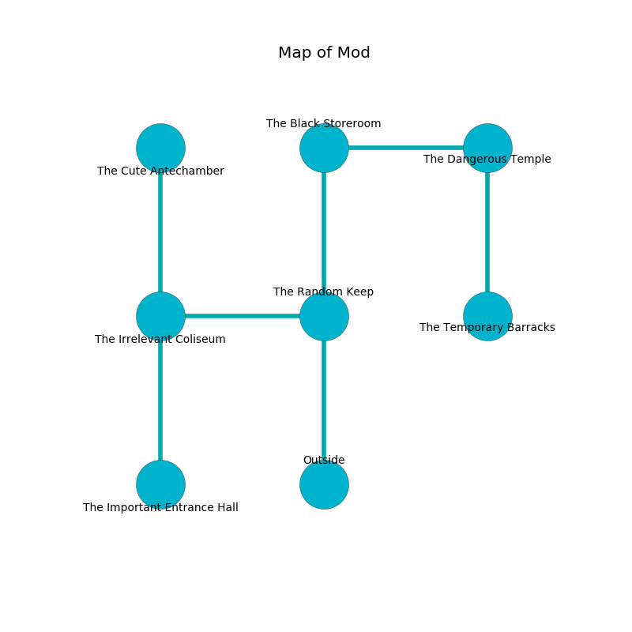

%Ruin Dogs

##Mod
###Overview
Mod is constructed on an obsidion tree. Parts of Mod are inaccessible. The ruin is sinking into the earth. It is occupied by Satyrs. Cheryle Snipes The Obstinate, a Barbed Devil is here. The Satyrs are the minions of Cheryle Snipes The Obstinate. She  is founding a new religion. 

###Artifact
####Cubbomaeid

Cubbomaeid has the form of a hard meteorite. It smells like tea. It is a dark brown color. When held it aids memory. 

###Locations

####the random keep
The floor is sticky. The air smells like marigold here. Yellow mushrooms are decaying from the ceiling. The crystal walls are covered in mold. 

There is an engraving on a tablet written in common. 

> A collar is a limit
>
> direct, narrow, single
>
> yet tall
>
> full-time, outside, fine
>
> influential, sensitive, ambiguous
>
> [Cubbomaeid](#Cubbomaeid)
>
> obscure, permanent, shallow
>
> stunning and pleasant
>
> We are corrupted
>
> international and international
>
> large, considerable, monthly
>
> We are corrupted
>
> but never cruel
>

* [Cheryle Snipes The Obstinate](#Cheryle-Snipes-The-Obstinate) is here.
* To the west a flooded artery connects to [the irrelevant coliseum](#the-irrelevant-coliseum).
* To the north a dripping threshold opens to [the black storeroom](#the-black-storeroom).
* To the south is the entrance.

####the black storeroom

* To the east a long pathway connects to [the dangerous temple](#the-dangerous-temple).
* To the south a dripping threshold leads to [the random keep](#the-random-keep).

####the irrelevant coliseum
The metallic walls are ruined. There are a Giant fire beetle, a Gold Dragon Wyrmling, and an Ogre Zombie here. The air tastes like musk here. 

* [Cubbomaeid](#Cubbomaeid) is here.
* To the east a flooded artery leads to [the random keep](#the-random-keep).
* To the north a narrow path connects to [the cute antechamber](#the-cute-antechamber).
* To the south a narrow opening leads to [the important entrance hall](#the-important-entrance-hall).

####the cute antechamber
The air smells like freshly cut hay here. The crystal walls are covered in mold. White razorgrass is sprouting in a patch on the floor. There are eight Satyrs here. One of the Satyrs is pointing a ballista at the entrance. 

* To the south a narrow path opens to [the irrelevant coliseum](#the-irrelevant-coliseum).

####the dangerous temple
The floor is flooded with nine inch deep scalding water. There is a trap here. When activated, a magical proximity detector will launch a poison needle. There are a Darkmantle, a Giant Toad, a Nightmare, and a Black Dragon Wyrmling here. White lichens are sprouting in a patch on the floor. 

* To the west a long pathway leads to [the black storeroom](#the-black-storeroom).
* To the south a torchlit walkway leads to [the temporary barracks](#the-temporary-barracks).

####the temporary barracks
The air smells like coumarinic here. The floor is smooth. The concrete walls are bloodstained. 

* There is a glove here.
* There is a stocking here.
* There is a cord here.
* To the north a torchlit walkway leads to [the dangerous temple](#the-dangerous-temple).

####the important entrance hall
The mirrored walls are unsettled. There are eight Satyrs here. The air smells like cornmint here. The Satyrs are willing to negotiate. 

* To the north a narrow opening connects to [the irrelevant coliseum](#the-irrelevant-coliseum).

