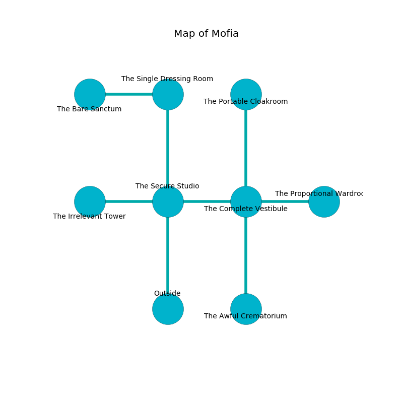

%Ruin Dogs

##Mofia
###Overview
Mofia is located on an alien mountain. Some areas of it are somewhat hot. A lunar eclipse is happening outside. It is occupied by Gnolls. Milagros Dorris The Resentful, a Hobgoblin Warlord is here. The Gnolls are the minions of Milagros Dorris The Resentful. She  is founding a new religion. 

###Artifact
####Edbuidmafa Defamd

Edbuidmafa Defamd is a powerful artifact in the shape of a broken crystal. It is a medium purple color. Air slips around it. When worshipped it levitates those nearby. 

###Locations

####the secure studio
Red lichens are swaying in a patch on the floor. The air smells like blueberry here. The metallic walls are covered in mold. 

* There is a bird here.
* [Edbuidmafa Defamd](#Edbuidmafa-Defamd) is here.
* To the west a twisted threshold opens to [the irrelevant tower](#the-irrelevant-tower).
* To the east a narrow cave opens to [the complete vestibule](#the-complete-vestibule).
* To the north a hazy passageway connects to [the single dressing room](#the-single-dressing-room).
* To the south is the entrance.

####the complete vestibule
The air smells like wasabi here. The mirrored walls are scratched. 

* To the west a narrow cave connects to [the secure studio](#the-secure-studio).
* To the east a hazy walkway connects to [the proportional wardroom](#the-proportional-wardroom).
* To the north a narrow passageway connects to [the portable cloakroom](#the-portable-cloakroom).
* To the south a long pathway connects to [the awful crematorium](#the-awful-crematorium).

####the single dressing room
The crystal walls are unsettled. 

* [Milagros Dorris The Resentful](#Milagros-Dorris-The-Resentful) is here.
* To the west a dark threshold leads to [the bare sanctum](#the-bare-sanctum).
* To the south a hazy passageway opens to [the secure studio](#the-secure-studio).

####the bare sanctum
The metallic walls are covered in mold. The air tastes like sand here. Yellow lichens are decaying in broken urns. There are a Gnoll Fang of Yeenoghu, two Gnolls, a Gnoll Pack Lord, and  here. The floor is sticky. One of the Gnolls is working a mechanism that can lock the exits. 

* To the east a dark threshold connects to [the single dressing room](#the-single-dressing-room).

####the awful crematorium
The air tastes like myrrh here. White moss is swaying in a patch on the floor. There are a Flumph, a Gnoll Pack Lord, an Air Elemental, a Panther, a Quaggoth, a Constrictor Snake, and a Bat here. The wooden walls are unsettled. 

There is an engraving on the wall written in common. 

> [Edbuidmafa Defamd](#Edbuidmafa-Defamd)
>
> yet terminal
>
> thoughtful and primary
>
> [Edbuidmafa Defamd](#Edbuidmafa-Defamd)
>
> bald, proud, aesthetic
>
> feminine and logical
>
> yet never ethnic
>
> [Edbuidmafa Defamd](#Edbuidmafa-Defamd)
>
> constant and distant
>

* To the north a long pathway leads to [the complete vestibule](#the-complete-vestibule).

####the proportional wardroom
The floor is glossy. The air tastes like cologne here. 

* To the west a hazy walkway leads to [the complete vestibule](#the-complete-vestibule).

####the portable cloakroom
The air smells like passion fruit here. 

* To the south a narrow passageway opens to [the complete vestibule](#the-complete-vestibule).

####the irrelevant tower
Gray mushrooms are decaying in a patch on the floor. The mirrored walls are covered in mold. 

* There is a rat here.
* To the east a twisted threshold opens to [the secure studio](#the-secure-studio).

