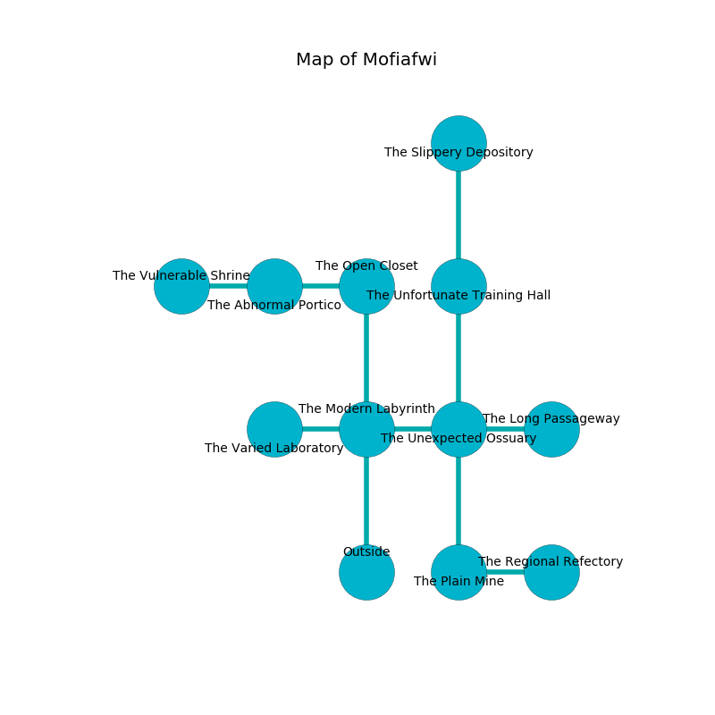

%Ruin Dogs

##Mofiafwi
###Overview
Mofiafwi is constructed on an alien mountain. Some rooms of it are cursed. The ruin is coming to life. It is occupied by Goblins. Collin Perron The Clinging, a Fire Giant is here. The Goblins have been charmed by Collin Perron The Clinging. He  is trying to exploit [Aelae Mahd](#Aelae-Mahd). 

###Artifact
####Aelae Mahd

Aelae Mahd has the form of a sharp blade. It smells like foliage. When worshipped it floats in the air. 

###Locations

####the modern labyrinth
The floor is flooded with four inch deep lukewarm water. The metallic walls are unsettled. 

* To the west a long walkway leads to [the varied laboratory](#the-varied-laboratory).
* To the east a narrow walkway connects to [the unexpected ossuary](#the-unexpected-ossuary).
* To the north a dripping artery opens to [the open closet](#the-open-closet).
* To the south is the entrance.

####the open closet
Blue mushrooms are decaying from the ceiling. The air smells like honeysuckle here. The brick walls are covered in mold. 

There is an engraving on a tablet written in Goblins Script. 

> Oh my life is inhumane
>
> yet extinct
>
> spontaneous and main
>
> fate is distinct
>

* There is a sponge here.
* There is a match here.
* To the west a small hall opens to [the abnormal portico](#the-abnormal-portico).
* To the south a dripping artery connects to [the modern labyrinth](#the-modern-labyrinth).

####the unexpected ossuary
The floor is cluttered with rocks. Yellow ferns are sprouting in cracks in the floor. There is a trap here. When activated, a magical proximity detector will launch a poison dart. The air smells like cauliflower here. 

There is an engraving on the wall written in Goblins Script. 

> I am lost in Mofiafwi.
>
> Try cowering.
>

* To the west a narrow walkway opens to [the modern labyrinth](#the-modern-labyrinth).
* To the east a torchlit cavern leads to [the long passageway](#the-long-passageway).
* To the north a narrow threshold connects to [the unfortunate training hall](#the-unfortunate-training-hall).
* To the south a long hallway leads to [the plain mine](#the-plain-mine).

####the varied laboratory
There are two Goblins, a Hobgoblin Warlord, a Hobgoblin Captain, a Hobgoblin, and  here. The glass walls are covered in mold. The floor is glossy. White mushrooms are decaying from the ceiling. One of the Goblins is working a mechanism that can pour noxious gases from the ceiling. 

* To the east a long walkway connects to [the modern labyrinth](#the-modern-labyrinth).

####the abnormal portico
There are a Goblin, a Hobgoblin Warlord, two Hobgoblin Captains, and  here. The stone walls are covered in mold. Blue lichens are swaying from the walls. If the Goblins notice the Ruin Dogs, one of them will retreat and alert the others. 

* To the west a windy hall leads to [the vulnerable shrine](#the-vulnerable-shrine).
* To the east a small hall connects to [the open closet](#the-open-closet).

####the long passageway
Gray ferns are decaying in broken urns. The air smells like nut here. There are two Hobgoblin Warlords here. The Goblins are performing a ritual. If not interrupted, [Collin Perron](#Collin-Perron) will be magically alarmed. 

There is an engraving on the wall written in Goblins Script. 

> Run away.
>

* There is a church here.
* [Collin Perron The Clinging](#Collin-Perron-The-Clinging) is here.
* To the west a torchlit cavern connects to [the unexpected ossuary](#the-unexpected-ossuary).

####the unfortunate training hall
The air smells like apple here. The floor is smooth. Yellow razorgrass is growing from the walls. The metallic walls are covered in mold. 

* To the north a torchlit cavern opens to [the slippery depository](#the-slippery-depository).
* To the south a narrow threshold opens to [the unexpected ossuary](#the-unexpected-ossuary).

####the plain mine
The floor is smooth. 

* [Aelae Mahd](#Aelae-Mahd) is here.
* To the east a small corridor opens to [the regional refectory](#the-regional-refectory).
* To the north a long hallway leads to [the unexpected ossuary](#the-unexpected-ossuary).

####the vulnerable shrine
The mirrored walls are pristine. There are six Goblins, a Hobgoblin, two Hobgoblin Captains, a Hobgoblin Warlord,  here. The Goblins are willing to negotiate. 

* To the east a windy hall leads to [the abnormal portico](#the-abnormal-portico).

####the slippery depository
The stone walls are pristine. The air tastes like black tea here. Yellow ferns are decaying in cracks in the floor. 

* To the south a torchlit cavern connects to [the unfortunate training hall](#the-unfortunate-training-hall).

####the regional refectory
The air tastes like clary sage here. Green razorgrass is sprouting from the walls. The obsidion walls are bloodstained. 

* To the west a small corridor opens to [the plain mine](#the-plain-mine).

