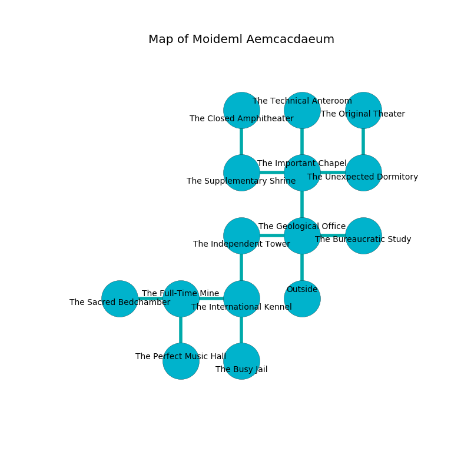

%Ruin Dogs

##Moideml Aemcacdaeum
###Overview
Moideml Aemcacdaeum is constructed on a cursed mountain. Some rooms of Moideml Aemcacdaeum are cursed. A windstorm is happening outside. It is occupied by Cyclopses. Dario Naquin The Gullible, an Assassin is here. The Cyclopses are the minions of Dario Naquin The Gullible. He  is founding a new religion. 

###Artifact
####Eiiofemca Dodaeh

Eiiofemca Dodaeh has the form of a mushy crystal. Fire shifts around it. When cradled it becomes a force of destiny. 

###Locations

####the geological office
There are two Cyclopses here. Blue razorgrass is sprouting in a patch on the floor. The metallic walls are covered in mold. The floor is sticky. One of the Cyclopses is working a mechanism that can engulf the room in a fiery blaze. 

* To the west a torchlit walkway connects to [the independent tower](#the-independent-tower).
* To the east a twisted pathway leads to [the bureaucratic study](#the-bureaucratic-study).
* To the north a narrow path connects to [the important chapel](#the-important-chapel).
* To the south is the entrance.

####the independent tower
White mushrooms are growing in cracks in the floor. The obsidion walls are pristine. There are a Spectator and a Yuan-Ti Abomination here. The air smells like lemon peel here. 

* To the east a torchlit walkway connects to [the geological office](#the-geological-office).
* To the south a small corridor opens to [the international kennel](#the-international-kennel).

####the important chapel
The floor is glossy. Yellow lichens are sprouting in broken urns. 

* There is a goat here.
* There is a diamond here.
* To the west a small artery opens to [the supplementary shrine](#the-supplementary-shrine).
* To the east a windy path connects to [the unexpected dormitory](#the-unexpected-dormitory).
* To the north a flooded path opens to [the technical anteroom](#the-technical-anteroom).
* To the south a narrow path leads to [the geological office](#the-geological-office).

####the international kennel
The air tastes like vegetables here. 

* There is a feather here.
* To the west a long cave leads to [the full-time mine](#the-full-time-mine).
* To the north a small corridor connects to [the independent tower](#the-independent-tower).
* To the south a narrow hallway leads to [the busy jail](#the-busy-jail).

####the unexpected dormitory
Blue ferns are growing in cracks in the floor. The floor is smooth. There are an Otyugh, a Carrion Crawler, a Peryton, and a Warhorse Skeleton here. 

There is an engraving on the floor written in common. 

> I am lost in Moideml Aemcacdaeum.
>

* To the west a windy path leads to [the important chapel](#the-important-chapel).
* To the north a small passageway connects to [the original theater](#the-original-theater).

####the full-time mine
There are a Giant Elk, a Beholder Zombie, and a Dretch here. 

* There is a key here.
* [Dario Naquin The Gullible](#Dario-Naquin-The-Gullible) is here.
* To the west a long artery opens to [the sacred bedchamber](#the-sacred-bedchamber).
* To the east a long cave leads to [the international kennel](#the-international-kennel).
* To the south a torchlit cavern leads to [the perfect music hall](#the-perfect-music-hall).

####the bureaucratic study
The crystal walls are covered in mold. Yellow mushrooms are sprouting from the walls. The floor is flooded with seven inch deep scalding water. The air tastes like carnation here. 

* To the west a twisted pathway leads to [the geological office](#the-geological-office).

####the busy jail
Green lichens are growing from the walls. The metallic walls are caving in. The floor is glossy. There are two Cyclopses here. If the Cyclopses notice the Ruin Dogs, one of them will retreat and alert the others. 

* There is a dog here.
* To the north a narrow hallway connects to [the international kennel](#the-international-kennel).

####the sacred bedchamber
There are two Cyclopses here. The metallic walls are unsettled. The Cyclopses are performing a ritual. If not interrupted, [Dario Naquin](#Dario-Naquin) will be magically alarmed. 

* To the east a long artery opens to [the full-time mine](#the-full-time-mine).

####the original theater
Red razorgrass is swaying from the ceiling. The floor is sticky. There are two Cyclopses here. The air tastes like pomegranate here. The metallic walls are covered in mold. One of the Cyclopses is on watch, the rest are meditating. 

There is an engraving on the wall written in common. 

> I am the best.
>
> Maybe try hiding.
>

* To the south a small passageway opens to [the unexpected dormitory](#the-unexpected-dormitory).

####the supplementary shrine

* [Eiiofemca Dodaeh](#Eiiofemca-Dodaeh) is here.
* To the east a small artery connects to [the important chapel](#the-important-chapel).
* To the north a flooded corridor connects to [the closed amphitheater](#the-closed-amphitheater).

####the technical anteroom
The wooden walls are pristine. There are a Stirge, a Death Dog, a Dryad, a Draft Horse, a Commoner, a Grick, a Silver Dragon Wyrmling, a Giant Eagle, a Mule, and a Goblin Boss here. Green razorgrass is growing in cracks in the floor. 

* To the south a flooded path opens to [the important chapel](#the-important-chapel).

####the perfect music hall
The floor is bloodstained. There is a Young Black Dragon here. Red mushrooms are growing from the walls. 

* To the north a torchlit cavern leads to [the full-time mine](#the-full-time-mine).

####the closed amphitheater
The floor is bloodstained. The glass walls are covered in mold. 

There is an engraving on the ceiling written in common. 

> Oh my! terrible you
>
> gregarious and true
>
> strict, unlikely, possible
>
> death is impossible
>

* There is a box here.
* There is a leaf here.
* To the south a flooded corridor opens to [the supplementary shrine](#the-supplementary-shrine).

