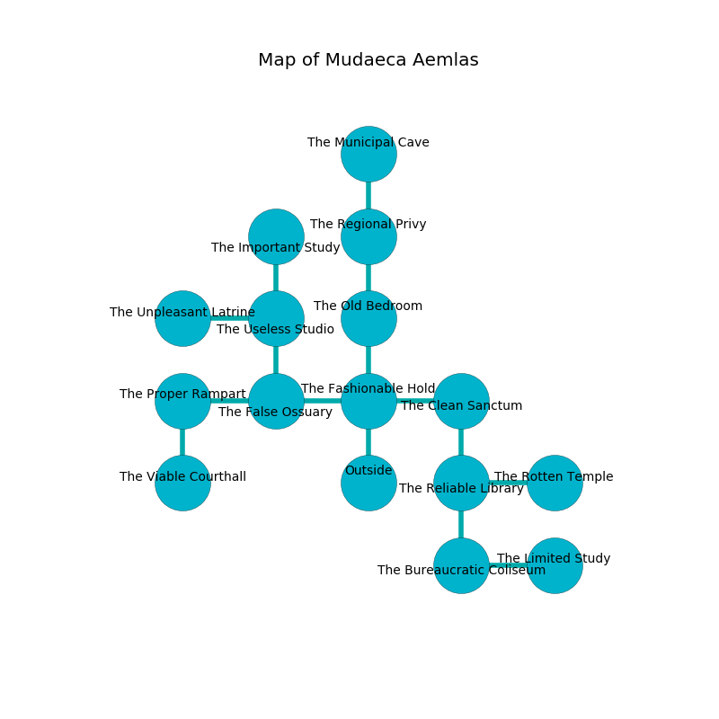

%Ruin Dogs

##Mudaeca Aemlas
###Overview
Mudaeca Aemlas is constructed on a crystal plain. Parts of it are inaccessible. A solar eclipse is happening outside. It is occupied by Kuo-Toa. Darren Leonard The Boring, a Drow Elite Warrior is here. The Kuo-Toa are the slaves of Darren Leonard The Boring. He  is trying to steal [Eddaeh](#Eddaeh). 

###Artifact
####Eddaeh

Eddaeh looks like a smooth crystal. It smells like bay. When gazed upon it floats above the ground. 

###Locations

####the fashionable hold
Green razorgrass is decaying from the ceiling. There are two Darkmantles, a Shadow, a Deep Gnome, an Orc War Chief, a Dretch, and  here. 

* To the west a torchlit hallway opens to [the false ossuary](#the-false-ossuary).
* To the east a long corridor connects to [the clean sanctum](#the-clean-sanctum).
* To the north a narrow walkway connects to [the old bedroom](#the-old-bedroom).
* To the south is the entrance.

####the clean sanctum
The mirrored walls are scratched. The air tastes like plum skin here. 

There is an engraving on the floor written in common. 

> I am seeking [Eddaeh](#Eddaeh).
>

* There is a sponge here.
* To the west a long corridor opens to [the fashionable hold](#the-fashionable-hold).
* To the south a small artery connects to [the reliable library](#the-reliable-library).

####the old bedroom
There are a Sprite, a Drow, a Weretiger, a Manes, a Quipper, a Warhorse, a Winged Kobold, and an Ankylosaurus here. The floor is sticky. The concrete walls are scratched. 

* To the north a long passageway opens to [the regional privy](#the-regional-privy).
* To the south a narrow walkway connects to [the fashionable hold](#the-fashionable-hold).

####the reliable library
Red razorgrass is sprouting in cracks in the floor. The floor is glossy. The air smells like watermelon here. The crystal walls are pristine. 

There is an engraving on the ceiling written in common. 

> A trap ahead.
>

* To the east a long cavern leads to [the rotten temple](#the-rotten-temple).
* To the north a small artery leads to [the clean sanctum](#the-clean-sanctum).
* To the south a small hallway opens to [the bureaucratic coliseum](#the-bureaucratic-coliseum).

####the rotten temple
The floor is glossy. White ferns are growing from the walls. The air smells like quince here. 

* There is a stick here.
* To the west a long cavern opens to [the reliable library](#the-reliable-library).

####the bureaucratic coliseum
The air smells like solvent here. The floor is cluttered with debris. 

* To the east a windy cave connects to [the limited study](#the-limited-study).
* To the north a small hallway opens to [the reliable library](#the-reliable-library).

####the false ossuary
The stone walls are unsettled. 

* To the west a twisted hall leads to [the proper rampart](#the-proper-rampart).
* To the east a torchlit hallway opens to [the fashionable hold](#the-fashionable-hold).
* To the north a narrow opening connects to [the useless studio](#the-useless-studio).

####the limited study
Red ferns are decaying from the walls. The floor is flooded with one inch deep hot water. The metallic walls are ruined. The air tastes like clove here. 

* There is a bee here.
* To the west a windy cave opens to [the bureaucratic coliseum](#the-bureaucratic-coliseum).

####the proper rampart
There is a trap here. When activated, a magical sound detector will make the walls close in. The air smells like wine here. The floor is bloodstained. 

There is an engraving on the ceiling written in Kuo-Toa Script. 

> You are sorrowful
>
> but well
>
> difficult and alive
>

* To the east a twisted hall opens to [the false ossuary](#the-false-ossuary).
* To the south a torchlit artery connects to [the viable courthall](#the-viable-courthall).

####the viable courthall
The mirrored walls are ruined. The floor is glossy. 

* To the north a torchlit artery connects to [the proper rampart](#the-proper-rampart).

####the useless studio
There are a Draft Horse, a Triceratops, a Gray Ooze, and a Rust Monster here. The air smells like cauliflower here. Gray mushrooms are growing in broken urns. 

* To the west a hazy cave connects to [the unpleasant latrine](#the-unpleasant-latrine).
* To the north a long pathway opens to [the important study](#the-important-study).
* To the south a narrow opening leads to [the false ossuary](#the-false-ossuary).

####the regional privy
There are a Kuo-Toa Monitor, a Kuo-Toa Whip, and a Kuo-Toa Archpriest here. There is a trap here. When activated, a tripwire will flood the room with water. The air smells like goat here. Yellow moss is swaying from the ceiling. If the Kuo-Toa notice the Ruin Dogs, one of them will retreat and alert [Darren Leonard](#Darren-Leonard). 

* [Eddaeh](#Eddaeh) is here.
* To the north a narrow artery opens to [the municipal cave](#the-municipal-cave).
* To the south a long passageway leads to [the old bedroom](#the-old-bedroom).

####the important study
The mirrored walls are ruined. There are a Red Slaad, a Winged Kobold, a Tiger, a Kobold, and a Manes here. Green lichens are swaying in broken urns. 

There is an engraving on the ceiling written in common. 

> We are hidden
>
> yet current
>
> cold and tolerant
>
> capable, outer, true
>
> We are hidden
>

* To the south a long pathway leads to [the useless studio](#the-useless-studio).

####the unpleasant latrine
There is a Kuo-Toa Archpriest here. The wooden walls are pristine. The floor is sticky. If the Kuo-Toa Archpriest notice the Ruin Dogs, one of them will retreat and alert [Darren Leonard](#Darren-Leonard). 

* There is a root here.
* [Darren Leonard The Boring](#Darren-Leonard-The-Boring) is here.
* To the east a hazy cave opens to [the useless studio](#the-useless-studio).

####the municipal cave
The air smells like forest here. There are a Cockatrice, an Intellect Devourer, a Green Hag, and a Will-O’-Wisp here. Blue ferns are sprouting in a patch on the floor. The floor is bloodstained. The crystal walls are pristine. 

There is an engraving on a stone written in Kuo-Toa Script. 

> I am lost in Mudaeca Aemlas.
>
> Hide here.
>

* To the south a narrow artery leads to [the regional privy](#the-regional-privy).

