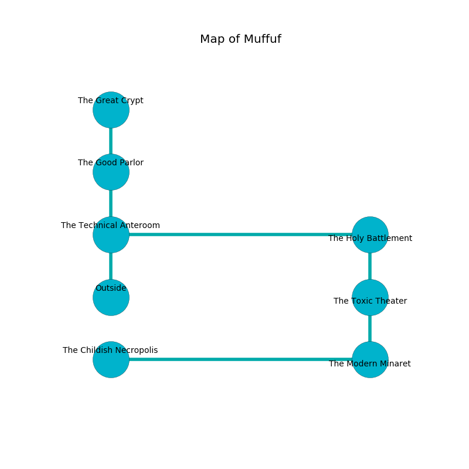

%Ruin Dogs

##Muffuf
###Overview
Muffuf is constructed on an alien city. Some rooms of it are flooded. A massive flood is happening outside. It is occupied by Demons. Carlita Laroche The Superficial, a Githyanki Warrior is here. The Demons are battling Carlita Laroche The Superficial. She  is founding a new religion. 

###Artifact
####Haed

Haed is a powerful artifact in the shape of a sharp meteorite. When gazed upon it floats above the ground. 

###Locations

####the technical anteroom
The crystal walls are scratched. The floor is smooth. 

* To the east a torchlit pathway opens to [the holy battlement](#the-holy-battlement).
* To the north a small gap connects to [the good parlor](#the-good-parlor).
* To the south is the entrance.

####the holy battlement
There is an Ettercap here. Blue mushrooms are swaying in broken urns. The air smells like cornmint here. 

* There is a rowboat here.
* To the west a torchlit pathway opens to [the technical anteroom](#the-technical-anteroom).
* To the south a torchlit threshold leads to [the toxic theater](#the-toxic-theater).

####the toxic theater
There is a Spined Devil here. The air tastes like milk here. If the Spined Devil notice the Ruin Dogs, one of them will retreat and alert the others. 

* To the north a torchlit threshold opens to [the holy battlement](#the-holy-battlement).
* To the south a torchlit artery opens to [the modern minaret](#the-modern-minaret).

####the modern minaret
The air smells like lavender here. There is a trap here. When activated, a tripwire will make the ceiling slowly lower. The crystal walls are ruined. The floor is cluttered with rocks. 

* To the west a small threshold leads to [the childish necropolis](#the-childish-necropolis).
* To the north a torchlit artery connects to [the toxic theater](#the-toxic-theater).

####the childish necropolis
The air tastes like toast here. The obsidion walls are unsettled. There are a Blink Dog, a Sahuagin Priestess, a Hyena, and an Octopus here. The floor is cluttered with broken glass. 

* To the east a small threshold leads to [the modern minaret](#the-modern-minaret).

####the good parlor
The floor is cluttered with shells. Blue mushrooms are sprouting in cracks in the floor. The air smells like acacia here. The brick walls are bloodstained. 

There is an engraving on the wall written in Demons Script. 

> Oh my! cruel soul
>
> mobile and whole
>
> rough and false
>
> sadness is whole
>

* There is a knife here.
* [Haed](#Haed) is here.
* To the north a windy opening leads to [the great crypt](#the-great-crypt).
* To the south a small gap leads to [the technical anteroom](#the-technical-anteroom).

####the great crypt
The stone walls are caving in. The floor is sticky. 

* [Carlita Laroche The Superficial](#Carlita-Laroche-The-Superficial) is here.
* To the south a windy opening opens to [the good parlor](#the-good-parlor).

