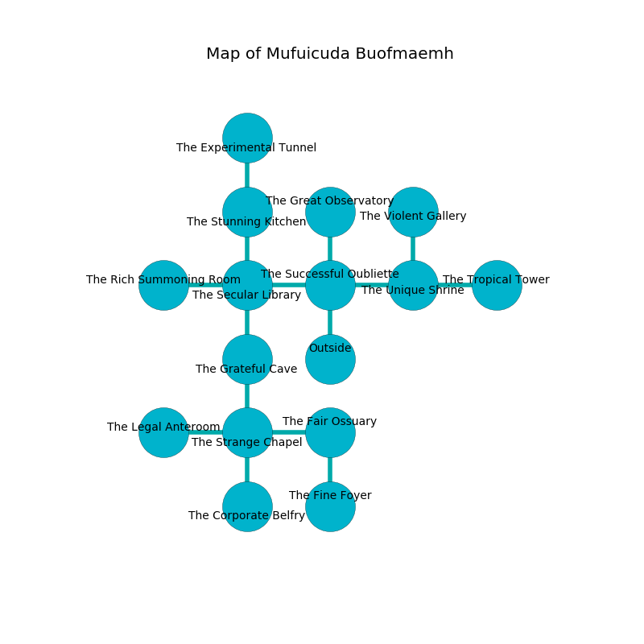

%Ruin Dogs

##Mufuicuda Buofmaemh
###Overview
Mufuicuda Buofmaemh is located on a haunted rift. Parts of Mufuicuda Buofmaemh are cursed. A solar eclipse is happening outside. It is occupied by Kenku. Coralee Houle The Vengeful, a Vampire Spawn is here. The Kenku are battling Coralee Houle The Vengeful. She  is founding a new religion. 

###Artifact
####The Artistic Cane

The Artistic Cane looks like a sharp amulet. It smells like vanilla. When thrown it repels insects. 

###Locations

####the successful oubliette
The floor is bloodstained. The stone walls are covered in mold. Yellow lichens are swaying in a patch on the floor. The air tastes like white rose here. 

* To the west a long artery connects to [the secular library](#the-secular-library).
* To the east a small hall opens to [the unique shrine](#the-unique-shrine).
* To the north a hazy gap opens to [the great observatory](#the-great-observatory).
* To the south is the entrance.

####the secular library
The concrete walls are pristine. There is a trap here. When activated, a pressure plate will collapse a wall. 

* To the west a dark threshold leads to [the rich summoning room](#the-rich-summoning-room).
* To the east a long artery connects to [the successful oubliette](#the-successful-oubliette).
* To the north a hazy pathway connects to [the stunning kitchen](#the-stunning-kitchen).
* To the south a flooded pathway leads to [the grateful cave](#the-grateful-cave).

####the unique shrine
The crystal walls are bloodstained. There are twenty Kenkus here. The Kenku are willing to negotiate. 

There is an engraving on a tablet written in Kenku Script. 

> I am cruel.
>
> I thought about digging.
>

* There is a hammer here.
* To the west a small hall opens to [the successful oubliette](#the-successful-oubliette).
* To the east a torchlit cavern opens to [the tropical tower](#the-tropical-tower).
* To the north a dripping cave leads to [the violent gallery](#the-violent-gallery).

####the great observatory
There are twenty Kenkus here. The air smells like naphthyl here. The floor is smooth. Gray razorgrass is sprouting from the ceiling. One of the Kenku is on watch, the rest are caring for babies. 

There is an engraving on a tablet written in common. 

> I am lost in Mufuicuda Buofmaemh.
>
> Leave at once.
>

* To the south a hazy gap leads to [the successful oubliette](#the-successful-oubliette).

####the violent gallery
The air tastes like chicken here. White mushrooms are swaying in cracks in the floor. The concrete walls are covered in mold. There are twenty Kenkus here. The floor is glossy. The Kenku are crazy with bloodlust. 

There is an engraving on the floor written in Kenku Script. 

> Oh my! terrible fate
>
> irrelevant and normal
>
> democratic and late
>
> cruelty is abnormal
>

* To the south a dripping cave leads to [the unique shrine](#the-unique-shrine).

####the grateful cave
The air tastes like almond here. There are a Kuo-Toa Whip, a Wererat, and a Weretiger here. Yellow lichens are growing in a patch on the floor. The floor is bloodstained. 

There is an engraving on the ceiling written in Kenku Script. 

> I could not try hiding.
>

* There is a baby here.
* There is a bone here.
* [Coralee Houle The Vengeful](#Coralee-Houle-The-Vengeful) is here.
* To the north a flooded pathway opens to [the secular library](#the-secular-library).
* To the south a hazy walkway leads to [the strange chapel](#the-strange-chapel).

####the tropical tower
The crystal walls are caving in. 

* To the west a torchlit cavern connects to [the unique shrine](#the-unique-shrine).

####the strange chapel
The glass walls are unsettled. 

There is an engraving on the ceiling written in common. 

> I discovered [The Artistic Cane](#The-Artistic-Cane).
>
> Go away.
>

* There is a finger here.
* To the west a flooded passageway leads to [the legal anteroom](#the-legal-anteroom).
* To the east a hazy threshold leads to [the fair ossuary](#the-fair-ossuary).
* To the north a hazy walkway opens to [the grateful cave](#the-grateful-cave).
* To the south a torchlit walkway leads to [the corporate belfry](#the-corporate-belfry).

####the legal anteroom
The floor is cluttered with bones. The air smells like peony here. White moss is decaying in broken urns. 

* To the east a flooded passageway connects to [the strange chapel](#the-strange-chapel).

####the stunning kitchen
The brick walls are unsettled. The air smells like celery here. There are twenty Kenkus here. The Kenku are performing a ritual. If not interrupted, a powerful monster will be summoned. 

* To the north a long walkway connects to [the experimental tunnel](#the-experimental-tunnel).
* To the south a hazy pathway connects to [the secular library](#the-secular-library).

####the fair ossuary
Blue razorgrass is growing in cracks in the floor. There are a Goblin, a Ghoul, a Bandit, and a Killer Whale here. 

* [The Artistic Cane](#The-Artistic-Cane) is here.
* To the west a hazy threshold opens to [the strange chapel](#the-strange-chapel).
* To the south a dark walkway opens to [the fine foyer](#the-fine-foyer).

####the corporate belfry
The air tastes like beef here. Red ferns are growing in cracks in the floor. 

* To the north a torchlit walkway opens to [the strange chapel](#the-strange-chapel).

####the rich summoning room

* To the east a dark threshold connects to [the secular library](#the-secular-library).

####the experimental tunnel
There are twenty Kenkus here. Green mushrooms are decaying from the walls. The air smells like roasted meaty here. One of the Kenku is working a mechanism that can launch acid at the Ruin Dogs. 

There is an engraving on a tablet written in Kenku Script. 

> [The Artistic Cane](#The-Artistic-Cane)
>
> content, personal, conscious
>
> always geological
>
> [The Artistic Cane](#The-Artistic-Cane)
>

* There is a fly here.
* To the south a long walkway connects to [the stunning kitchen](#the-stunning-kitchen).

####the fine foyer
The mirrored walls are bloodstained. There are twenty Kenkus here. The floor is sticky. The air smells like davana here. White moss is growing in a patch on the floor. One of the Kenku is pointing a ballista at the entrance. 

There is an engraving on a monolith written in Kenku Script. 

> Try cowering.
>

* To the north a dark walkway leads to [the fair ossuary](#the-fair-ossuary).

