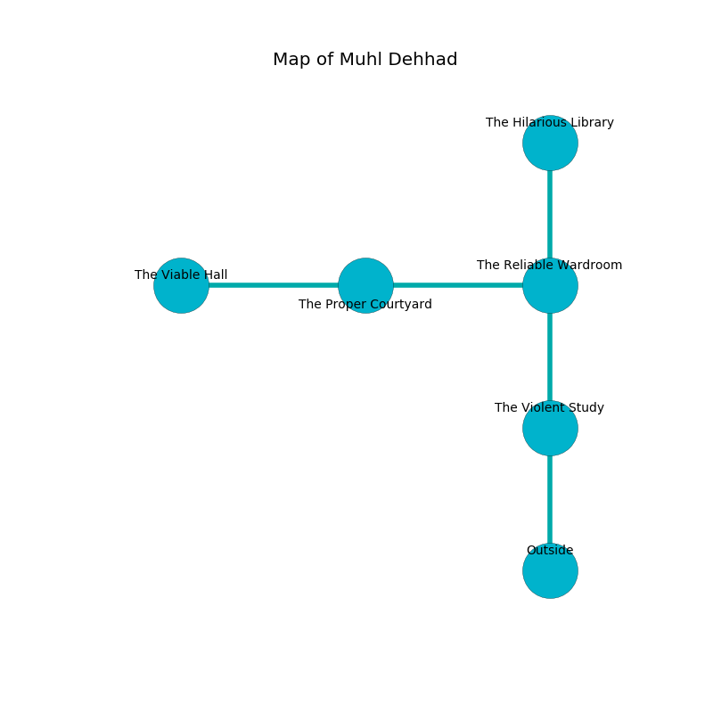

%Ruin Dogs

##Muhl Dehhad
###Overview
Muhl Dehhad is located in a poisoned mountain. Some areas of it are flooded. The ruin is coming to life. It is occupied by Drows. Eloy Ott The Cunning, a Yuan-Ti Pureblood is here. The Drows are the soldiers of Eloy Ott The Cunning. He  is founding a new religion. 

###Artifact
####The Expensive Architecture

The Expensive Architecture is a powerful artifact in the shape of a wet doll. Gravity flows around it. It smells like sugar. It is a pale gray color. When gazed upon it becomes a force of destiny. 

###Locations

####the violent study
The floor is smooth. There is a Polar Bear here. 

There is an engraving on a tablet written in Drows Script. 

> A prison is an illusion
>
> vulnerable and astonishing
>
> but never old
>
> A prison is an illusion
>

* There is a triptych here.
* To the north a dark opening connects to [the reliable wardroom](#the-reliable-wardroom).
* To the south is the entrance.

####the reliable wardroom
The concrete walls are ruined. There are eight Drows here. Gray mushrooms are decaying in a patch on the floor. The Drows are crazy with bloodlust. 

* [Eloy Ott The Cunning](#Eloy-Ott-The-Cunning) is here.
* To the west a flooded opening opens to [the proper courtyard](#the-proper-courtyard).
* To the north a hazy pathway connects to [the hilarious library](#the-hilarious-library).
* To the south a dark opening leads to [the violent study](#the-violent-study).

####the proper courtyard
The air smells like origanum here. 

There is an engraving on a monolith written in common. 

> I discovered [The Expensive Architecture](#The-Expensive-Architecture).
>
> I thought about praying.
>

* [The Expensive Architecture](#The-Expensive-Architecture) is here.
* To the west a torchlit cave opens to [the viable hall](#the-viable-hall).
* To the east a flooded opening connects to [the reliable wardroom](#the-reliable-wardroom).

####the hilarious library
The floor is smooth. 

* To the south a hazy pathway opens to [the reliable wardroom](#the-reliable-wardroom).

####the viable hall
Red lichens are swaying in broken urns. The air tastes like peppermint here. The floor is glossy. 

* To the east a torchlit cave leads to [the proper courtyard](#the-proper-courtyard).

